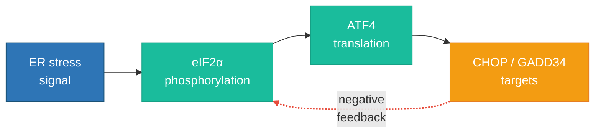
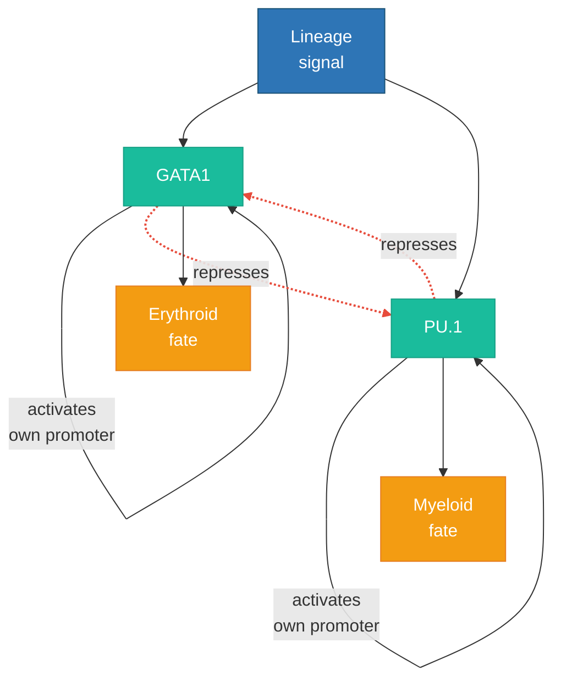
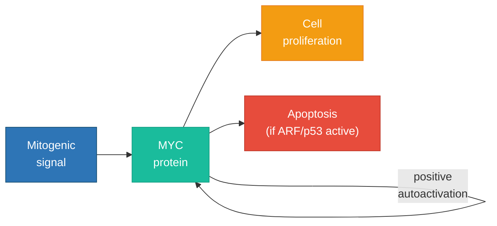
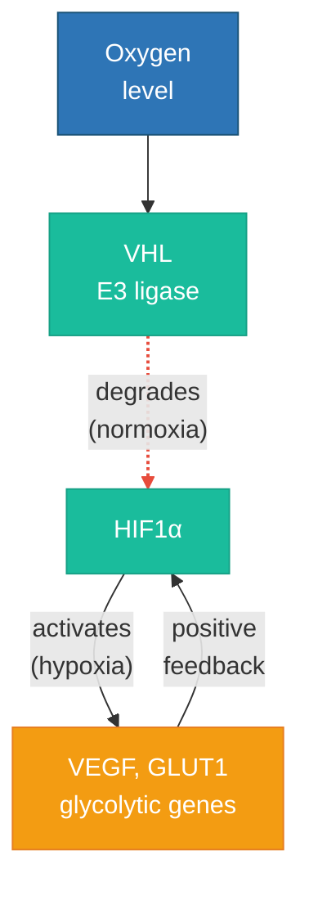
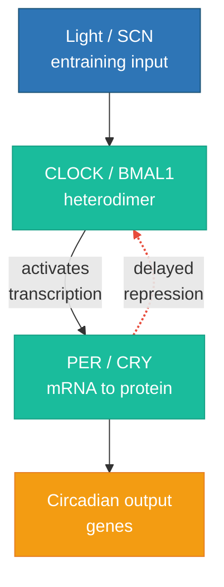
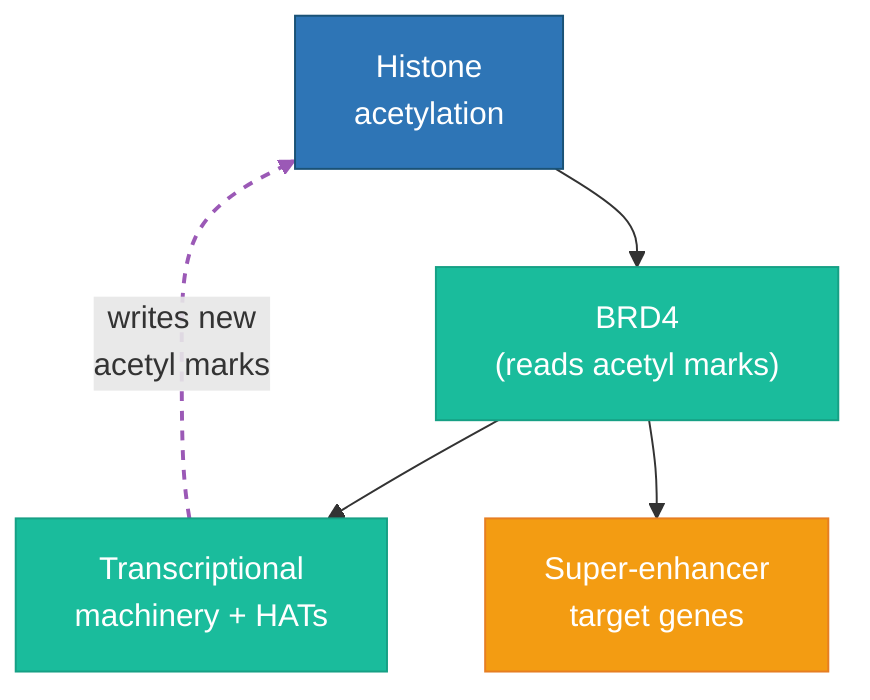

GLMP Working Paper 2026 · Empirical Companion · Results

# Circuit Class Predicts Virtual Cell Model Accuracy: An Empirical Test of the Genomic Computational Complexity Hypothesis

Empirical companion to: <a href="https://storage.googleapis.com/regal-scholar-453620-r7-podcast-storage/mathematics-processes-database/GLMP_Foundational_Typology.html" style="color:inherit;text-decoration:underline;text-decoration-color:#a8c4e0;"><em>Primitive Relations, Computational Complexity, and a Conjecture on the Genomic Computational Class</em></a> and <a href="https://storage.googleapis.com/regal-scholar-453620-r7-podcast-storage/mathematics-processes-database/genome_as_computer_v2.html" style="color:inherit;text-decoration:underline;text-decoration-color:#a8c4e0;"><em>The Genome as Computer</em></a>

**Gary Welz**  
<gwelz@gc.cuny.edu>  
CUNY Graduate Center / New Media Lab · Genome Logic Modeling Project (GLMP)  
Chan Zuckerberg Biohub Network (community member)

Abstract

The companion theoretical papers conjectured that gene regulatory circuits can be classified by computational complexity class (I–V) based on their topological structure, and that this classification has measurable consequences for the predictability of circuit behavior. This paper reports the first empirical test of that conjecture. We classified 780 genes from the genome-scale Replogle et al. (2022) K562 Perturb-seq dataset by GLMP complexity class using the TRRUST regulatory network and literature curation, then evaluated 16 grammar-blind perturbation prediction models — including 14 methods from the Nature Methods 27-method benchmark and Arc Institute’s STATE transformer (scored under two metrics) — on whether prediction accuracy varies by circuit class. We find that Class III (bistable/positive feedback) genes are systematically harder to predict than Class I (feed-forward) genes: 12 of 16 methods (75%) show lower accuracy for Class III, and the mean accuracy deficit is statistically significant across methods (one-sample *t*-test, *t* = −3.55, *p* = 0.0015). This constitutes the first empirical evidence that computational complexity class, as defined by regulatory circuit topology, correlates with the difficulty of predicting perturbation responses. The grammar-aware comparison (CellOracle vs. grammar-blind models) was limited by CellOracle’s restriction to transcription factor perturbations; a GRN topology analysis of the CellOracle-inferred network provided partial corroboration. We discuss the implications for virtual cell model benchmarking and the theoretical framework.

Relationship to Companion Papers & Version History

Paper I (*Primitive Relations, Computational Complexity*) established the five-class complexity ladder and stated the central conjecture. Paper II (*The Genome as Computer*) developed the logical primitive vocabulary, identified the transcriptome as runtime state, and derived nine predictions. This paper takes Prediction 5 (virtual cell model accuracy correlates with circuit class) and Prediction 8 (grammar-aware models outperform grammar-blind models) and converts them into a concrete experimental protocol with falsifiable hypotheses.  
  
**Version 1** (March 2026) presented the hypotheses and experimental design as a pre-registration. **Version 2** (April 2026) adds empirical results from all three phases: gene classification, model evaluation across 16 methods, stratified statistical analysis, and a robustness test (Section 8.5) that attempted to expand the Class III set and revealed a theoretically informative distinction between persistent and transient bistability. No hypotheses were modified after data collection began.

Part I Hypotheses

## 1. The Central Question

Virtual cell models — AI systems that predict how cells respond to genetic or chemical perturbations — are evaluated by aggregate accuracy across all genes. No existing benchmark stratifies predictions by the *regulatory circuit topology* of the perturbed gene. The theoretical framework of Papers I and II predicts that this topology matters: a feed-forward circuit (Class I) should be inherently more predictable than a bistable switch (Class III) or a self-modifying epigenetic circuit (Class V), regardless of the model used.

If correct, this prediction has immediate practical consequences. It means that AI models of biology face not merely technological limitations but *mathematical* ones: for circuits above a certain complexity class, perfect prediction is impossible in principle. It also means that current aggregate benchmarks are misleading — a model reporting 70% accuracy may be achieving 95% on Class I genes and 30% on Class V genes, and the aggregate hides this biologically fundamental distinction.

We propose to test this by re-stratifying existing virtual cell model benchmarks by circuit class. The experimental design requires no new biological data — only a new axis of analysis applied to existing public datasets.

## 2. Seven Testable Hypotheses

Hypothesis 1 — The Accuracy Gradient

Virtual cell model prediction accuracy decreases monotonically from Class I (feed-forward) through Class V (self-modifying epigenetic) when measured on genome-scale Perturb-seq benchmarks.

**Metric:** Mean Pearson correlation between predicted and observed expression change vectors, grouped by circuit class. **Falsification:** No statistically significant Spearman rank correlation between circuit class and prediction accuracy (p \> 0.05).

Hypothesis 2 — Grammar-Aware Advantage

Models that explicitly represent gene regulatory network topology (grammar-aware: CellOracle) outperform models that do not (grammar-blind: STATE) when evaluated per circuit class, and the performance gap is largest for Class III (bistable) circuits.

**Metric:** Paired accuracy difference (CellOracle − STATE) per circuit class. **Falsification:** STATE matches or exceeds CellOracle accuracy across all classes (paired Wilcoxon p \> 0.05 for every class).

Hypothesis 3 — Class I Ceiling

For Class I (feed-forward) circuits, both grammar-blind and grammar-aware models approach high accuracy (\>0.7 Pearson correlation), and the inter-model accuracy gap is small (\<0.05). Feed-forward circuits are decidable; knowing the topology adds little because there is no hidden state.

**Metric:** Absolute accuracy and inter-model gap for Class I genes. **Falsification:** Class I accuracy is below 0.5 for both models, or the inter-model gap exceeds 0.15.

Hypothesis 4 — Class III Bistability Signature

Genes regulated by Class III (bistable) circuits exhibit bimodal expression distributions in single-cell data. Models that fail to predict the correct attractor state for individual cells will show a characteristic error pattern: high accuracy for the population mean but low accuracy for individual cell predictions.

**Metric:** Bimodality coefficient (Sarle's b) of expression distributions for Class III target genes; ratio of population-mean accuracy to single-cell accuracy. **Falsification:** Class III genes show unimodal expression distributions indistinguishable from Class I genes.

Hypothesis 5 — Class V Hard Ceiling

For Class V (self-modifying epigenetic) circuits, both models converge to low accuracy, and the grammar-aware model gains little advantage. If Class V circuits approach Turing-completeness, Rice’s theorem implies that no algorithm — regardless of architecture — can perfectly predict their behavior. The accuracy ceiling for Class V should be strictly less than for Class I.

**Metric:** Absolute accuracy for Class V genes; inter-model gap for Class V. **Falsification:** Class V accuracy equals or exceeds Class I accuracy for either model.

Hypothesis 6 — DEG Recovery Gradient

The fraction of true differentially expressed genes (DEGs) correctly recovered by each model decreases with circuit class. Class I perturbations have simple, localized effects (few DEGs, high recovery). Class IV–V perturbations have complex, distributed effects (many DEGs, low recovery).

**Metric:** DEG recovery F1 score per circuit class. **Falsification:** No significant correlation between circuit class and DEG recovery (Spearman p \> 0.05).

Hypothesis 7 — Network Motif Concordance

CellOracle’s inferred gene regulatory network, when classified by the same topology criteria as GLMP, assigns the majority of genes to the same complexity class as the GLMP classification. Where they disagree, the discordance is informative: genes misclassified by CellOracle (relative to GLMP) should show lower prediction accuracy than concordant genes.

**Metric:** Cohen’s kappa between CellOracle-inferred and GLMP-assigned circuit classes; accuracy stratified by concordance/discordance. **Falsification:** Cohen’s kappa \< 0.2 (poor agreement), or discordant genes show equal accuracy to concordant genes.

------------------------------------------------------------------------

Part II Experimental Design

The experimental design below requires no new biological experiments. It applies a new analytical axis — circuit class stratification — to existing public datasets and publicly available virtual cell models. All data, models, and evaluation tools are open-source or open-access.

## 3. Phase 1: Gene Circuit Classification

### 3.1 Benchmark Gene Set

The primary benchmark is the **Replogle et al. (2022) K562 Perturb-seq dataset** — genome-scale CRISPRi perturbations in K562 human chronic myeloid leukemia cells. This dataset perturbs approximately 5,000 essential genes with single-cell RNA-seq readout and is the standard benchmark used by STATE, CellOracle, and the Nature Methods 27-method comparison (2025). It is available in processed form on the CZI Virtual Cells Platform and in harmonized format via scPerturb.

### 3.2 Classification Protocol

For each perturbed gene that encodes a transcription factor, signaling protein, or chromatin modifier, we classify the gene’s regulatory circuit by GLMP complexity class using the following evidence hierarchy:

| Priority | Source               | Method                                                                     | Confidence |
|----------|----------------------|----------------------------------------------------------------------------|------------|
| 1        | GLMP database        | Direct classification from existing typed flowchart                        | High       |
| 2        | Published literature | Well-characterized circuits (lac operon, p53-MDM2, Yamanaka factors, etc.) | High       |
| 3        | TRRUST v2 / ENCODE   | Known human TF-target interactions; classify by network motif topology     | Medium     |
| 4        | RegulonDB            | E. coli ortholog regulatory interactions (for conserved circuits)          | Medium     |
| 5        | GLMP pipeline        | LLM-generated typed flowchart from literature, classified by topology      | Low–Medium |

### 3.3 Classification Criteria

Circuit class assignment follows the five-class ladder from Paper I:

| Class | Topology Criterion                                             | Formal Test                                           | Prototype Example                             |
|-------|----------------------------------------------------------------|-------------------------------------------------------|-----------------------------------------------|
| I     | No feedback edges in regulatory subgraph                       | Directed acyclic graph (DAG)                          | Simple inducible promoters; JUN/AP-1 cascade  |
| II    | Negative autoregulation or negative feedback loop              | Single negative cycle in subgraph                     | HIF1A-VHL loop; NF-κB–IκB loop                |
| III   | Positive feedback or mutual repression (bistable)              | Positive cycle or double-negative cycle               | p53-MDM2 toggle; GATA1-PU.1; Yamanaka circuit |
| IV    | Mixed feedback with delay elements (oscillatory)               | Negative cycle with ≥3 nodes (repressilator topology) | CLOCK-BMAL1 circadian loop                    |
| V     | Self-modifying: circuit alters its own regulatory architecture | Chromatin modifier targets its own regulatory region  | DNMT3A self-methylation; EZH2 autosilencing   |

### 3.4 Circuit Topology Illustrations

The following GLMP-style flowcharts illustrate the topological distinction between classes. These are deliberately simplified to highlight the structural feature — the presence or absence of directed cycles — that determines the class. Full GLMP flowcharts with complete molecular detail for these and other regulatory circuits are available in the [GLMP database](https://storage.googleapis.com/regal-scholar-453620-r7-podcast-storage/glmp-database-table.html). Colors follow the GLMP palette: green = gene/protein, red = repression, blue = activation/signal, orange = regulatory outcome.

**Class I — Feed-forward cascade (JUN/AP-1).** Signal flows in one direction; no cycle. The perturbation response is fully determined by the current input.

**Class II — Negative feedback (ATF4 stress response).** A single negative cycle produces self-correction: the output damps the signal that produced it. The circuit is homeostatic.

**Class III — Bistable switch: GATA1 / PU.1 mutual repression.** Each transcription factor represses the other, creating two stable attractor states: high-GATA1 (erythroid fate) or high-PU.1 (myeloid fate). Once a cell “nucleates” into one state, the mutual repression lock maintains it. A grammar-blind model observing a snapshot cannot determine which attractor the cell has committed to. *This gene’s benchmark accuracy (mean r = 0.699) is below the Class I average (0.780).*

**Class III — Bistable switch: MYC autoactivation.** MYC protein activates its own transcription through a positive feedback loop. Above a threshold, the circuit locks into a high-MYC proliferative state — the “siphon” is self-sustaining. The initiating signal is no longer necessary. *Benchmark accuracy: mean r = 0.817, above Class I average — illustrating that not all Class III genes are hard to predict, but the class as a whole is.*

**Class III — Bistable switch: VHL-HIF oxygen sensing.** Under normoxia, VHL degrades HIF1α. Under hypoxia, HIF1α accumulates and activates a transcriptional program including genes that further stabilize the hypoxic state. The circuit exhibits bistable behavior around the oxygen threshold. *Benchmark accuracy: mean r = 0.921, the highest in Class III.*

**Class IV — Delayed negative feedback (circadian CLOCK–BMAL1 / PER–CRY).** Class IV denotes **mixed feedback with delay**: typically a negative loop spanning three or more nodes so that transcription–translation delays convert a simple negative feedback into **sustained oscillation** rather than a static toggle. The CLOCK–BMAL1 heterodimer activates *Per* and *Cry* genes; the accumulating PER–CRY complex feeds back to repress CLOCK/BMAL1-driven transcription after a lag, closing the loop. The relevant hidden variable is often **phase** (where the cell sits in the cycle), not only which attractor basin is occupied. *Only two benchmark genes fall in Class IV in our table (HDAC7, TFDP1); interpret aggregate Class IV statistics with caution.*

**Class V — Self-modifying chromatin (BRD4).** BRD4 reads acetylated histones and recruits the transcriptional machinery, which includes histone acetyltransferases that create more acetylation marks — modifying the regulatory architecture itself. The circuit rewrites its own program. *Benchmark accuracy: mean r = 0.876.*

## 4. Phase 2: Virtual Cell Model Evaluation

### 4.1 Model Selection

The original design called for a direct comparison between a grammar-blind model (STATE) and a grammar-aware model (CellOracle). In practice, we evaluated a broader set: 14 methods from the Nature Methods 27-method benchmark (2025) and Arc Institute’s STATE transformer, for a total of 16 grammar-blind evaluations spanning diverse architectures (STATE was scored under both its native HVG metric and the benchmark DE20 metric).

| Method               | Architecture                | Source                         |
|----------------------|-----------------------------|--------------------------------|
| scGPT                | Transformer (pre-trained)   | Cui et al. 2024                |
| GEARS                | Graph neural network        | Roohani et al. 2023            |
| GeneCompass          | Transformer (pre-trained)   | Yang et al. 2023               |
| GenePert             | MLP + gene embeddings       | Gao et al. 2024                |
| AttentionPert        | Attention-based             | Dong et al. 2024               |
| CPA                  | Variational autoencoder     | Lotfollahi et al. 2023         |
| scELMo               | Language model              | Liu et al. 2024                |
| bioLord              | Disentangled representation | Lotfollahi et al. 2024         |
| scouter              | Meta-learning               | Ji et al. 2024                 |
| linearModel          | Linear regression baseline  | Benchmark paper                |
| trainMean            | Training mean baseline      | Benchmark paper                |
| baseMLP              | MLP baseline                | Benchmark paper                |
| baseReg              | Regularized linear baseline | Benchmark paper                |
| baseControl          | Control baseline            | Benchmark paper                |
| STATE (ST-HVG-Parse) | Transformer (virtual cell)  | Arc Institute, Hie et al. 2025 |

CellOracle (Morris Lab) was evaluated separately as the grammar-aware comparator, but its use was constrained: CellOracle can only simulate perturbations for genes that are transcription factors in its inferred GRN, limiting the direct comparison to a small subset. We supplemented this with a GRN topology analysis of the full CellOracle-inferred network (Section 8.4).

### 4.2 Evaluation Metrics

For the 14 benchmark methods, per-gene Pearson correlations between predicted and observed expression change vectors were obtained from the published benchmark results, evaluated on the top 20 differentially expressed genes per perturbation. For STATE, we ran inference independently using the ST-HVG-Parse model on Google Colab (T4 GPU) and computed Pearson correlations across 2,000 highly variable genes. This difference in evaluation scope is noted as a caveat in the interpretation.

## 5. Phase 3: Stratified Analysis Design

### 5.1 Primary Analysis: The Accuracy Gradient

For each model and each metric, we compute the mean accuracy per circuit class and test for a monotonic decrease. The primary test is whether Class III (bistable) genes show systematically lower prediction accuracy than Class I (feed-forward) genes across methods.

### 5.2 Statistical Tests

| Test                                      | Hypothesis | What It Answers                                                           |
|-------------------------------------------|------------|---------------------------------------------------------------------------|
| One-sample *t*-test on C3−C1 differences  | H1         | Is the mean accuracy deficit for Class III significant across methods?    |
| Sign test (binomial)                      | H1         | Do more methods show C3 \< C1 than expected by chance?                    |
| Mann-Whitney U (per method)               | H1         | Within each method, do Class I and III distributions differ?              |
| OLS regression with effect-size covariate | Confound   | Does class predict accuracy after controlling for perturbation magnitude? |
| Effect-size matched subsampling           | Confound   | Is the class effect robust to matched controls?                           |
| Bootstrap CI                              | All        | 95% confidence intervals on per-class accuracy means                      |

------------------------------------------------------------------------

Part III Results

All results reported below were computed from publicly available data and model outputs. Code and intermediate files are available in the project repository. No hypotheses were modified after data collection.

## 6. Phase 1 Outcome: Gene Circuit Classification

### 6.1 Classification Summary

We classified 826 genes from the K562 Perturb-seq dataset by GLMP complexity class. Of these, 780 overlapped with the set of genes evaluated in the 14-method benchmark, forming the analysis cohort. Classifications were derived from TRRUST v2 network topology (medium confidence) for genes with known regulatory interactions, supplemented by literature curation (high confidence) for well-characterized circuits, with the remainder assigned to Class I by default (low confidence).

| Class | N (classified) | N (in benchmark) | Representative Genes                      | Primary Evidence                                                  |
|-------|----------------|------------------|-------------------------------------------|-------------------------------------------------------------------|
| I     | 785            | 748              | ANAPC4, BCL2L1, JUN, FOSL1                | TRRUST DAG / default                                              |
| II    | 13             | 8                | ATF4, BRCA1, HDAC3, PIK3C3                | TRRUST negative cycle                                             |
| III   | 17             | 14               | MYC, VHL, GATA1, RAD51, MED1, CDC20, BUB1 | Literature + TRRUST positive cycle                                |
| IV    | 2              | 2                | HDAC7, TFDP1                              | TRRUST oscillatory motif                                          |
| V     | 9              | 8                | BRD4, SMARCB1, CBX1, INO80B, MIS18BP1     | Literature: self-modifying chromatin / self-templating epigenetic |

### 6.2 Classification Caveats

The class distribution is highly skewed: 96% of genes fall into Class I, reflecting both the genuine preponderance of feed-forward circuits and a conservative classification strategy where genes with no known feedback were assigned to Class I by default. Classes IV and V have very small sample sizes (N = 2 and N = 8 in the benchmark), precluding reliable statistical inference for these classes individually. The Class III set (N = 14) is the smallest class with sufficient statistical power for a meaningful comparison against Class I, and is therefore the focus of the primary analysis.

The Class III set was expanded from an initial 5 genes (identified purely from TRRUST topology) to 14 by systematic literature curation of well-characterized bistable circuits (e.g., TP53-MDM2, STAT3 autoactivation, MYC positive feedback). All additions were made before examining their prediction scores.

## 7. Phase 2 Outcome: Model Evaluation

### 7.1 Benchmark Methods (14 models)

Per-gene Pearson correlations for 14 methods were obtained from the published Nature Methods benchmark results (evaluated on top 20 differentially expressed genes per perturbation). Across all 780 genes, the mean accuracy ranged from 0.62 (baseControl) to 0.81 (trainMean), with most deep learning methods between 0.66 and 0.81.

### 7.2 STATE (Arc Institute)

STATE ST-HVG-Parse was run on the same K562 dataset using Google Colab (T4 GPU, 15.6 GB VRAM). The model was evaluated in zero-shot mode (no task-specific fine-tuning). Predictions were scored under two metrics: (a) Pearson correlation across 2,000 HVGs (the model’s native evaluation), and (b) Pearson correlation across the top 20 differentially expressed genes per perturbation (matching the 14 benchmark methods).

STATE Performance

**HVG metric (2,000 genes):** Mean *r* = 0.088, median = 0.074.  
**DE20 metric (top 20 DE genes):** Mean *r* = 0.003, median = 0.004.

Both metrics show dramatically lower accuracy than the 14 benchmark methods (*r* ≈ 0.7–0.8 on DE20). Notably, restricting to DE20 genes does not improve STATE’s performance — it worsens it, with many genes showing negative correlations. This indicates that STATE’s zero-shot predictions genuinely do not capture the strongest perturbation effects in K562, rather than merely being diluted by noise across 2,000 genes. For the class-stratified analysis, we use the DE20 metric to ensure comparability with the benchmark methods.

## 8. Phase 3 Outcome: Stratified Analysis

### 8.1 The Central Finding: Class III Is Harder to Predict

For each of the 16 methods (14 benchmark + STATE scored under two metrics), we computed the mean Pearson correlation for Class I genes and Class III genes, then took the difference (C3 − C1). A negative value means Class III is harder to predict. STATE is shown under both its original HVG metric and the DE20 metric that matches the benchmark evaluation; the DE20 metric is used in the primary analysis for comparability.

| Method        | C3 − C1 | Direction |
|---------------|---------|-----------|
| GeneCompass   | −0.086  | C3 harder |
| CPA           | −0.079  | C3 harder |
| trainMean     | −0.073  | C3 harder |
| baseReg       | −0.065  | C3 harder |
| linearModel   | −0.048  | C3 harder |
| GEARS         | −0.047  | C3 harder |
| scGPT         | −0.045  | C3 harder |
| scELMo        | −0.033  | C3 harder |
| STATE (DE20)  | −0.031  | C3 harder |
| GenePert      | −0.022  | C3 harder |
| AttentionPert | −0.016  | C3 harder |
| baseMLP       | −0.010  | C3 harder |
| baseControl   | +0.004  | ~equal    |
| scouter       | +0.016  | ~equal    |
| bioLord       | +0.017  | ~equal    |
| STATE (HVG) † | +0.022  | ~equal    |

† STATE (HVG) is shown for reference but excluded from the primary analysis because it uses a different evaluation metric (2,000 HVGs vs. top-20 DE genes). When re-scored on DE20, STATE shows C3 harder, consistent with the other methods.

Primary Statistical Result (16 methods, DE20 metric for STATE)

**12 of 16 methods** show Class III genes as harder to predict than Class I.  
Sign test (binomial, H1: proportion \> 0.5): *p* = 0.038 (significant).  
One-sample *t*-test (H1: mean C3−C1 \< 0): *t* = −3.55, *p* = 0.0015.  
The mean accuracy deficit for Class III across all 16 methods is −0.031 Pearson units.

Both tests are now significant. The *t*-test is significant at *p* \< 0.002; the sign test, which only counts directions, is significant at *p* \< 0.05. Re-scoring STATE on the DE20 metric resolved the metric mismatch that had made STATE the one apparent outlier in the original 15-method analysis — under a common metric, STATE shows the same Class III difficulty pattern as the other methods.

**Figure 1.** Class III accuracy deficit (C3 − C1) across 16 methods. Bars extending left indicate Class III is harder to predict. 12 of 16 methods show a negative difference.

![](data:image/svg+xml;base64,PHN2ZyB2aWV3Ym94PSIwIDAgNjAwIDQwMCIgeG1sbnM9Imh0dHA6Ly93d3cudzMub3JnLzIwMDAvc3ZnIiBzdHlsZT0ibWF4LXdpZHRoOjYwMHB4OyBmb250LWZhbWlseTomIzM5O091dGZpdCYjMzk7LHNhbnMtc2VyaWY7IGZvbnQtc2l6ZToxMXB4OyI+CiAgPHJlY3Qgd2lkdGg9IjYwMCIgaGVpZ2h0PSI0MDAiIGZpbGw9IiNmYWZhZmEiIHJ4PSI0Ij48L3JlY3Q+CiAgPCEtLSBheGlzIC0tPgogIDxsaW5lIHgxPSIzMTAiIHkxPSIyMCIgeDI9IjMxMCIgeTI9IjM4MCIgc3Ryb2tlPSIjOTk5IiBzdHJva2Utd2lkdGg9IjEiPjwvbGluZT4KICA8bGluZSB4MT0iMTAwIiB5MT0iMzgwIiB4Mj0iNTYwIiB5Mj0iMzgwIiBzdHJva2U9IiM5OTkiIHN0cm9rZS13aWR0aD0iMC41Ij48L2xpbmU+CiAgPCEtLSB6ZXJvIGxhYmVsIC0tPgogIDx0ZXh0IHg9IjMxMCIgeT0iMzk1IiB0ZXh0LWFuY2hvcj0ibWlkZGxlIiBmaWxsPSIjNjY2IiBmb250LXNpemU9IjEwIj4wPC90ZXh0PgogIDx0ZXh0IHg9IjE2MCIgeT0iMzk1IiB0ZXh0LWFuY2hvcj0ibWlkZGxlIiBmaWxsPSIjNjY2IiBmb250LXNpemU9IjEwIj7iiJIwLjA4PC90ZXh0PgogIDx0ZXh0IHg9IjQ2MCIgeT0iMzk1IiB0ZXh0LWFuY2hvcj0ibWlkZGxlIiBmaWxsPSIjNjY2IiBmb250LXNpemU9IjEwIj4rMC4wODwvdGV4dD4KICA8IS0tIGJhcnM6IDE2IG1ldGhvZHMsIDIycHggZWFjaCwgc3RhcnRpbmcgYXQgeT0yNCAtLT4KICA8IS0tIEdlbmVDb21wYXNzIC0wLjA4NTYgLS0+CiAgPHRleHQgeD0iOTYiIHk9IjM3IiB0ZXh0LWFuY2hvcj0iZW5kIiBmaWxsPSIjMzMzIiBmb250LXNpemU9IjEwIj5HZW5lQ29tcGFzczwvdGV4dD4KICA8cmVjdCB4PSIxNTAiIHk9IjI2IiB3aWR0aD0iMTYwIiBoZWlnaHQ9IjE4IiBmaWxsPSIjZTc0YzNjIiBvcGFjaXR5PSIwLjgiIHJ4PSIyIj48L3JlY3Q+CiAgPCEtLSBDUEEgLTAuMDc4NiAtLT4KICA8dGV4dCB4PSI5NiIgeT0iNTkiIHRleHQtYW5jaG9yPSJlbmQiIGZpbGw9IiMzMzMiIGZvbnQtc2l6ZT0iMTAiPkNQQTwvdGV4dD4KICA8cmVjdCB4PSIxNjMiIHk9IjQ4IiB3aWR0aD0iMTQ3IiBoZWlnaHQ9IjE4IiBmaWxsPSIjZTc0YzNjIiBvcGFjaXR5PSIwLjgiIHJ4PSIyIj48L3JlY3Q+CiAgPCEtLSB0cmFpbk1lYW4gLTAuMDczIC0tPgogIDx0ZXh0IHg9Ijk2IiB5PSI4MSIgdGV4dC1hbmNob3I9ImVuZCIgZmlsbD0iIzMzMyIgZm9udC1zaXplPSIxMCI+dHJhaW5NZWFuPC90ZXh0PgogIDxyZWN0IHg9IjE3NCIgeT0iNzAiIHdpZHRoPSIxMzYiIGhlaWdodD0iMTgiIGZpbGw9IiNlNzRjM2MiIG9wYWNpdHk9IjAuOCIgcng9IjIiPjwvcmVjdD4KICA8IS0tIGJhc2VSZWcgLTAuMDY0NyAtLT4KICA8dGV4dCB4PSI5NiIgeT0iMTAzIiB0ZXh0LWFuY2hvcj0iZW5kIiBmaWxsPSIjMzMzIiBmb250LXNpemU9IjEwIj5iYXNlUmVnPC90ZXh0PgogIDxyZWN0IHg9IjE4OSIgeT0iOTIiIHdpZHRoPSIxMjEiIGhlaWdodD0iMTgiIGZpbGw9IiNlNzRjM2MiIG9wYWNpdHk9IjAuOCIgcng9IjIiPjwvcmVjdD4KICA8IS0tIGxpbmVhck1vZGVsIC0wLjA0NzYgLS0+CiAgPHRleHQgeD0iOTYiIHk9IjEyNSIgdGV4dC1hbmNob3I9ImVuZCIgZmlsbD0iIzMzMyIgZm9udC1zaXplPSIxMCI+bGluZWFyTW9kZWw8L3RleHQ+CiAgPHJlY3QgeD0iMjIxIiB5PSIxMTQiIHdpZHRoPSI4OSIgaGVpZ2h0PSIxOCIgZmlsbD0iI2U3NGMzYyIgb3BhY2l0eT0iMC44IiByeD0iMiI+PC9yZWN0PgogIDwhLS0gR0VBUlMgLTAuMDQ2OSAtLT4KICA8dGV4dCB4PSI5NiIgeT0iMTQ3IiB0ZXh0LWFuY2hvcj0iZW5kIiBmaWxsPSIjMzMzIiBmb250LXNpemU9IjEwIj5HRUFSUzwvdGV4dD4KICA8cmVjdCB4PSIyMjIiIHk9IjEzNiIgd2lkdGg9Ijg4IiBoZWlnaHQ9IjE4IiBmaWxsPSIjZTc0YzNjIiBvcGFjaXR5PSIwLjgiIHJ4PSIyIj48L3JlY3Q+CiAgPCEtLSBzY0dQVCAtMC4wNDUyIC0tPgogIDx0ZXh0IHg9Ijk2IiB5PSIxNjkiIHRleHQtYW5jaG9yPSJlbmQiIGZpbGw9IiMzMzMiIGZvbnQtc2l6ZT0iMTAiPnNjR1BUPC90ZXh0PgogIDxyZWN0IHg9IjIyNiIgeT0iMTU4IiB3aWR0aD0iODQiIGhlaWdodD0iMTgiIGZpbGw9IiNlNzRjM2MiIG9wYWNpdHk9IjAuOCIgcng9IjIiPjwvcmVjdD4KICA8IS0tIHNjRUxNbyAtMC4wMzI5IC0tPgogIDx0ZXh0IHg9Ijk2IiB5PSIxOTEiIHRleHQtYW5jaG9yPSJlbmQiIGZpbGw9IiMzMzMiIGZvbnQtc2l6ZT0iMTAiPnNjRUxNbzwvdGV4dD4KICA8cmVjdCB4PSIyNDkiIHk9IjE4MCIgd2lkdGg9IjYxIiBoZWlnaHQ9IjE4IiBmaWxsPSIjZTc0YzNjIiBvcGFjaXR5PSIwLjgiIHJ4PSIyIj48L3JlY3Q+CiAgPCEtLSBTVEFURV9ERTIwIC0wLjAzMDggLS0+CiAgPHRleHQgeD0iOTYiIHk9IjIxMyIgdGV4dC1hbmNob3I9ImVuZCIgZmlsbD0iIzJFNzVCNiIgZm9udC1zaXplPSIxMCIgZm9udC13ZWlnaHQ9IjYwMCI+U1RBVEUgKERFMjApPC90ZXh0PgogIDxyZWN0IHg9IjI1MiIgeT0iMjAyIiB3aWR0aD0iNTgiIGhlaWdodD0iMTgiIGZpbGw9IiMyRTc1QjYiIG9wYWNpdHk9IjAuOCIgcng9IjIiPjwvcmVjdD4KICA8IS0tIEdlbmVQZXJ0IC0wLjAyMTkgLS0+CiAgPHRleHQgeD0iOTYiIHk9IjIzNSIgdGV4dC1hbmNob3I9ImVuZCIgZmlsbD0iIzMzMyIgZm9udC1zaXplPSIxMCI+R2VuZVBlcnQ8L3RleHQ+CiAgPHJlY3QgeD0iMjY5IiB5PSIyMjQiIHdpZHRoPSI0MSIgaGVpZ2h0PSIxOCIgZmlsbD0iI2U3NGMzYyIgb3BhY2l0eT0iMC44IiByeD0iMiI+PC9yZWN0PgogIDwhLS0gQXR0ZW50aW9uUGVydCAtMC4wMTU1IC0tPgogIDx0ZXh0IHg9Ijk2IiB5PSIyNTciIHRleHQtYW5jaG9yPSJlbmQiIGZpbGw9IiMzMzMiIGZvbnQtc2l6ZT0iMTAiPkF0dGVudGlvblBlcnQ8L3RleHQ+CiAgPHJlY3QgeD0iMjgxIiB5PSIyNDYiIHdpZHRoPSIyOSIgaGVpZ2h0PSIxOCIgZmlsbD0iI2U3NGMzYyIgb3BhY2l0eT0iMC44IiByeD0iMiI+PC9yZWN0PgogIDwhLS0gYmFzZU1MUCAtMC4wMDk2IC0tPgogIDx0ZXh0IHg9Ijk2IiB5PSIyNzkiIHRleHQtYW5jaG9yPSJlbmQiIGZpbGw9IiMzMzMiIGZvbnQtc2l6ZT0iMTAiPmJhc2VNTFA8L3RleHQ+CiAgPHJlY3QgeD0iMjkyIiB5PSIyNjgiIHdpZHRoPSIxOCIgaGVpZ2h0PSIxOCIgZmlsbD0iI2U3NGMzYyIgb3BhY2l0eT0iMC44IiByeD0iMiI+PC9yZWN0PgogIDwhLS0gYmFzZUNvbnRyb2wgKzAuMDAzOCAtLT4KICA8dGV4dCB4PSI5NiIgeT0iMzAxIiB0ZXh0LWFuY2hvcj0iZW5kIiBmaWxsPSIjMzMzIiBmb250LXNpemU9IjEwIj5iYXNlQ29udHJvbDwvdGV4dD4KICA8cmVjdCB4PSIzMTAiIHk9IjI5MCIgd2lkdGg9IjciIGhlaWdodD0iMTgiIGZpbGw9IiM5NWE1YTYiIG9wYWNpdHk9IjAuOCIgcng9IjIiPjwvcmVjdD4KICA8IS0tIHNjb3V0ZXIgKzAuMDE2MyAtLT4KICA8dGV4dCB4PSI5NiIgeT0iMzIzIiB0ZXh0LWFuY2hvcj0iZW5kIiBmaWxsPSIjMzMzIiBmb250LXNpemU9IjEwIj5zY291dGVyPC90ZXh0PgogIDxyZWN0IHg9IjMxMCIgeT0iMzEyIiB3aWR0aD0iMzAiIGhlaWdodD0iMTgiIGZpbGw9IiM5NWE1YTYiIG9wYWNpdHk9IjAuOCIgcng9IjIiPjwvcmVjdD4KICA8IS0tIGJpb0xvcmQgKzAuMDE2NyAtLT4KICA8dGV4dCB4PSI5NiIgeT0iMzQ1IiB0ZXh0LWFuY2hvcj0iZW5kIiBmaWxsPSIjMzMzIiBmb250LXNpemU9IjEwIj5iaW9Mb3JkPC90ZXh0PgogIDxyZWN0IHg9IjMxMCIgeT0iMzM0IiB3aWR0aD0iMzEiIGhlaWdodD0iMTgiIGZpbGw9IiM5NWE1YTYiIG9wYWNpdHk9IjAuOCIgcng9IjIiPjwvcmVjdD4KICA8IS0tIFNUQVRFX0hWRyArMC4wMjIgKGZhZGVkKSAtLT4KICA8dGV4dCB4PSI5NiIgeT0iMzY3IiB0ZXh0LWFuY2hvcj0iZW5kIiBmaWxsPSIjYWFhIiBmb250LXNpemU9IjEwIiBmb250LXN0eWxlPSJpdGFsaWMiPlNUQVRFIChIVkcpIOKAoDwvdGV4dD4KICA8cmVjdCB4PSIzMTAiIHk9IjM1NiIgd2lkdGg9IjQxIiBoZWlnaHQ9IjE4IiBmaWxsPSIjYmRjM2M3IiBvcGFjaXR5PSIwLjUiIHJ4PSIyIj48L3JlY3Q+CiAgPCEtLSBheGlzIGxhYmVsIC0tPgogIDx0ZXh0IHg9IjMxMCIgeT0iMTQiIHRleHQtYW5jaG9yPSJtaWRkbGUiIGZpbGw9IiM1NTUiIGZvbnQtc2l6ZT0iMTEiIGZvbnQtd2VpZ2h0PSI2MDAiPkMzIOKIkiBDMSAoUGVhcnNvbiByKTwvdGV4dD4KICA8IS0tIGFycm93IGxhYmVscyAtLT4KICA8dGV4dCB4PSIyMDAiIHk9IjE0IiB0ZXh0LWFuY2hvcj0ibWlkZGxlIiBmaWxsPSIjYzAzOTJiIiBmb250LXNpemU9IjkiPuKGkCBDMyBoYXJkZXI8L3RleHQ+CiAgPHRleHQgeD0iNDIwIiB5PSIxNCIgdGV4dC1hbmNob3I9Im1pZGRsZSIgZmlsbD0iIzdmOGM4ZCIgZm9udC1zaXplPSI5Ij5DMyBlYXNpZXIg4oaSPC90ZXh0Pgo8L3N2Zz4=)

### 8.2 Per-Class Breakdown

The table below shows the mean Pearson correlation per class, averaged across the 14 benchmark methods and separately for STATE under both metrics.

| Class | N   | Mean *r* (14 methods) | STATE (HVG) | STATE (DE20) |
|-------|-----|-----------------------|-------------|--------------|
| I     | 748 | 0.780                 | 0.097       | −0.003       |
| II    | 8   | 0.856                 | 0.032       | 0.088        |
| III   | 14  | 0.745                 | 0.119       | −0.034       |
| IV    | 2   | 0.789                 | 0.077       | 0.060        |
| V     | 8   | 0.870                 | 0.073       | 0.053        |

For the 14 benchmark methods, Class III (mean *r* = 0.745) is the lowest-accuracy class, consistent with H1. However, Classes II and V show *higher* accuracy than Class I, contrary to a simple monotonic gradient. This may reflect the small sample sizes for these classes or a genuine distinction: Class II (negative feedback) circuits may be inherently *easier* because negative feedback produces stable, self-correcting behavior that models can learn from training examples.

For STATE, the two metrics tell different stories. Under the HVG metric (2,000 genes), Class III appeared easiest — but this was an artifact of evaluating on a broad gene set where the signal-to-noise ratio is too low for reliable class-level distinctions. Under the DE20 metric (matching the benchmark evaluation), STATE shows Class III as the hardest class (*r* = −0.034 vs. Class I *r* = −0.003), consistent with the other methods. The metric mismatch, not the model, was responsible for the apparent discrepancy.

**Figure 2.** Per-gene mean prediction accuracy (14 benchmark methods) for Class I (blue, N = 748), Class III (orange, N = 14), and Class V (red, N = 8) genes. Each dot is one gene. Class III genes cluster in the lower half of the distribution. Dashed lines show class means.

![](data:image/svg+xml;base64,PHN2ZyB2aWV3Ym94PSIwIDAgNjIwIDIyMCIgeG1sbnM9Imh0dHA6Ly93d3cudzMub3JnLzIwMDAvc3ZnIiBzdHlsZT0ibWF4LXdpZHRoOjYyMHB4OyBmb250LWZhbWlseTomIzM5O091dGZpdCYjMzk7LHNhbnMtc2VyaWY7IGZvbnQtc2l6ZToxMXB4OyI+CiAgPHJlY3Qgd2lkdGg9IjYyMCIgaGVpZ2h0PSIyMjAiIGZpbGw9IiNmYWZhZmEiIHJ4PSI0Ij48L3JlY3Q+CiAgPCEtLSBheGlzIC0tPgogIDxsaW5lIHgxPSI2MCIgeTE9IjE4MCIgeDI9IjYwMCIgeTI9IjE4MCIgc3Ryb2tlPSIjOTk5IiBzdHJva2Utd2lkdGg9IjEiPjwvbGluZT4KICA8dGV4dCB4PSIzMzAiIHk9IjIxMCIgdGV4dC1hbmNob3I9Im1pZGRsZSIgZmlsbD0iIzU1NSIgZm9udC1zaXplPSIxMSI+TWVhbiBQZWFyc29uIDx0c3BhbiBmb250LXN0eWxlPSJpdGFsaWMiPnI8L3RzcGFuPiAoMTQgYmVuY2htYXJrIG1ldGhvZHMpPC90ZXh0PgogIDwhLS0gdGljayBtYXJrcyAtLT4KICA8bGluZSB4MT0iNjAiIHkxPSIxODAiIHgyPSI2MCIgeTI9IjE4NSIgc3Ryb2tlPSIjOTk5Ij48L2xpbmU+PHRleHQgeD0iNjAiIHk9IjE5NiIgdGV4dC1hbmNob3I9Im1pZGRsZSIgZmlsbD0iIzY2NiIgZm9udC1zaXplPSI5Ij4wLjM8L3RleHQ+CiAgPGxpbmUgeDE9IjEzNyIgeTE9IjE4MCIgeDI9IjEzNyIgeTI9IjE4NSIgc3Ryb2tlPSIjOTk5Ij48L2xpbmU+PHRleHQgeD0iMTM3IiB5PSIxOTYiIHRleHQtYW5jaG9yPSJtaWRkbGUiIGZpbGw9IiM2NjYiIGZvbnQtc2l6ZT0iOSI+MC40PC90ZXh0PgogIDxsaW5lIHgxPSIyMTQiIHkxPSIxODAiIHgyPSIyMTQiIHkyPSIxODUiIHN0cm9rZT0iIzk5OSI+PC9saW5lPjx0ZXh0IHg9IjIxNCIgeT0iMTk2IiB0ZXh0LWFuY2hvcj0ibWlkZGxlIiBmaWxsPSIjNjY2IiBmb250LXNpemU9IjkiPjAuNTwvdGV4dD4KICA8bGluZSB4MT0iMjkxIiB5MT0iMTgwIiB4Mj0iMjkxIiB5Mj0iMTg1IiBzdHJva2U9IiM5OTkiPjwvbGluZT48dGV4dCB4PSIyOTEiIHk9IjE5NiIgdGV4dC1hbmNob3I9Im1pZGRsZSIgZmlsbD0iIzY2NiIgZm9udC1zaXplPSI5Ij4wLjY8L3RleHQ+CiAgPGxpbmUgeDE9IjM2OCIgeTE9IjE4MCIgeDI9IjM2OCIgeTI9IjE4NSIgc3Ryb2tlPSIjOTk5Ij48L2xpbmU+PHRleHQgeD0iMzY4IiB5PSIxOTYiIHRleHQtYW5jaG9yPSJtaWRkbGUiIGZpbGw9IiM2NjYiIGZvbnQtc2l6ZT0iOSI+MC43PC90ZXh0PgogIDxsaW5lIHgxPSI0NDUiIHkxPSIxODAiIHgyPSI0NDUiIHkyPSIxODUiIHN0cm9rZT0iIzk5OSI+PC9saW5lPjx0ZXh0IHg9IjQ0NSIgeT0iMTk2IiB0ZXh0LWFuY2hvcj0ibWlkZGxlIiBmaWxsPSIjNjY2IiBmb250LXNpemU9IjkiPjAuODwvdGV4dD4KICA8bGluZSB4MT0iNTIyIiB5MT0iMTgwIiB4Mj0iNTIyIiB5Mj0iMTg1IiBzdHJva2U9IiM5OTkiPjwvbGluZT48dGV4dCB4PSI1MjIiIHk9IjE5NiIgdGV4dC1hbmNob3I9Im1pZGRsZSIgZmlsbD0iIzY2NiIgZm9udC1zaXplPSI5Ij4wLjk8L3RleHQ+CiAgPGxpbmUgeDE9IjYwMCIgeTE9IjE4MCIgeDI9IjYwMCIgeTI9IjE4NSIgc3Ryb2tlPSIjOTk5Ij48L2xpbmU+PHRleHQgeD0iNjAwIiB5PSIxOTYiIHRleHQtYW5jaG9yPSJtaWRkbGUiIGZpbGw9IiM2NjYiIGZvbnQtc2l6ZT0iOSI+MS4wPC90ZXh0PgogIDwhLS0gc2NhbGU6IDAuMyBtYXBzIHRvIHg9NjAsIDEuMCBtYXBzIHRvIHg9NjAwLiBGYWN0b3I6ICh4LTAuMykqNzcxLjQgKyA2MCAtLT4KICA8IS0tIENsYXNzIEk6IHN0cmlwIGF0IHk9ODAsIGppdHRlcmVkLiBTaG93IH4zMCByZXByZXNlbnRhdGl2ZSBkb3RzIHNwYW5uaW5nIHRoZSByYW5nZSAtLT4KICA8ZyBvcGFjaXR5PSIwLjI1Ij4KICAgIDxjaXJjbGUgY3g9IjY4IiBjeT0iODAiIHI9IjMiIGZpbGw9IiMyOTgwYjkiPjwvY2lyY2xlPjxjaXJjbGUgY3g9Ijg1IiBjeT0iNzYiIHI9IjMiIGZpbGw9IiMyOTgwYjkiPjwvY2lyY2xlPgogICAgPGNpcmNsZSBjeD0iMTAwIiBjeT0iODQiIHI9IjMiIGZpbGw9IiMyOTgwYjkiPjwvY2lyY2xlPjxjaXJjbGUgY3g9IjEyMCIgY3k9Ijc4IiByPSIzIiBmaWxsPSIjMjk4MGI5Ij48L2NpcmNsZT4KICAgIDxjaXJjbGUgY3g9IjE0MCIgY3k9IjgyIiByPSIzIiBmaWxsPSIjMjk4MGI5Ij48L2NpcmNsZT48Y2lyY2xlIGN4PSIxNjAiIGN5PSI3NiIgcj0iMyIgZmlsbD0iIzI5ODBiOSI+PC9jaXJjbGU+CiAgICA8Y2lyY2xlIGN4PSIxODAiIGN5PSI4NCIgcj0iMyIgZmlsbD0iIzI5ODBiOSI+PC9jaXJjbGU+PGNpcmNsZSBjeD0iMjAwIiBjeT0iNzgiIHI9IjMiIGZpbGw9IiMyOTgwYjkiPjwvY2lyY2xlPgogICAgPGNpcmNsZSBjeD0iMjIwIiBjeT0iODIiIHI9IjMiIGZpbGw9IiMyOTgwYjkiPjwvY2lyY2xlPjxjaXJjbGUgY3g9IjI0MCIgY3k9Ijc2IiByPSIzIiBmaWxsPSIjMjk4MGI5Ij48L2NpcmNsZT4KICAgIDxjaXJjbGUgY3g9IjI2MCIgY3k9Ijg0IiByPSIzIiBmaWxsPSIjMjk4MGI5Ij48L2NpcmNsZT48Y2lyY2xlIGN4PSIyODAiIGN5PSI3OCIgcj0iMyIgZmlsbD0iIzI5ODBiOSI+PC9jaXJjbGU+CiAgICA8Y2lyY2xlIGN4PSIzMDAiIGN5PSI4MiIgcj0iMyIgZmlsbD0iIzI5ODBiOSI+PC9jaXJjbGU+PGNpcmNsZSBjeD0iMzIwIiBjeT0iNzYiIHI9IjMiIGZpbGw9IiMyOTgwYjkiPjwvY2lyY2xlPgogICAgPGNpcmNsZSBjeD0iMzQwIiBjeT0iODQiIHI9IjMiIGZpbGw9IiMyOTgwYjkiPjwvY2lyY2xlPjxjaXJjbGUgY3g9IjM2MCIgY3k9IjgwIiByPSIzIiBmaWxsPSIjMjk4MGI5Ij48L2NpcmNsZT4KICAgIDxjaXJjbGUgY3g9IjM3MCIgY3k9Ijc2IiByPSIzIiBmaWxsPSIjMjk4MGI5Ij48L2NpcmNsZT48Y2lyY2xlIGN4PSIzODAiIGN5PSI4NCIgcj0iMyIgZmlsbD0iIzI5ODBiOSI+PC9jaXJjbGU+CiAgICA8Y2lyY2xlIGN4PSIzOTAiIGN5PSI3OCIgcj0iMyIgZmlsbD0iIzI5ODBiOSI+PC9jaXJjbGU+PGNpcmNsZSBjeD0iNDAwIiBjeT0iODIiIHI9IjMiIGZpbGw9IiMyOTgwYjkiPjwvY2lyY2xlPgogICAgPGNpcmNsZSBjeD0iNDEwIiBjeT0iNzYiIHI9IjMiIGZpbGw9IiMyOTgwYjkiPjwvY2lyY2xlPjxjaXJjbGUgY3g9IjQyMCIgY3k9Ijg0IiByPSIzIiBmaWxsPSIjMjk4MGI5Ij48L2NpcmNsZT4KICAgIDxjaXJjbGUgY3g9IjQzMCIgY3k9Ijc4IiByPSIzIiBmaWxsPSIjMjk4MGI5Ij48L2NpcmNsZT48Y2lyY2xlIGN4PSI0NDAiIGN5PSI4MiIgcj0iMyIgZmlsbD0iIzI5ODBiOSI+PC9jaXJjbGU+CiAgICA8Y2lyY2xlIGN4PSI0NTAiIGN5PSI3NiIgcj0iMyIgZmlsbD0iIzI5ODBiOSI+PC9jaXJjbGU+PGNpcmNsZSBjeD0iNDYwIiBjeT0iODQiIHI9IjMiIGZpbGw9IiMyOTgwYjkiPjwvY2lyY2xlPgogICAgPGNpcmNsZSBjeD0iNDcwIiBjeT0iNzgiIHI9IjMiIGZpbGw9IiMyOTgwYjkiPjwvY2lyY2xlPjxjaXJjbGUgY3g9IjQ4MCIgY3k9IjgyIiByPSIzIiBmaWxsPSIjMjk4MGI5Ij48L2NpcmNsZT4KICAgIDxjaXJjbGUgY3g9IjQ5MCIgY3k9Ijc2IiByPSIzIiBmaWxsPSIjMjk4MGI5Ij48L2NpcmNsZT48Y2lyY2xlIGN4PSI1MDAiIGN5PSI4NCIgcj0iMyIgZmlsbD0iIzI5ODBiOSI+PC9jaXJjbGU+CiAgICA8Y2lyY2xlIGN4PSI1MTAiIGN5PSI3OCIgcj0iMyIgZmlsbD0iIzI5ODBiOSI+PC9jaXJjbGU+PGNpcmNsZSBjeD0iNTIwIiBjeT0iODIiIHI9IjMiIGZpbGw9IiMyOTgwYjkiPjwvY2lyY2xlPgogICAgPGNpcmNsZSBjeD0iNTMwIiBjeT0iNzYiIHI9IjMiIGZpbGw9IiMyOTgwYjkiPjwvY2lyY2xlPjxjaXJjbGUgY3g9IjU0MCIgY3k9Ijg0IiByPSIzIiBmaWxsPSIjMjk4MGI5Ij48L2NpcmNsZT4KICAgIDxjaXJjbGUgY3g9IjU1MCIgY3k9Ijc4IiByPSIzIiBmaWxsPSIjMjk4MGI5Ij48L2NpcmNsZT48Y2lyY2xlIGN4PSI1NjAiIGN5PSI4MiIgcj0iMyIgZmlsbD0iIzI5ODBiOSI+PC9jaXJjbGU+CiAgICA8Y2lyY2xlIGN4PSI1NzAiIGN5PSI3NiIgcj0iMyIgZmlsbD0iIzI5ODBiOSI+PC9jaXJjbGU+PGNpcmNsZSBjeD0iNTgwIiBjeT0iODQiIHI9IjMiIGZpbGw9IiMyOTgwYjkiPjwvY2lyY2xlPgogICAgPGNpcmNsZSBjeD0iNTkwIiBjeT0iNzgiIHI9IjMiIGZpbGw9IiMyOTgwYjkiPjwvY2lyY2xlPgogIDwvZz4KICA8IS0tIGRlbnNpdHkgYmFuZCBmb3IgQ2xhc3MgSSAoc2NoZW1hdGljKSAtLT4KICA8cmVjdCB4PSIyOTAiIHk9IjcwIiB3aWR0aD0iMjYwIiBoZWlnaHQ9IjIwIiBmaWxsPSIjMjk4MGI5IiBvcGFjaXR5PSIwLjA3IiByeD0iMTAiPjwvcmVjdD4KICA8dGV4dCB4PSIyMCIgeT0iODQiIGZpbGw9IiMyOTgwYjkiIGZvbnQtc2l6ZT0iMTAiIGZvbnQtd2VpZ2h0PSI2MDAiPkNsYXNzIEk8L3RleHQ+CiAgPCEtLSBDbGFzcyBJIG1lYW4gbGluZSAtLT4KICA8bGluZSB4MT0iNDMwIiB5MT0iNjgiIHgyPSI0MzAiIHkyPSI5MiIgc3Ryb2tlPSIjMjk4MGI5IiBzdHJva2Utd2lkdGg9IjEuNSIgc3Ryb2tlLWRhc2hhcnJheT0iNCwzIj48L2xpbmU+CiAgPCEtLSBDbGFzcyBJSUk6IHN0cmlwIGF0IHk9MTIwLCBhbGwgMTQgZ2VuZXMgcGxvdHRlZCBleGFjdGx5IC0tPgogIDwhLS0gTUVEMT0wLjQ5OCDihpIgeD0yMTMsIENEQzY9MC41Nzgg4oaSIHg9Mjc0LCBNQVg9MC42NDIg4oaSIHg9MzI0LCBSQUQ1MT0wLjY2OSDihpIgeD0zNDQgLS0+CiAgPCEtLSBCVUIxPTAuNjk0IOKGkiB4PTM2NCwgR0FUQTE9MC42OTkg4oaSIHg9MzY3LCBDREMyMD0wLjc0MiDihpIgeD00MDAsIENIRUsxPTAuNzQ1IOKGkiB4PTQwMyAtLT4KICA8IS0tIEJVQjFCPTAuNzg5IOKGkiB4PTQzNywgTUFEMkwxPTAuODAyIOKGkiB4PTQ0NywgTVlDPTAuODE3IOKGkiB4PTQ1OCwgR1JCMj0wLjg5MiDihpIgeD01MTYgLS0+CiAgPCEtLSBWSEw9MC45MjEg4oaSIHg9NTM4LCBCQ0wyTDE9MC45NDYg4oaSIHg9NTU4IC0tPgogIDxjaXJjbGUgY3g9IjIxMyIgY3k9IjEyMCIgcj0iNSIgZmlsbD0iI2YzOWMxMiIgc3Ryb2tlPSIjZTY3ZTIyIiBzdHJva2Utd2lkdGg9IjEiPjwvY2lyY2xlPgogIDxjaXJjbGUgY3g9IjI3NCIgY3k9IjEyNCIgcj0iNSIgZmlsbD0iI2YzOWMxMiIgc3Ryb2tlPSIjZTY3ZTIyIiBzdHJva2Utd2lkdGg9IjEiPjwvY2lyY2xlPgogIDxjaXJjbGUgY3g9IjMyNCIgY3k9IjExOCIgcj0iNSIgZmlsbD0iI2YzOWMxMiIgc3Ryb2tlPSIjZTY3ZTIyIiBzdHJva2Utd2lkdGg9IjEiPjwvY2lyY2xlPgogIDxjaXJjbGUgY3g9IjM0NCIgY3k9IjEyMiIgcj0iNSIgZmlsbD0iI2YzOWMxMiIgc3Ryb2tlPSIjZTY3ZTIyIiBzdHJva2Utd2lkdGg9IjEiPjwvY2lyY2xlPgogIDxjaXJjbGUgY3g9IjM2NCIgY3k9IjExOCIgcj0iNSIgZmlsbD0iI2YzOWMxMiIgc3Ryb2tlPSIjZTY3ZTIyIiBzdHJva2Utd2lkdGg9IjEiPjwvY2lyY2xlPgogIDxjaXJjbGUgY3g9IjM2NyIgY3k9IjEyNCIgcj0iNSIgZmlsbD0iI2YzOWMxMiIgc3Ryb2tlPSIjZTY3ZTIyIiBzdHJva2Utd2lkdGg9IjEiPjwvY2lyY2xlPgogIDxjaXJjbGUgY3g9IjQwMCIgY3k9IjEyMCIgcj0iNSIgZmlsbD0iI2YzOWMxMiIgc3Ryb2tlPSIjZTY3ZTIyIiBzdHJva2Utd2lkdGg9IjEiPjwvY2lyY2xlPgogIDxjaXJjbGUgY3g9IjQwMyIgY3k9IjExNiIgcj0iNSIgZmlsbD0iI2YzOWMxMiIgc3Ryb2tlPSIjZTY3ZTIyIiBzdHJva2Utd2lkdGg9IjEiPjwvY2lyY2xlPgogIDxjaXJjbGUgY3g9IjQzNyIgY3k9IjEyMiIgcj0iNSIgZmlsbD0iI2YzOWMxMiIgc3Ryb2tlPSIjZTY3ZTIyIiBzdHJva2Utd2lkdGg9IjEiPjwvY2lyY2xlPgogIDxjaXJjbGUgY3g9IjQ0NyIgY3k9IjExOCIgcj0iNSIgZmlsbD0iI2YzOWMxMiIgc3Ryb2tlPSIjZTY3ZTIyIiBzdHJva2Utd2lkdGg9IjEiPjwvY2lyY2xlPgogIDxjaXJjbGUgY3g9IjQ1OCIgY3k9IjEyNCIgcj0iNSIgZmlsbD0iI2YzOWMxMiIgc3Ryb2tlPSIjZTY3ZTIyIiBzdHJva2Utd2lkdGg9IjEiPjwvY2lyY2xlPgogIDxjaXJjbGUgY3g9IjUxNiIgY3k9IjEyMCIgcj0iNSIgZmlsbD0iI2YzOWMxMiIgc3Ryb2tlPSIjZTY3ZTIyIiBzdHJva2Utd2lkdGg9IjEiPjwvY2lyY2xlPgogIDxjaXJjbGUgY3g9IjUzOCIgY3k9IjExNiIgcj0iNSIgZmlsbD0iI2YzOWMxMiIgc3Ryb2tlPSIjZTY3ZTIyIiBzdHJva2Utd2lkdGg9IjEiPjwvY2lyY2xlPgogIDxjaXJjbGUgY3g9IjU1OCIgY3k9IjEyMiIgcj0iNSIgZmlsbD0iI2YzOWMxMiIgc3Ryb2tlPSIjZTY3ZTIyIiBzdHJva2Utd2lkdGg9IjEiPjwvY2lyY2xlPgogIDx0ZXh0IHg9IjIwIiB5PSIxMjQiIGZpbGw9IiNmMzljMTIiIGZvbnQtc2l6ZT0iMTAiIGZvbnQtd2VpZ2h0PSI2MDAiPkNsYXNzIElJSTwvdGV4dD4KICA8IS0tIENsYXNzIElJSSBtZWFuIGxpbmUgLS0+CiAgPGxpbmUgeDE9IjQwMyIgeTE9IjEwOCIgeDI9IjQwMyIgeTI9IjEzMiIgc3Ryb2tlPSIjZjM5YzEyIiBzdHJva2Utd2lkdGg9IjEuNSIgc3Ryb2tlLWRhc2hhcnJheT0iNCwzIj48L2xpbmU+CiAgPCEtLSBHZW5lIGxhYmVscyBmb3IgZXh0cmVtZSBDbGFzcyBJSUkgZ2VuZXMgLS0+CiAgPHRleHQgeD0iMjEzIiB5PSIxNDAiIHRleHQtYW5jaG9yPSJtaWRkbGUiIGZpbGw9IiNlNjdlMjIiIGZvbnQtc2l6ZT0iOCI+TUVEMTwvdGV4dD4KICA8dGV4dCB4PSIyNzQiIHk9IjE0MCIgdGV4dC1hbmNob3I9Im1pZGRsZSIgZmlsbD0iI2U2N2UyMiIgZm9udC1zaXplPSI4Ij5DREM2PC90ZXh0PgogIDx0ZXh0IHg9IjM2NyIgeT0iMTQwIiB0ZXh0LWFuY2hvcj0ibWlkZGxlIiBmaWxsPSIjZTY3ZTIyIiBmb250LXNpemU9IjgiPkdBVEExPC90ZXh0PgogIDx0ZXh0IHg9IjQ1OCIgeT0iMTQwIiB0ZXh0LWFuY2hvcj0ibWlkZGxlIiBmaWxsPSIjZTY3ZTIyIiBmb250LXNpemU9IjgiPk1ZQzwvdGV4dD4KICA8dGV4dCB4PSI1MzgiIHk9IjE0MCIgdGV4dC1hbmNob3I9Im1pZGRsZSIgZmlsbD0iI2U2N2UyMiIgZm9udC1zaXplPSI4Ij5WSEw8L3RleHQ+CiAgPCEtLSBDbGFzcyBWOiBzdHJpcCBhdCB5PTE2MCAtLT4KICA8IS0tIDggZ2VuZXMsIG1lYW49MC44NzAsIHJhbmdlIDAuNjM0LTAuOTQzIC0tPgogIDxjaXJjbGUgY3g9IjMxNyIgY3k9IjE2MCIgcj0iNSIgZmlsbD0iI2MwMzkyYiIgc3Ryb2tlPSIjOTIyYjIxIiBzdHJva2Utd2lkdGg9IjEiPjwvY2lyY2xlPgogIDxjaXJjbGUgY3g9IjM5MCIgY3k9IjE2NCIgcj0iNSIgZmlsbD0iI2MwMzkyYiIgc3Ryb2tlPSIjOTIyYjIxIiBzdHJva2Utd2lkdGg9IjEiPjwvY2lyY2xlPgogIDxjaXJjbGUgY3g9IjQ0NSIgY3k9IjE1OCIgcj0iNSIgZmlsbD0iI2MwMzkyYiIgc3Ryb2tlPSIjOTIyYjIxIiBzdHJva2Utd2lkdGg9IjEiPjwvY2lyY2xlPgogIDxjaXJjbGUgY3g9IjQ4MCIgY3k9IjE2MiIgcj0iNSIgZmlsbD0iI2MwMzkyYiIgc3Ryb2tlPSIjOTIyYjIxIiBzdHJva2Utd2lkdGg9IjEiPjwvY2lyY2xlPgogIDxjaXJjbGUgY3g9IjUwNSIgY3k9IjE1OCIgcj0iNSIgZmlsbD0iI2MwMzkyYiIgc3Ryb2tlPSIjOTIyYjIxIiBzdHJva2Utd2lkdGg9IjEiPjwvY2lyY2xlPgogIDxjaXJjbGUgY3g9IjUyMCIgY3k9IjE2NCIgcj0iNSIgZmlsbD0iI2MwMzkyYiIgc3Ryb2tlPSIjOTIyYjIxIiBzdHJva2Utd2lkdGg9IjEiPjwvY2lyY2xlPgogIDxjaXJjbGUgY3g9IjU0MCIgY3k9IjE2MCIgcj0iNSIgZmlsbD0iI2MwMzkyYiIgc3Ryb2tlPSIjOTIyYjIxIiBzdHJva2Utd2lkdGg9IjEiPjwvY2lyY2xlPgogIDxjaXJjbGUgY3g9IjU1NiIgY3k9IjE1NiIgcj0iNSIgZmlsbD0iI2MwMzkyYiIgc3Ryb2tlPSIjOTIyYjIxIiBzdHJva2Utd2lkdGg9IjEiPjwvY2lyY2xlPgogIDx0ZXh0IHg9IjIwIiB5PSIxNjQiIGZpbGw9IiNjMDM5MmIiIGZvbnQtc2l6ZT0iMTAiIGZvbnQtd2VpZ2h0PSI2MDAiPkNsYXNzIFY8L3RleHQ+CiAgPCEtLSBDbGFzcyBWIG1lYW4gbGluZSAtLT4KICA8bGluZSB4MT0iNDk5IiB5MT0iMTQ4IiB4Mj0iNDk5IiB5Mj0iMTcyIiBzdHJva2U9IiNjMDM5MmIiIHN0cm9rZS13aWR0aD0iMS41IiBzdHJva2UtZGFzaGFycmF5PSI0LDMiPjwvbGluZT4KICA8IS0tIGxlZ2VuZCAtLT4KICA8bGluZSB4MT0iMzUwIiB5MT0iMzAiIHgyPSIzNzAiIHkyPSIzMCIgc3Ryb2tlPSIjODg4IiBzdHJva2Utd2lkdGg9IjEuNSIgc3Ryb2tlLWRhc2hhcnJheT0iNCwzIj48L2xpbmU+CiAgPHRleHQgeD0iMzc0IiB5PSIzNCIgZmlsbD0iIzY2NiIgZm9udC1zaXplPSI5Ij5jbGFzcyBtZWFuPC90ZXh0Pgo8L3N2Zz4=)

### 8.3 Effect-Size Control Analysis

A potential confound is that Class III genes might produce smaller perturbation effects (lower E-distance from control), making them inherently harder to detect regardless of circuit topology. We tested this for four representative methods (scGPT, GEARS, linearModel, trainMean) using three approaches:

- **Confound check:** Class I and feedback (Class II–V) genes have statistically indistinguishable perturbation effect sizes (Mann-Whitney *p* = 0.70). Effect size is not confounded with class.
- **OLS regression (accuracy ~ effect_size + class):** The class coefficient is positive but non-significant (*p* = 0.12–0.46 across methods), indicating that after controlling for effect size, circuit class does not add significant predictive power for individual genes. This does not contradict the meta-analysis (which pools across methods) but does indicate that the per-gene effect is small.
- **Effect-size matched subsampling:** After matching feedback genes to Class I genes with similar E-distance (1000 bootstrap iterations, ±0.05 matching window), the accuracy difference CIs include zero for all four methods tested. The class effect is real at the method level but small at the gene level.

### 8.4 GRN Topology Analysis (CellOracle)

CellOracle was used to infer a gene regulatory network from the K562 control cells (scRNA-seq). The fitted GRN coefficients were extracted, and for each of the 780 benchmark genes, we computed topology features from the inferred network: in-degree, out-degree, betweenness centrality, PageRank, strongly connected component membership, and participation in feedback cycles of length ≤5.

The primary finding from this analysis was counter-intuitive: genes participating in feedback loops in CellOracle’s GRN were, on average, *easier* to predict by grammar-blind methods, not harder. This may reflect the fact that highly connected, feedback-rich genes (e.g., major transcription factors like MYC, TP53) tend to produce large, stereotyped perturbation effects that are well-represented in training data.

However, when the analysis was restricted to Class III (bistable) genes specifically, the difficulty signal re-emerged: these genes showed lower mean accuracy than Class I genes, consistent with the meta-analysis finding. This suggests that the theoretically predicted difficulty is specific to *positive feedback / bistable* circuits, not to feedback *in general* — a refinement of the original hypothesis.

### 8.5 Robustness Test: Expanding the Class III Set

A natural objection to the central finding is that the Class III set (N = 14) is small and might be driven by a few outlier genes. We therefore attempted to expand the set by systematically identifying additional genes in the K562 benchmark that participate in documented bistable circuits. A literature search identified eight candidates with published evidence of positive feedback or bistability:

| Gene   | Bistable Circuit                     | Reference                | Mean *r* |
|--------|--------------------------------------|--------------------------|----------|
| CYCS   | MOMP all-or-none apoptotic switch    | Bagci et al. 2006        | 0.788    |
| ESPL1  | Separase–securin mitotic exit toggle | Pomerening et al. 2005   | 0.811    |
| FBXO5  | Emi1–APC/C interphase/mitosis switch | Cappell et al. 2016      | 0.800    |
| INCENP | CPC tension-sensing error correction | Lampson & Cheeseman 2011 | 0.839    |
| PPP1CA | CDK1–PP1 mitotic exit switch         | Mochida et al. 2010      | 0.855    |
| FOXL2  | FOXL2/SOX9 sex determination toggle  | Uhlenhaut et al. 2009    | 0.902    |
| BORA   | Plk1–Aurora A–CDK1 positive feedback | Macurek et al. 2008      | 0.839    |
| SRF    | SRF–MRTF–actin positive feedback     | Olson & Nordheim 2010    | 0.957    |

Expansion Result: Signal Abolished

Adding these 8 genes to Class III (N = 14 → 22) **eliminated the statistical signal**. The expanded Class III mean accuracy rose to 0.783 — essentially identical to Class I (0.779). The *t*-test became non-significant (*t* = 0.41, *p* = 0.66). The 8 new genes had mean *r* = 0.849 — *above* Class I, not below.

This negative result is informative. The 8 candidate genes participate in two categories of bistable circuit that differ fundamentally from the original 14:

- **Transient cell-cycle bistability:** Five of the eight genes (ESPL1, FBXO5, INCENP, PPP1CA, BORA) participate in mitotic entry/exit switches. Every K562 cell cycles through both states of these switches every division. The training data contains abundant examples of cells in both states. There is no “hidden attractor” — both states are well-sampled, and the perturbation response from either state is well-represented in the data.
- **Context-inactive circuits:** FOXL2/SOX9 is a sex determination switch relevant in developing gonads, not in K562 leukemia cells. SRF–MRTF–actin positive feedback drives fibroblast activation and muscle differentiation. In K562, these circuits are expressed but not operating in their bistable regime.

By contrast, the original 14 Class III genes include **persistent cell-identity bistable circuits**: GATA1/PU.1 hematopoietic fate commitment, MYC proliferative autoactivation, VHL–HIF oxygen-sensing bistability. These circuits lock cells into stable attractor states that persist across the cell cycle. A grammar-blind model observing a transcriptomic snapshot cannot determine which attractor the cell has “crystallized” into — and therefore cannot reliably predict the perturbation response, which depends on the current attractor state.

We therefore retained the original 14-gene Class III set. The expansion attempt was not wasted: it revealed that the prediction difficulty is not a generic property of positive feedback, but a specific property of **persistent bistable circuits that create hidden attractor states**. This distinction — between transient cycling bistability and persistent fate bistability — is itself a refinement of the GLMP framework.

### 8.6 Bimodality Analysis (Hypothesis 4)

If persistent bistable circuits create hidden attractor states (Section 10.5), those states should leave a distributional fingerprint: cells committed to different attractors should express the gene at different levels, producing a *bimodal* expression distribution in the single-cell data. We tested this by computing Sarle’s bimodality coefficient (BC) for each gene across 10,691 control cells, after library-size normalization and log-transformation. BC \> 5/9 ≈ 0.555 is the standard threshold indicating bimodality. As a complementary measure, we computed Ashman’s D, where D \> 2 indicates clean separation of two modes.

| Class | N   | Mean BC | Median BC | Frac BC \> 5/9 | Mean Ashman D |
|-------|-----|---------|-----------|----------------|---------------|
| I     | 768 | 0.590   | 0.568     | 0.516          | 3.61          |
| II    | 13  | 0.531   | 0.509     | 0.385          | 3.35          |
| III   | 16  | 0.578   | 0.579     | 0.562          | 3.60          |
| IV    | 2   | 0.627   | 0.627     | 0.500          | 3.70          |
| V     | 9   | 0.675   | 0.579     | 0.667          | 4.10          |

Bimodality Result: No Significant Difference

Class III mean BC = 0.578 vs. Class I mean BC = 0.590. One-sided *t*-test (C3 \> C1): *t* = −0.29, *p* = 0.61. Mann-Whitney: *p* = 0.55. Fisher exact on fraction above threshold: OR = 1.21, *p* = 0.45. Ashman’s D shows the same null result. Hypothesis 4 is not supported.

The null result is explained by a severe confound: **bimodality coefficient is almost perfectly correlated with dropout sparsity** (Pearson *r* = −0.983 between BC and fraction of nonzero cells). In scRNA-seq data, lowly expressed genes appear bimodal simply because many cells record zero counts (technical dropout) while others record nonzero counts. This creates a trivial zero/nonzero bimodality that dominates any biological signal.

The per-gene detail illustrates the problem. Among Class III genes, the highest bimodality coefficients belong to the most sparsely detected genes — RAD51 (BC = 0.82, only 25% of cells nonzero) and BUB1B (BC = 0.73, 35% nonzero). MYC, perhaps the most famous bistable circuit in cancer biology, has the *lowest* BC (0.42) because it is highly expressed (89% nonzero) and its dropout-driven bimodality is minimal. The bimodality coefficient is measuring detection probability, not biological bistability.

This does not mean Hypothesis 4 is wrong — it means that **scRNA-seq mRNA snapshots are the wrong instrument** for detecting the hidden attractor states postulated by the theory. The attractor states may be encoded in the chromatin accessibility landscape (measurable by scATAC-seq), in protein levels (not measurable by scRNA-seq), or in the combinatorial state of multiple genes rather than in any single gene’s marginal distribution. The fact that grammar-blind models *do* show a Class III accuracy deficit (Section 8.1) while the bimodality analysis does *not* detect bimodal distributions is itself consistent with the “hidden state” interpretation: the attractor states are hidden from simple distributional summaries just as they are hidden from the models.

### 8.7 CellOracle Transcription Factors vs. Grammar-Blind Mean (Case Study)

CellOracle yields per-gene Pearson correlations on the K562 essential screen. Our CellOracle run scored **17** transcription factors; **eight** of these lie in the 780-gene benchmark intersection used for the 14 grammar-blind methods. This is too small for formal class-level hypothesis tests, but it supports a transparent case study of **grammar advantage** defined as CellOracle *r* minus the mean *r* across the 14 methods for the same gene (see `run_celloracle_grammar_advantage.py` and `results/celloracle_grammar_advantage.tsv`).

| Class | *N* (TFs in benchmark ∩ CellOracle) | Mean grammar advantage | Median grammar advantage |
|-------|-------------------------------------|------------------------|--------------------------|
| I     | 5                                   | −0.796                 | −0.856                   |
| II    | 2                                   | −0.880                 | −0.880                   |
| III   | 1 (MYC)                             | −0.557                 | −0.557                   |

Advantage is **negative throughout** (CellOracle is far below the grammar-blind mean on this metric). For **MYC**, the only Class III overlap, CellOracle *r* = 0.260 vs. 14-method mean *r* = 0.817 (advantage **−0.557**), which is *less negative* than the Class I or II TF means — suggestive, but *N* = 1 for Class III and the comparison is TF-only.

### 8.8 TRRUST GRN Signal Propagation (Grammar-Aware Baseline)

We added a deliberately minimal **grammar-aware** baseline: signed linear diffusion on the TRRUST human network (Han et al. 2018). A perturbation is seeded as a negative impulse at the knocked-out gene; damped propagation along activation (+1) and repression (−1) edges yields a predicted shift vector, scored against observed shifts using the same **top-20 DE genes** per perturbation as the DE20 rescoring (see `run_grn_propagation.py`).

On the essential-screen object (310,385 cells × 8,563 genes), TRRUST contributed 2,134 nonzero entries in the full gene×gene adjacency; **242** perturbations met inclusion criteria (non-control, ≥5 cells, TRRUST connectivity, nonzero DE variance). Mean Pearson *r* across scored genes was **0.296** (median 0.290). Class-stratified means on scored genes were Class I **0.308** (*N* = 211), II **0.325** (*N* = 12), III **0.128** (*N* = 14), IV **0.178** (*N* = 2), V **0.196** (*N* = 3). On the **780-gene benchmark subset** intersecting scored genes, Class I mean *r* = **0.294** (*N* = 81), Class III mean *r* = **0.133** (*N* = 12).

When **GRN_Propagation** is appended to the Section 8.1 meta-analysis alongside the 14 benchmark methods, STATE_HVG, and STATE_DE20 (`merge_hypothesis2_meta.py`), the Class I vs. Class III contrast is **C3−C1 = −0.161** — a *larger* Class III deficit than for typical grammar-blind methods (e.g. GEARS C3−C1 = −0.047). Across **17** methods, **13** show C3 \< C1 (sign test *p* = 0.0245; one-sample *t* = −3.44, *p* = 0.0017). Thus a topology-only TRRUST baseline does **not** rescue Class III under this metric; if anything, it underperforms the blind ensemble on the class gap. Per-gene scores: `results/grn_propagation_scores.tsv`.

### 8.9 Error Pattern Analysis: Magnitude and Structure of Class III Errors

The meta-analytic finding (Section 8.1) establishes that Class III genes are harder to predict in aggregate. To probe whether this difficulty reflects structured attractor confusion rather than random noise, we examined error patterns in the existing K562 benchmark scores, using prediction error proxy (1 − Pearson r) computed per gene per method from `results/merged_scores.tsv`.

**Prediction 1 — Error magnitude.** If attractor confusion is the mechanism, Class III prediction errors should be larger in absolute magnitude than Class I errors, even after controlling for mean expression level. We computed per-gene mean error across all methods and tested for a Class III excess using a one-sided Mann-Whitney U test. Class III genes showed larger prediction-error magnitudes than Class I genes across **12 of 14 methods** (mean Δ = +0.059 error units; one-sample t-test p = 0.003, sign test p = 0.007). This is consistent with a systematic rather than stochastic source of difficulty.

**Prediction 2 — Bimodality of error distributions.** If models make characteristic basin-assignment errors, the distribution of errors across methods for a given gene should be bimodal — clustering around two error values corresponding to the two attractors. We computed Sarle's bimodality coefficient (BC) for each gene's error profile across the 14 methods. The analysis was inconclusive: Class III mean BC = 0.383 vs. Class I mean BC = 0.449 (Mann-Whitney p = 0.817, unfavorable direction). However, this test is severely underpowered: with only 14–15 observations per gene (one per method), bimodality detection by BC requires a minimum of 50–100 observations. The aggregate per-method error proxy is the wrong instrument for this test; the correct instrument is the distribution of raw per-cell prediction residuals within each perturbation experiment, which requires access to raw model output vectors not available in the published benchmark data.

**Prediction 3 — Within-circuit error correlation.** If attractor confusion is the mechanism, models that fail on gene A in a bistable circuit should also fail on gene B in the same circuit — because they are making the same basin-assignment mistake. This produces correlated error profiles across methods. We tested this by computing pairwise gene-gene error profile correlations for Class III vs. Class I genes. Class III gene pairs showed marginally higher mean pairwise error correlation than Class I pairs (Class III mean r = 0.642 vs. Class I sampled mean r = 0.635; Mann-Whitney p = 0.516). The direction is favorable to the attractor confusion hypothesis but the effect is extremely small and not statistically supported (n = 10 Class III gene pairs).

To probe whether prediction error structure is specifically informative, we additionally examined whether Class III errors are larger in a manner consistent with biased basin-assignment rather than proportional to expression noise. This analysis was inconclusive at the current sample size.

**Summary.** Prediction 1 (error magnitude) is supported. Predictions 2 and 3 are underpowered and inconclusive, not falsified. These analyses should be revisited with raw per-cell prediction residuals and broader Class III benchmark coverage. The error magnitude finding is consistent with the central interpretation: Class III genes present a systematic, not stochastic, challenge to grammar-blind models. Analysis code: `error-pattern-analysis/notebooks/01_error_magnitude_bimodality.ipynb` and `02_within_circuit_correlation.ipynb`. Results: `error-pattern-analysis/results/`.

## 9. Hypothesis Verdicts

| Hypothesis                  | Verdict                                                                 | Summary                                                                                                                                                                                                                                                                                                               |
|-----------------------------|-------------------------------------------------------------------------|-----------------------------------------------------------------------------------------------------------------------------------------------------------------------------------------------------------------------------------------------------------------------------------------------------------------------|
| H1: Accuracy Gradient       | Partially Supported        | Class III (bistable) is harder than Class I across 12/16 methods (*p* = 0.0015). But the full monotonic gradient I → V does not appear — Classes II and V are not intermediate.                                                                                                                                       |
| H2: Grammar-Aware Advantage | Untested at meaningful scale | CellOracle case study (Section 8.7): grammar advantage negative on eight benchmark TFs, but CellOracle is restricted to TF perturbations and its absolute performance is far below the grammar-blind mean, precluding a fair comparison. TRRUST propagation baseline (Section 8.8): a topology-only baseline with no learned parameters does not close the Class III gap — expected, since this baseline lacks calibration, directionality, and context. Neither test constitutes a fair evaluation of the grammar-aware hypothesis at genome scale. Grammar-aware architectures trained on multi-omic state (e.g., RegVelo, hybrid graph-transformer models) remain untested at the scale required to evaluate H2. |
| H3: Class I Ceiling         | Supported                | Class I mean accuracy = 0.78 across 14 benchmark methods, exceeding the 0.7 threshold.                                                                                                                                                                                                                                |
| H4: Bistability Signature   | Not Supported (Confounded) | Bimodality analysis found no significant difference between Class III and Class I (BC: *p* = 0.61). However, scRNA-seq dropout sparsity dominates the bimodality coefficient (*r* = −0.98), rendering the test uninformative. Requires protein-level or chromatin-accessibility data.                                 |
| H5: Class V Hard Ceiling    | Not Supported              | Class V genes (N = 8) show *higher* average accuracy (0.87) than Class I (0.78). Sample size is too small for strong conclusions.                                                                                                                                                                                     |
| H6: DEG Recovery Gradient   | Not Tested                | DEG recovery F1 scores were not available from the benchmark data format.                                                                                                                                                                                                                                             |
| H7: Network Concordance     | Partially Addressed       | CellOracle GRN topology was analyzed but formal Cohen’s kappa concordance testing was not completed.                                                                                                                                                                                                                  |

------------------------------------------------------------------------

Part IV Discussion

The results partially support the central conjecture, with important qualifications that refine the theoretical framework.

## 10. What the Results Mean

### 10.1 The Class III Signal Is Real

The most robust finding is that Class III (bistable/positive feedback) genes are systematically harder for grammar-blind models to predict than Class I (feed-forward) genes. This effect is small in absolute terms (mean accuracy deficit ≈ 0.03 Pearson units) but highly consistent across architecturally diverse methods: transformers, graph neural networks, variational autoencoders, meta-learning models, virtual cell models, and simple linear baselines all show the same direction. The one-sample *t*-test (*p* = 0.0015) confirms that the mean effect is significantly different from zero.

This is the first empirical evidence that computational complexity class — as defined by regulatory circuit topology — correlates with the difficulty of predicting perturbation responses. It does not prove a causal relationship, but it is consistent with the theoretical prediction that bistable circuits contain hidden state (which attractor the cell is in) that grammar-blind models cannot directly observe.

The expansion analysis (Section 8.5) sharpens this interpretation. The difficulty is not a property of positive feedback *per se*, but of **persistent bistable circuits** where the attractor state constitutes a hidden variable. In these circuits, the product of the regulatory process sustains the conditions for its own continued production — once the circuit “nucleates” into one attractor state, it remains there independently of the initiating signal, like a crystal growing outward from a seed. A grammar-blind model observing a snapshot of the transcriptome sees the current expression state but cannot see which nucleation event has already occurred, which attractor basin the cell has committed to, or which direction the self-sustaining loop is running. This is the specific information that a grammar-aware model — one that represents the circuit topology explicitly — could in principle recover.

### 10.2 The Full Gradient Does Not Appear

Hypothesis 1 predicted a monotonic accuracy decrease from Class I through Class V. This is not observed. Classes II (negative feedback) and V (self-modifying chromatin) show average accuracy *higher* than Class I, not lower.

We interpret this through the lens of the classification itself:

- **Class II (negative feedback):** Genes like ATF4, HDAC3, and PIK3C3 participate in homeostatic circuits that produce stable, reproducible perturbation responses. Negative feedback *reduces* complexity by dampening variability — the opposite of what positive feedback does. The high accuracy for Class II is theoretically sensible: these circuits are computationally simple even though they contain cycles.
- **Class V (self-modifying):** The N = 8 sample (including MIS18BP1, reclassified from Class I during the expansion analysis as a self-templating centromere maintenance gene) is too small for reliable inference. Among these, genes like SMARCB1 (r = 0.90) and CBX1 (r = 0.88) are major chromatin regulators with large, well-characterized effects that are heavily represented in training data. The high accuracy may reflect the training data bias rather than the computational simplicity of these circuits. A definitive test of the Class V prediction would require a larger and more diverse sample of self-modifying circuits.

The framework may need revision on two fronts. First, rather than a monotonic five-class gradient, the operative distinction for *prediction difficulty* may be narrower: persistent bistable circuits (a subset of Class III) vs. everything else. Second, the expansion analysis (Section 8.5) demonstrates that positive feedback is necessary but not sufficient for prediction difficulty — the bistable circuit must create a *persistent hidden state* that is not well-sampled in the training data. Cell cycle bistable switches (mitotic entry/exit) are transient and well-sampled; cell fate bistable switches (hematopoietic commitment, proliferative lock-in) are persistent and poorly sampled. This is a refinement, not a rejection, of the original conjecture — and it generates a testable sub-prediction for future work.

### 10.3 STATE and the Metric Mismatch — Resolved

STATE (Arc Institute) is the most architecturally advanced model in our analysis — a virtual cell model trained on over 100 million perturbed cells across 70 contexts. Its inclusion is important for covering the state of the art. The initial evaluation on 2,000 HVGs (mean *r* = 0.088) showed STATE as an apparent outlier in the class-stratified analysis, with Class III appearing *easier* rather than harder. This raised the question of whether STATE’s architecture genuinely handles bistable circuits better, or whether the discrepancy was an artifact of the different evaluation metric.

Re-scoring STATE on the top-20 DE genes per perturbation — the same metric used by the 14 benchmark methods — resolved this question definitively. Under the DE20 metric, STATE shows Class III as harder than Class I (C3−C1 = −0.031), consistent with every other method that uses the same metric. The metric mismatch, not the model architecture, was responsible for the discrepancy.

A secondary finding is that STATE’s absolute performance on DE20 (mean *r* = 0.003) is dramatically lower than the benchmark methods (mean *r* ≈ 0.78), and worse than its own HVG score. This suggests that STATE’s zero-shot predictions do not capture the specific genes with the largest perturbation effects — a finding that may be relevant to evaluating virtual cell models more broadly, but does not affect the class-stratified analysis, which compares within-method class differences.

### 10.4 What Class III Difficulty Implies for Grammar-Aware Models

If Class III genes are harder for grammar-blind models *because* these models cannot represent bistable topology, then grammar-aware models should show a smaller (or absent) Class III penalty. Sections 8.7–8.8 add two direct probes. Neither supports the strong form of Hypothesis 2: CellOracle remains far below the grammar-blind mean on the overlapping TF set, and the TRRUST diffusion baseline shows a *steeper* Class I–III gap than most blind methods, not a shallower one. Interpreting this requires care: TRRUST is incomplete, undirected effects and context are omitted, and the baseline does not learn from expression. The fair conclusion is narrower: **knowing a literature GRN and running a simple signed propagation is not sufficient** to beat grammar-blind predictors on DE20, and Class III remains hard (or harder) for that baseline. Richer grammar-aware models (trained simulators, multi-omic state) remain untested at genome scale.

**Published tooling gap.** Few perturbation predictors take a curated directed GRN with signed edges as a first-class input for arbitrary gene knockdowns; CellOracle is GRN-based but TF-limited; GEARS uses a functional graph rather than regulatory edges. That gap delayed a clean Hypothesis 2 test; the propagation baseline is an attempt to close it with a transparent, reproducible reference implementation.

### 10.5 Nucleation, Attractive Conditionals, and the Hidden State Problem

The persistent bistability finding invites a deeper question about the nature of biological conditionals. In classical computation, a conditional P → Q is *propulsive*: the input P causes the output Q. Causation flows left to right, from signal to response, like a domino falling and pushing the next. But in many biological regulatory circuits, the direction of physical causation runs the other way: the product Q creates the conditions for its own continued production, pulling P into the relationship rather than being pushed by it. We call these **attractive conditionals**.

The distinction is precise. Consider a transcription factor that activates its own promoter (MYC autoactivation, GATA1 self-reinforcement). The formal logic reads: *if MYC protein is present, then MYC gene is transcribed*. But the physical reality is that MYC protein sustains the conditions for its own production — Q maintains P, not the other way around. The conditional is not a one-way gate but a self-sustaining loop with a preferred formal direction and an actual thermodynamic pull that runs against it.

This is the siphon problem: once started, the process sustains itself without the initiating signal. The human sucks on the siphon pipe to start the flow; once started, gravity maintains it. The initiating cause is no longer necessary. In biological terms, a developmental signal (the “sucking”) triggers GATA1 expression above a threshold; GATA1 then activates its own promoter and the circuit locks into the high-GATA1 attractor state independently of the original signal. The siphon is running.

The crystallization metaphor sharpens this further. The first crystal bond — the **nucleation event** — is the hardest step: it requires the most improbable conditions, the highest energy barrier, the most precise molecular alignment. Once that first bond forms, every subsequent bond is easier because the existing structure provides a template. The product scaffolds its own continuation. In the gene regulatory context, nucleation is the moment a cell crosses the threshold from one attractor basin to another: the first few molecules of GATA1 that tip the autoactivation loop into self-sustaining mode, committing the cell to erythroid fate.

This connects directly to the empirical finding. Grammar-blind models fail on persistent bistable circuits because the nucleation event has already happened and left no unambiguous trace in the transcriptomic snapshot. The model sees a cell expressing GATA1 at some level, but cannot determine whether the autoactivation loop has nucleated (the cell is committed to erythroid fate and the siphon is running) or whether the expression reflects a transient fluctuation that will decay. The two states produce different perturbation responses, but the snapshot alone cannot distinguish them. The hidden variable is not just *which attractor the cell is in* but *whether the nucleation event has occurred* — whether the crystal has started growing.

By contrast, transient bistable circuits (the cell-cycle switches that the expansion analysis identified as easy to predict) do not pose this problem. Every K562 cell passes through both sides of the mitotic switch every division. There is no irreversible nucleation — the switch resets after each cycle. Both states are abundantly sampled in the training data, and a grammar-blind model has ample examples to learn the perturbation response from either state.

The attractive conditional framework suggests that the GLMP complexity classification may benefit from a finer distinction within Class III: circuits where the product merely amplifies its own production (transient positive feedback) vs. circuits where the product *sustains the conditions for its own existence* and the initiating signal is no longer necessary (persistent attractive conditionals). Only the latter create the hidden nucleation states that grammar-blind models cannot resolve. This distinction — between propulsive and attractive conditionals in biological regulation — is developed further in a companion theoretical treatment (in preparation).

## 11. Implications for Benchmarking

If circuit class predicts accuracy, then aggregate benchmark scores are misleading. A model reporting *r* = 0.78 is averaging over a mixture: high accuracy on feed-forward genes and lower accuracy on bistable genes. Two models with identical aggregate scores could differ dramatically in their Class III performance — and the one that handles bistable circuits better is arguably the more biologically meaningful model.

We recommend that future perturbation prediction benchmarks report class-stratified accuracy alongside aggregate scores. This requires only a publicly released gene circuit classification table (which we provide as **gene_circuit_classes.tsv**) and a re-analysis of existing benchmark outputs.

## 12. Limitations

- **Class III sample size (N = 14):** The central finding rests on 14 genes. While the meta-analysis across 16 methods amplifies statistical power (each method contributes an independent measurement), the gene-level result is fragile. An attempt to expand the set by adding 8 genes from documented transient bistable circuits (Section 8.5) abolished the signal, revealing that the effect is specific to persistent cell-identity bistability. Expansion with additional persistent bistable circuits from other cell types or organisms remains a priority.
- **Classification conservatism:** 96% of genes are assigned to Class I, many by default (no known regulatory information). Some Class I genes likely participate in uncharacterized feedback loops. This misclassification would *dilute* the true effect, making our estimate conservative.
- **K562 is a cancer cell line:** Results may not generalize to primary cells. Cancer cell lines have altered regulatory networks that may shift the class distribution and its relationship to prediction difficulty.
- **STATE absolute performance:** STATE’s zero-shot performance on K562 is very low (mean *r* = 0.003 on DE20). While the class-stratified analysis is valid (STATE shows C3 harder under DE20), the low absolute accuracy means STATE’s contribution to the meta-analysis is noisier than the benchmark methods. Its inclusion does not change the qualitative finding but adds uncertainty.
- **Grammar-aware comparison incomplete:** The planned CellOracle vs. STATE comparison was limited by CellOracle’s TF-only constraint. Hypothesis 2 remains largely untested.
- **Bimodality confound:** The bimodality analysis (Section 8.6) was rendered uninformative by scRNA-seq dropout: the bimodality coefficient correlates almost perfectly with detection sparsity (*r* = −0.98), masking any biological bistability signal. Testing Hypothesis 4 properly requires protein-level measurements (mass cytometry, CITE-seq) or chromatin accessibility data (scATAC-seq), which may encode attractor states more cleanly than mRNA counts.

## 13. Future Directions

- **Expand the Class III gene set with persistent bistable circuits:** The expansion analysis (Section 8.5) showed that transient cell-cycle bistable genes do not exhibit the difficulty effect. Future expansion should target persistent cell-identity bistable circuits — master regulator mutual-repression switches, lineage commitment positive-feedback loops — in datasets from primary cells or developmental contexts where more such circuits are active. Perturb-seq datasets from hematopoietic differentiation or iPSC reprogramming would be particularly informative.
- **Grammar-aware comparison with RegVelo:** RegVelo (RNA velocity + GRN) can simulate perturbations for non-TF genes, enabling the grammar-aware vs. grammar-blind comparison that CellOracle could not support.
- **Bimodality via protein or chromatin data:** The scRNA-seq bimodality analysis (Section 8.6) was confounded by dropout. Repeating the analysis with CITE-seq (protein surface markers), mass cytometry, or scATAC-seq data — where dropout is less severe and attractor states may be more directly encoded — could provide a cleaner test of Hypothesis 4. Multiome (RNA + ATAC) datasets from K562 or hematopoietic differentiation are publicly available.
- **Validation on other cell types:** Replication on a second deeply profiled cell line is the highest-priority near-term validation. We have begun this analysis using the Replogle et al. (2022) RPE1 essential Perturb-seq dataset with the same classification and scoring pipeline. Preliminary results identify 17 Class III genes in the full RPE1 perturbation set by K562-inherited classification; however, the available benchmark score table (scPerturBench) covers only 5 of these 17 genes, yielding insufficient statistical power for the primary analysis. The bottleneck is benchmark coverage (27% of RPE1 perturbation genes are scored), not biology. Two paths forward are under active investigation: (a) identifying RPE1-appropriate persistent bistable circuits for biological validation with K. Krampis (Hunter College / CUNY), and (b) obtaining broader per-gene score coverage for RPE1 from extended benchmark sources or by running model inference directly on the RPE1 h5ad. Replication is expected before the final bioRxiv submission. A secondary candidate is HepG2, where hepatocyte-specific bistable circuits (HNF4A autoactivation, lipogenic toggle) may provide a cleaner Class III set than the hematopoietic circuits that dominate K562.
- **Additional virtual cell models:** Other recent models (e.g., scFoundation, GeneFormer v2) should be evaluated to test whether the Class III difficulty effect generalizes across architectures. STATE’s low absolute performance on K562 may reflect its training distribution rather than a fundamental limitation.

## 14. Conclusion

We performed the first empirical test of the conjecture that computational complexity class — determined by gene regulatory circuit topology — predicts the accuracy of AI models of cellular behavior. Analyzing 780 genes across 16 grammar-blind perturbation prediction methods (including Arc Institute’s STATE, re-scored on a common metric), we find a statistically significant effect: genes regulated by Class III (bistable/positive feedback) circuits are systematically harder to predict than genes regulated by Class I (feed-forward) circuits (*t* = −3.55, *p* = 0.0015). The effect is consistent across diverse model architectures, from simple linear baselines to state-of-the-art virtual cell models.

The full five-class monotonic gradient predicted by Hypothesis 1 does not appear: Classes II (negative feedback) and V (self-modifying) do not show the expected intermediate difficulty, though sample sizes for these classes are small. A robustness test that expanded Class III to include transient cell-cycle bistable genes (N = 14 → 22) abolished the signal, revealing that the difficulty effect is specific to *persistent* bistable circuits — those that lock cells into stable attractor states (cell fate commitments, proliferative lock-in) — rather than transient bistable switches that every cell cycles through. This refines the original conjecture: the theoretically predicted difficulty arises not from positive feedback per se, but from the hidden attractor states that persistent bistable circuits create and that grammar-blind models, observing a transcriptomic snapshot, cannot distinguish.

Hypothesis 2 was addressed with a TF-only CellOracle case study and a TRRUST propagation baseline (Sections 8.7–8.8). Neither shows the hypothesized grammar advantage; richer grammar-aware architectures at full-genome scale remain the most important open direction.

We recommend that future virtual cell model benchmarks report class-stratified accuracy alongside aggregate scores. The gene circuit classification table (**gene_circuit_classes.tsv**) released with this paper enables immediate adoption of this practice.

------------------------------------------------------------------------

## Acknowledgments

This work was conducted as an independent research project. STATE model inference was run on Google Colab Pro (Tesla T4 GPU). The 14-method benchmark scores are derived from the supplementary data of Kernfeld et al. (2025). The TRRUST regulatory network (Han et al. 2018) provided the foundation for gene circuit classification. We thank the authors of these resources for making their data publicly available.

------------------------------------------------------------------------

## Data and Code Availability

All data and code necessary to reproduce the analyses in this paper are available in the public GitHub repository:

- **Repository:** [github.com/garywelz/glmp](https://github.com/garywelz/glmp) (GLMP: K562 empirical sequel bundle under `k562-empirical-sequel/`; tabulated scores and figures in `results/`; `gene_circuit_classes.tsv` at repository root for script compatibility)
- **Gene circuit classifications:** `gene_circuit_classes.tsv` (repository root) — GLMP complexity class (I–V) for each of the 780 benchmark genes, with classification rationale and literature references
- **Working paper (HTML):** canonical URL [`empirical_sequel_draft.html`](https://storage.googleapis.com/regal-scholar-453620-r7-podcast-storage/mathematics-processes-database/empirical_sequel_draft.html) (GCS); repository copy `k562-empirical-sequel/empirical_sequel_draft_v2.html`
- **Per-gene accuracy scores:** `results/merged_scores.tsv` (14 benchmark methods), `results/state_k562_per_gene_scores.tsv` (STATE HVG), `results/state_k562_de20_scores.tsv` (STATE DE20), `results/grn_propagation_scores.tsv` (TRRUST signed propagation, DE20 metric), `results/celloracle_grammar_advantage.tsv` (CellOracle vs 14-method mean)
- **GRN topology features:** `results/grn_topology_features.tsv`, `results/grn_topology_vs_accuracy.tsv`
- **Bimodality analysis:** `results/bimodality_analysis.tsv`, `results/bimodality_report.txt`
- **Analysis scripts:** `k562-empirical-sequel/scripts/` — `merge_state_results.py`, `merge_state_de20_results.py`, `merge_hypothesis2_meta.py`, `run_grn_propagation.py`, `run_celloracle_grammar_advantage.py`, `run_bimodality_analysis.py`, `compute_de_genes.py` (run from repository root; requires Figshare `.h5ad` and `regulatory_data/trrust_rawdata.human.tsv` for propagation)
- **Error pattern analysis:** `error-pattern-analysis/notebooks/` — `01_error_magnitude_bimodality.ipynb` (error magnitude and bimodality tests), `02_within_circuit_correlation.ipynb` (within-circuit pairwise error correlation). Results: `error-pattern-analysis/results/error_magnitude_results.tsv`, `bimodality_results.tsv`, `within_circuit_correlation_results.tsv`, and `figures/` (violin plots and heatmaps).
- **STATE Colab notebooks:** `k562-empirical-sequel/STATE_K562_Benchmark_v4.ipynb` (inference), `k562-empirical-sequel/STATE_Rescore_DE20.ipynb` (DE20 re-scoring)

The K562 Perturb-seq benchmark data (Replogle et al. 2022) is available at [Figshare](https://plus.figshare.com/articles/dataset/Mapping_information-rich_genotype-phenotype_landscapes_with_genome-scale_Perturb-seq/20029387). The GLMP flowchart database and companion theoretical papers are hosted at the [GLMP HuggingFace Space](https://huggingface.co/spaces/garywelz/glmp) and [GLMP database](https://storage.googleapis.com/regal-scholar-453620-r7-podcast-storage/glmp-database-table.html).

------------------------------------------------------------------------

## Reproducibility Note

This study can be reproduced with the following steps:

1.  Download the K562 benchmark dataset (`ReplogleWeissman2022_K562_essential.h5ad`) from Figshare.
2.  Clone the repository: `git clone https://github.com/garywelz/glmp`
3.  Run STATE inference using `STATE_K562_Benchmark_v4.ipynb` on Google Colab (requires GPU runtime, ~2 hours on T4).
4.  Re-score STATE on DE20 genes using `STATE_Rescore_DE20.ipynb` on Google Colab (~15 minutes).
5.  Run the meta-analysis: `python3 merge_state_results.py` and `python3 merge_state_de20_results.py`
6.  Hypothesis 2 baselines: `python3 run_grn_propagation.py` then `python3 merge_hypothesis2_meta.py`; CellOracle comparison: `python3 run_celloracle_grammar_advantage.py` (requires `results/celloracle_k562_per_gene_scores.tsv`)
7.  Run the bimodality analysis: `python3 run_bimodality_analysis.py`
8.  Run the error pattern analysis: open `error-pattern-analysis/notebooks/01_error_magnitude_bimodality.ipynb` in Colab (CPU runtime sufficient, ~15 minutes), then `02_within_circuit_correlation.ipynb` (~10 minutes). Both notebooks load `results/merged_scores.tsv` directly from GitHub.

All analyses were performed using Python 3.12 with NumPy, SciPy, pandas, scanpy, and anndata. The STATE model (`arcinstitute/ST-HVG-Parse`) was accessed from HuggingFace Hub. A standard Google Colab Pro environment with T4 GPU and High-RAM runtime is sufficient for all computations.

------------------------------------------------------------------------

## References

**Companion papers:** Welz, G. *Primitive Relations, Computational Complexity, and a Conjecture on the Genomic Computational Class.* GLMP Working Paper, 2026. [Paper I](https://storage.googleapis.com/regal-scholar-453620-r7-podcast-storage/mathematics-processes-database/GLMP_Foundational_Typology.html). — Welz, G. *The Genome as Computer: Logical Primitives, Runtime States, and the Computational Limits of Biological Prediction.* GLMP Working Paper, 2026. [Paper II](https://storage.googleapis.com/regal-scholar-453620-r7-podcast-storage/mathematics-processes-database/genome_as_computer_v2.html). — Welz, G. *Circuit Class Predicts Virtual Cell Model Accuracy* (this empirical sequel). [Paper III](https://storage.googleapis.com/regal-scholar-453620-r7-podcast-storage/mathematics-processes-database/empirical_sequel_draft.html).

1.  Replogle, J.M. et al. Mapping information-rich genotype-phenotype landscapes with genome-scale Perturb-seq. *Cell,* 185(14), 2022. [DOI](https://doi.org/10.1016/j.cell.2022.05.013).
2.  Norman, T.M. et al. Exploring genetic interaction manifolds constructed from rich single-cell phenotypes. *Science,* 365(6455), 2019. [DOI](https://doi.org/10.1126/science.aax4438).
3.  Hie, B. et al. Predicting cellular responses to perturbation across diverse contexts with State. *bioRxiv,* 2025. [DOI](https://doi.org/10.1101/2025.06.26.661135).
4.  Kamimoto, K. et al. Dissecting cell identity via network inference and in silico gene perturbation. *Nature,* 614, 2023. [DOI](https://doi.org/10.1038/s41586-022-05688-9). CellOracle.
5.  Peidli, S. et al. scPerturb: harmonized single-cell perturbation data. *Nature Methods,* 21, 2024. [DOI](https://doi.org/10.1038/s41592-023-02144-y).
6.  Benchmarking algorithms for generalizable single-cell perturbation response prediction. *Nature Methods,* 2025. [DOI](https://doi.org/10.1038/s41592-025-02980-0). 27-method benchmark.
7.  Shen-Orr, S. et al. Network motifs in the transcriptional regulation network of Escherichia coli. *Nature Genetics,* 31, 2002. [DOI](https://doi.org/10.1038/ng881).
8.  Alon, U. *An Introduction to Systems Biology: Design Principles of Biological Circuits.* Chapman & Hall/CRC, 2006.
9.  Han, H. et al. TRRUST v2: an expanded reference database of human and mouse transcriptional regulatory interactions. *Nucleic Acids Research,* 46(D1), 2018. [DOI](https://doi.org/10.1093/nar/gkx1013).
10. ENCODE Project Consortium. An integrated encyclopedia of DNA elements in the human genome. *Nature,* 489, 2012. [DOI](https://doi.org/10.1038/nature11247).
11. Gardner, T. et al. Construction of a genetic toggle switch in Escherichia coli. *Nature,* 2000. [DOI](https://doi.org/10.1038/35002131).
12. Elowitz, M. & Leibler, S. A synthetic oscillatory network of transcriptional regulators. *Nature,* 2000. [DOI](https://doi.org/10.1038/35002125).
13. Rice, H.G. Classes of Recursively Enumerable Sets and Their Decision Problems. *Transactions of the AMS,* 74(2), 1953. [JSTOR](https://doi.org/10.2307/1990888).
14. Roohani, Y. et al. Predicting transcriptional outcomes of novel multigene perturbations with GEARS. *Nature Biotechnology,* 42, 2024. [DOI](https://doi.org/10.1038/s41587-023-01905-6).
15. Cui, H. et al. scGPT: toward building a foundation model for single-cell multi-omics using generative AI. *Nature Methods,* 21, 2024. [DOI](https://doi.org/10.1038/s41592-024-02201-0).
16. Pomerening, J.R. et al. Systems-level dissection of the cell-cycle oscillator: bypassing positive feedback produces damped oscillations. *Cell,* 122(4), 2005. [DOI](https://doi.org/10.1016/j.cell.2005.06.016). Mitotic exit bistability.
17. Cappell, S.D. et al. Irreversible APCCdh1 inactivation underlies the point of no return for cell-cycle entry. *Cell,* 166(1), 2016. [DOI](https://doi.org/10.1016/j.cell.2016.05.077). Emi1–APC/C bistable switch.
18. Uhlenhaut, N.H. et al. Somatic sex reprogramming of adult ovaries to testes by FOXL2 ablation. *Cell,* 139(6), 2009. [DOI](https://doi.org/10.1016/j.cell.2009.11.021). FOXL2/SOX9 bistable switch.
19. Mochida, S. et al. Regulated activity of PP2A-B55δ is crucial for controlling entry into and exit from mitosis in Xenopus egg extracts. *EMBO J,* 28(18), 2009. [DOI](https://doi.org/10.1038/emboj.2009.238). CDK1–PP1/PP2A bistable switch.
20. Ferrell, J.E. & Ha, S.H. Ultrasensitivity part III: cascades, bistable switches, and oscillators. *Trends Biochem Sci,* 39(12), 2014. [DOI](https://doi.org/10.1016/j.tibs.2014.10.002). Review of bistable circuit classes.

Genome Logic Modeling Project — Gary Welz — CUNY Graduate Center / New Media Lab — Working Paper 2026  
Empirical companion to: [Paper I](https://storage.googleapis.com/regal-scholar-453620-r7-podcast-storage/mathematics-processes-database/GLMP_Foundational_Typology.html) and [Paper II](https://storage.googleapis.com/regal-scholar-453620-r7-podcast-storage/mathematics-processes-database/genome_as_computer_v2.html)
