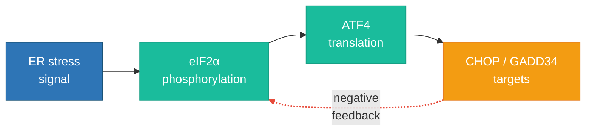
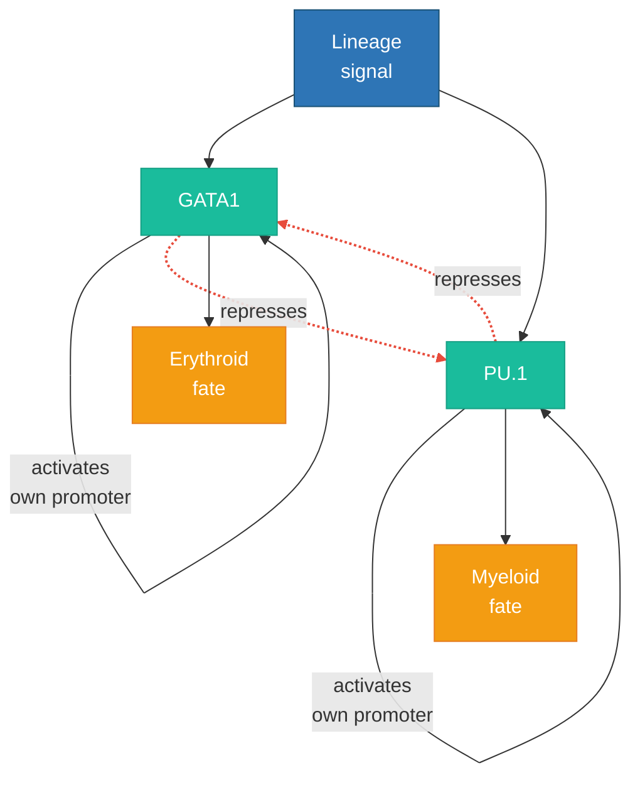
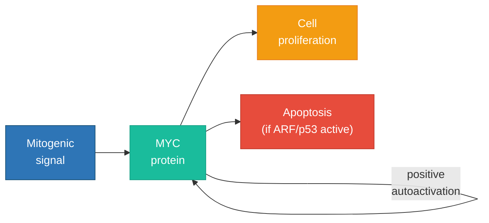
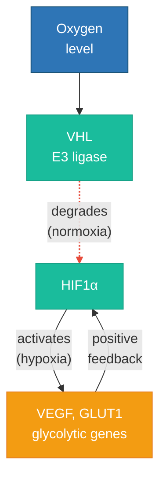
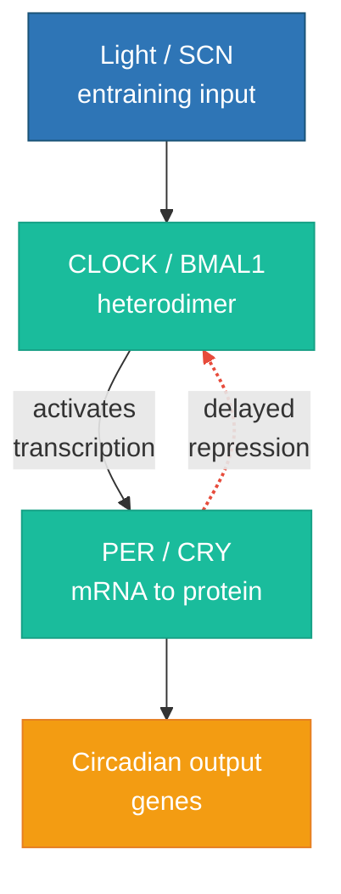
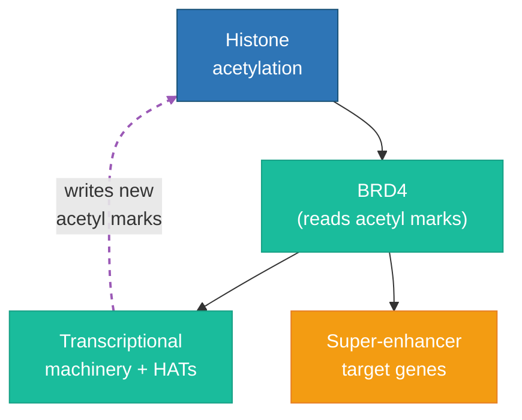

GLMP · Synthesis for biology · Draft for bioRxiv

# Genomic regulatory complexity and the limits of perturbation prediction: a synthesis for biologists

Companion overview to three working papers on foundational typology, logical primitives for gene regulation, and the first empirical stratification of virtual-cell benchmarks by circuit topology.

**Gary Welz**  
<gwelz@gc.cuny.edu>  
CUNY Graduate Center / New Media Lab · Genome Logic Modeling Project (GLMP)

Abstract

Machine-learning models that predict transcriptional responses to genetic perturbations are typically scored in aggregate across thousands of genes. Yet regulatory biology is heterogeneous: a feed-forward induction cascade, a homeostatic negative-feedback loop, a bistable lineage switch, a delayed oscillator, and a chromatin program that rewrites its own inputs pose different inferential challenges. The Genome Logic Modeling Project (GLMP) proposes a five-level “complexity class” ladder for mammalian gene circuits, motivated by analogies to how choice of primitives shapes formal theories in mathematics—an analogy used here only as heuristics, not as a claim of biological isomorphism to formal systems. A companion empirical study stratified 780 genes from the Replogle *et al.* (2022) K562 Perturb-seq benchmark by circuit class (using TRRUST-based regulatory subgraphs plus literature curation) and re-used published scores for sixteen perturbation-prediction pipelines, including the Arc Institute STATE model re-scored on the same top-twenty differentially-expressed-gene metric as the Nature Methods benchmark. Across methods, Class III (bistable or mutually reinforcing positive-feedback) targets were systematically harder to predict than Class I (acyclic feed-forward) targets: twelve of sixteen evaluations showed lower mean accuracy for Class III, and a one-sample *t*-test on the cross-method Class-III-minus-Class-I contrast yielded *t* = −3.55, *p* = 0.0015. Grammar-aware versus grammar-blind comparisons remained incomplete because of tool coverage limits. This synthesis, aimed at experimental and computational biologists, foregrounds those empirical findings and a concrete agenda—multi-line replication, gold-standard classification, single-cell attractor assays, richer topology-aware models, and stratified reporting—while relegating formal foundations to the cited technical companions.

**How to read this document.** Full mathematical development (foundational typology, dependency among axiomatic systems, proof-theoretic ordinals, and formal logic) appears in [Paper I](https://storage.googleapis.com/regal-scholar-453620-r7-podcast-storage/mathematics-processes-database/GLMP_Foundational_Typology.html). The mapping from Boolean and temporal operators to molecular mechanisms, transcriptome-as-state, and nine testable predictions appears in [Paper II](https://storage.googleapis.com/regal-scholar-453620-r7-podcast-storage/mathematics-processes-database/genome_as_computer_v2.html). Protocol detail, hypothesis register, robustness checks, and extended discussion of model scores appear in [Paper III](https://storage.googleapis.com/regal-scholar-453620-r7-podcast-storage/mathematics-processes-database/empirical_sequel_draft.html). Here we integrate the story for a biological audience and emphasize what can be tested next at the bench or in silico without reading the formal side in depth.

## 1. Introduction: why aggregate benchmarks may hide structure

High-throughput perturbation screens coupled with single-cell RNA-seq have made it possible to ask, for thousands of genes at once, how strongly any given computational model anticipates the transcriptional shift induced by CRISPR interference, knockout, or chemical mimicry. Leaderboards and community challenges rightly reward overall correlation between predicted and observed change vectors. They rarely ask whether accuracy is uniform across *types* of regulatory architecture. That omission matters if some architectures are intrinsically easier to learn from covariance patterns alone, while others require explicit representation of feedback, hidden cell states, or chromatin history.

The GLMP program began as an effort to visualize biochemical and gene-regulatory processes as typed, logic-style flowcharts so that both humans and algorithms could inspect the commitments behind a mechanistic story. From repeated curation emerged a simple observation: not all regulatory subgraphs look alike when drawn honestly. Some are shallow directed acyclic graphs from signal to promoter. Some add a single negative loop. Others close positive feedback or mutual repression, producing memory and discrete decision boundaries. Still others insert delays long enough to support oscillation, or chromatin-modifying activities that target their own regulatory DNA—architectures that resemble self-modifying programs more than static wiring diagrams.

Papers I and II propose naming five recurrent **topology classes** (I–V) and treating them as a ladder of increasing dynamical and inferential difficulty. The names deliberately echo discourse from computability theory, but **this synthesis does not assert that cells implement Peano arithmetic or Turing machines in any literal sense.** The mathematics papers use formal foundations as a *suggestive vocabulary*: if primitive choices change what a logical theory can express, perhaps the presence or absence of feedback primitives changes what can be inferred from observational omics alone. The only claim that must stand on its own for biologists is empirical: **does stratifying benchmark genes by coarse circuit topology reveal systematic differences in how well existing predictors perform?** Paper III answers yes for one large human dataset and a family of contemporary models. The present document summarizes that evidence, states limitations plainly, and outlines how independent groups could falsify or extend the pattern without adopting any particular formal metaphor.

The timing of that question is practical. Over the past three years, foundation-style models trained on enormous compendia of single-cell profiles have moved from imputation to *counterfactual* prediction: given a genetic or chemical intervention never seen in training, what expression vector should we expect? Commercial and academic “virtual cell” initiatives now advertise zero-shot generalization across cell types and species. Community benchmarks rightly emphasize held-out perturbations, leakage control, and calibration. What they still omit—because no standard reporting template exists—is **whether accuracy is homogeneous across regulatory contexts**. A model can look excellent on mean Pearson correlation while systematically failing on the subset of genes whose control logic requires history-dependence. Those genes are not obscure corner cases; they include master regulators of proliferation, stress adaptation, and differentiation that dominate cancer pharmacology.

GLMP does not compete with virtual-cell architectures. It supplies an orthogonal axis: **mechanistic topology inferred from prior knowledge graphs and literature**, coarse enough to assign hundreds of genes automatically yet fine enough to separate acyclic cascades from feedback-rich neighborhoods. The empirical sequel then asks whether existing predictors, treated as black boxes, already “know” that distinction implicitly. The fact that many do not—that accuracy drops where positive cycles appear in TRRUST—suggests either insufficient inductive bias or insufficient state variables in the training setup, or both. Either interpretation is actionable: it points toward richer latent-state models *and* toward better documentation of which perturbations should never be interpreted through bulk accuracy alone.

## 2. A five-class ladder in biological language

Throughout GLMP, **Class I** denotes regulatory neighborhoods that, when represented as directed graphs restricted to experimentally supported edges, contain **no directed cycle**: information flows from upstream signals or transcription factors toward target promoters without feedback through the subgraph itself. These are the circuits for which a snapshot of signaling state and chromatin accessibility often suffices to reason qualitatively about the direction of a perturbation. Many metabolic enzymes under simple induction, or immediate-early genes driven by MAP kinase cascades, approximate this idealization when the regulatory subgraph is truncated to transcription factors with high-confidence ChIP support.

**Class II** adds a single negative feedback arc: the regulated gene product, or a downstream consequence, damps the same input arm that activated it. Homeostatic circuits fit here; population-level predictions may still be tractable because fluctuations are suppressed rather than amplified across two stable basins. The distinction between Class I and II matters for timescale: the same gene may look feed-forward on hours-long stimulation experiments but reveal homeostatic closure once translation and feedback phosphorylation are tracked.

**Class III** is reserved for subgraphs that contain **positive feedback**, **mutual repression**, or other motifs that generate **multistability or sharp thresholds** in deterministic caricatures. Lineage decisions, stress toggles, and oncogene addiction scenarios populate this bin. The empirical paper emphasizes Class III because theory predicts the hardest learning problem when the model never observes which basin a cell occupied before perturbation. Even coarse scRNA-seq can sometimes reveal bimodality or broadened variance for such targets; bulk-derived training signals often wash those signatures out, which partially explains why predictors trained on pseudobulk or cell-mixture means miss the biology that matters clinically.

**Class IV** collects delayed negative-feedback architectures long enough to support **oscillation** rather than a fixed point. Circadian clocks are the canonical textbook illustration. In the current K562 benchmark slice, very few genes met strict Class IV criteria; any statement about Class IV-specific accuracy should be treated as provisional. When larger Class IV cohorts become available, the relevant prediction task may shift from “mean shift” to “phase shift,” requiring models that represent time explicitly rather than treating each perturbation as a steady-state counterfactual.

**Class V** flags circuits in which a chromatin or DNA-modifying enzyme participates in regulating its own expression or binding sites—a cartoon of **self-modifying control**. Assignment is sparse and noisy; the empirical analysis treats Class V statistics cautiously. Papers I–II discuss why, *if* such circuits approached unconstrained self-modification, pessimistic theorems from computability could in principle cap predictability. That chain is speculative; nothing in the K562 analysis depends on it. For bench scientists the operational takeaway is simpler: when chromatin remodelers sit on their own promoters or enhancers, perturbation outcomes may depend on cis configuration and allele-specific methylation that bulk gene lists rarely capture—another reason to stratify benchmarks rather than trusting a single scalar score.

Table 1 condenses the operational classification rules used in Paper III (full decision tree and motif illustrations appear there).

| Class | Informal criterion                                           | Biological cartoon                                       |
|-------|--------------------------------------------------------------|----------------------------------------------------------|
| I     | Acyclic regulatory subgraph among scored edges               | Inducible feed-forward control                           |
| II    | Single negative cycle                                        | Homeostasis, NF-κB–IκB–style buffering                   |
| III   | Positive or double-negative feedback cycle                   | Lineage switches, toggles, MYC-type autoactivation       |
| IV    | Delayed negative feedback spanning ≥ three mechanistic steps | Circadian delay loops                                    |
| V     | Self-targeting chromatin or DNA modification                 | DNMT3A- or EZH2-class self-regulation (rare assignments) |

## 3. Phase 1: Gene circuit classification

### 3.1 Benchmark gene set

The primary benchmark is the **Replogle *et al.* (2022) K562 Perturb-seq dataset** — genome-scale CRISPRi perturbations in K562 human chronic myeloid leukemia cells. This dataset perturbs approximately 5,000 essential genes with single-cell RNA-seq readout and is the standard benchmark used by STATE, CellOracle, and the Nature Methods 27-method comparison (2025). It is available in processed form on the CZI Virtual Cells Platform and in harmonized format via scPerturb.

### 3.2 Classification protocol

For each perturbed gene that encodes a transcription factor, signaling protein, or chromatin modifier, we classify the gene’s regulatory circuit by GLMP complexity class using the following evidence hierarchy:

| Priority | Source               | Method                                                                     | Confidence |
|----------|----------------------|----------------------------------------------------------------------------|------------|
| 1        | GLMP database        | Direct classification from existing typed flowchart                        | High       |
| 2        | Published literature | Well-characterized circuits (lac operon, p53-MDM2, Yamanaka factors, etc.) | High       |
| 3        | TRRUST v2 / ENCODE   | Known human TF-target interactions; classify by network motif topology     | Medium     |
| 4        | RegulonDB            | *E. coli* ortholog regulatory interactions (for conserved circuits)        | Medium     |
| 5        | GLMP pipeline        | LLM-generated typed flowchart from literature, classified by topology      | Low–Medium |

### 3.3 Classification criteria

Circuit class assignment follows the five-class ladder from Paper I:

| Class | Topology criterion                                             | Formal test                                           | Prototype example                             |
|-------|----------------------------------------------------------------|-------------------------------------------------------|-----------------------------------------------|
| I     | No feedback edges in regulatory subgraph                       | Directed acyclic graph (DAG)                          | Simple inducible promoters; JUN/AP-1 cascade  |
| II    | Negative autoregulation or negative feedback loop              | Single negative cycle in subgraph                     | HIF1A-VHL loop; NF-κB–IκB loop                |
| III   | Positive feedback or mutual repression (bistable)              | Positive cycle or double-negative cycle               | p53-MDM2 toggle; GATA1-PU.1; Yamanaka circuit |
| IV    | Mixed feedback with delay elements (oscillatory)               | Negative cycle with ≥3 nodes (repressilator topology) | CLOCK-BMAL1 circadian loop                    |
| V     | Self-modifying: circuit alters its own regulatory architecture | Chromatin modifier targets its own regulatory region  | DNMT3A self-methylation; EZH2 autosilencing   |

### 3.4 Circuit topology illustrations

The following GLMP-style flowcharts illustrate the topological distinction between classes. These are deliberately simplified to highlight the structural feature — the presence or absence of directed cycles — that determines the class. Full GLMP flowcharts with complete molecular detail for these and other regulatory circuits are available in the [GLMP database](https://storage.googleapis.com/regal-scholar-453620-r7-podcast-storage/glmp-database-table.html). Colors follow the GLMP palette: green = gene/protein, red = repression, blue = activation/signal, orange = regulatory outcome.

**Class I — Feed-forward cascade (JUN/AP-1).** Signal flows in one direction; no cycle. The perturbation response is fully determined by the current input.

**Class II — Negative feedback (ATF4 stress response).** A single negative cycle produces self-correction: the output damps the signal that produced it. The circuit is homeostatic.

**Class III — Bistable switch: GATA1 / PU.1 mutual repression.** Each transcription factor represses the other, creating two stable attractor states: high-GATA1 (erythroid fate) or high-PU.1 (myeloid fate). Once a cell “nucleates” into one state, the mutual repression lock maintains it. A grammar-blind model observing a snapshot cannot determine which attractor the cell has committed to. *This gene’s benchmark accuracy (mean Pearson *r* = 0.699) is below the Class I average (0.780).*

**Class III — Bistable switch: MYC autoactivation.** MYC protein activates its own transcription through a positive feedback loop. Above a threshold, the circuit locks into a high-MYC proliferative state — the “siphon” is self-sustaining. The initiating signal is no longer necessary. *Benchmark accuracy: mean Pearson *r* = 0.817, above Class I average — illustrating that not all Class III genes are hard to predict, but the class as a whole is.*

**Class III — Bistable switch: VHL–HIF oxygen sensing.** Under normoxia, VHL degrades HIF1α. Under hypoxia, HIF1α accumulates and activates a transcriptional program including genes that further stabilize the hypoxic state. The circuit exhibits bistable behavior around the oxygen threshold. *Benchmark accuracy: mean Pearson *r* = 0.921, the highest in Class III.*

**Class IV — Delayed negative feedback (circadian CLOCK–BMAL1 / PER–CRY).** Class IV denotes **mixed feedback with delay**: typically a negative loop spanning three or more nodes so that transcription–translation delays convert a simple negative feedback into **sustained oscillation** rather than a static toggle. The CLOCK–BMAL1 heterodimer activates *Per* and *Cry* genes; the accumulating PER–CRY complex feeds back to repress CLOCK/BMAL1-driven transcription after a lag, closing the loop. The relevant hidden variable is often **phase** (where the cell sits in the cycle), not only which attractor basin is occupied. *Only two benchmark genes fall in Class IV in our table (HDAC7, TFDP1); interpret aggregate Class IV statistics with caution.*

**Class V — Self-modifying chromatin (BRD4).** BRD4 reads acetylated histones and recruits the transcriptional machinery, which includes histone acetyltransferases that create more acetylation marks — modifying the regulatory architecture itself. The circuit rewrites its own program. *Benchmark accuracy: mean Pearson *r* = 0.876.*

## 4. Phase 2: Virtual cell model evaluation

### 4.1 Model selection

The original design called for a direct comparison between a grammar-blind model (STATE) and a grammar-aware model (CellOracle). In practice, we evaluated a broader set: 14 methods from the Nature Methods 27-method benchmark (2025) and Arc Institute’s STATE transformer, for a total of **16 grammar-blind evaluation rows** spanning diverse architectures: the fourteen published models plus STATE scored under both its native HVG metric and the benchmark DE20 metric (Paper III).

| Method               | Architecture                | Source                           |
|----------------------|-----------------------------|----------------------------------|
| scGPT                | Transformer (pre-trained)   | Cui *et al.* 2024                |
| GEARS                | Graph neural network        | Roohani *et al.* 2023            |
| GeneCompass          | Transformer (pre-trained)   | Yang *et al.* 2023               |
| GenePert             | MLP + gene embeddings       | Gao *et al.* 2024                |
| AttentionPert        | Attention-based             | Dong *et al.* 2024               |
| CPA                  | Variational autoencoder     | Lotfollahi *et al.* 2023         |
| scELMo               | Language model              | Liu *et al.* 2024                |
| bioLord              | Disentangled representation | Lotfollahi *et al.* 2024         |
| scouter              | Meta-learning               | Ji *et al.* 2024                 |
| linearModel          | Linear regression baseline  | Benchmark paper                  |
| trainMean            | Training mean baseline      | Benchmark paper                  |
| baseMLP              | MLP baseline                | Benchmark paper                  |
| baseReg              | Regularized linear baseline | Benchmark paper                  |
| baseControl          | Control baseline            | Benchmark paper                  |
| STATE (ST-HVG-Parse) | Transformer (virtual cell)  | Arc Institute, Hie *et al.* 2025 |

CellOracle (Morris Lab) was evaluated separately as the grammar-aware comparator, but its use was constrained: CellOracle can only simulate perturbations for genes that are transcription factors in its inferred GRN, limiting the direct comparison to a small subset. Paper III supplements this with a GRN topology analysis of the full CellOracle-inferred network.

### 4.2 Evaluation metrics

For the 14 benchmark methods, per-gene Pearson correlations between predicted and observed expression change vectors were obtained from the published benchmark results, evaluated on the top 20 differentially expressed genes per perturbation (DE20). For STATE, Paper III ran inference independently using the ST-HVG-Parse model on Google Colab (T4 GPU) and computed Pearson correlations across 2,000 highly variable genes, then **re-scored** the same predictions on DE20 for cross-method comparability. That difference in native versus harmonized evaluation scope is the main caveat when reading absolute STATE numbers; the class-stratified pattern is interpreted under a *common* metric within each analysis row. High-variable-gene panels dilute each perturbation’s signal across thousands of transcripts; DE20 concentrates evaluation on the genes the experiment moves most, so a model can show weak positive correlation on HVGs while failing the strongest responders on DE20.

## 5. Phase 3: Stratified analysis design

### 5.1 Primary analysis: the accuracy gradient

For each model and each metric, we compute the mean accuracy per circuit class and test for a monotonic decrease. The primary test is whether Class III (bistable) genes show systematically lower prediction accuracy than Class I (feed-forward) genes across methods.

### 5.2 Statistical tests

| Test                                      | Hypothesis | What it answers                                                           |
|-------------------------------------------|------------|---------------------------------------------------------------------------|
| One-sample *t*-test on C3−C1 differences  | H1         | Is the mean accuracy deficit for Class III significant across methods?    |
| Sign test (binomial)                      | H1         | Do more methods show C3 \< C1 than expected by chance?                    |
| Mann-Whitney U (per method)               | H1         | Within each method, do Class I and III distributions differ?              |
| OLS regression with effect-size covariate | Confound   | Does class predict accuracy after controlling for perturbation magnitude? |
| Effect-size matched subsampling           | Confound   | Is the class effect robust to matched controls?                           |
| Bootstrap CI                              | All        | 95% confidence intervals on per-class accuracy means                      |

For each method *m*, define Δ*m* = (mean *r* for Class III targets) − (mean *r* for Class I targets); negative values imply Class III is harder. Paper III reports one-sample *t*-tests and sign tests on these contrasts, with leave-one-method-out sensitivity checks.

## 6. “Genome as computer”: metaphor only

Paper II develops a detailed isomorphism-style lexicon: Boolean operators implemented by combinatorial promoter logic, temporal operators mapped to single-cell trajectories, the transcriptome as a high-dimensional readout analogous to a machine state, and predictions about noise geometry across classes. For most experimental groups, only a lightweight version of that story is needed.

**Metaphor in three sentences.** (i) Treat measured expression and chromatin marks as a *state vector* you observe through noisy sensors. (ii) Treat regulatory DNA plus bound factors as a *program* that updates that state when signals or drugs change. (iii) Treat feedback as the qualitative transition from “one-step causal stories usually suffice” to “history and hidden compartments matter.” Nothing in the empirical test requires subscribing to stronger claims about Rice’s theorem or Turing completeness; those are forward-looking theoretical hazards, not measured quantities.

The actionable piece for biologists is predictive: **if a target gene sits in a Class III subgraph under TRRUST-style literature edges, aggregate accuracy is a poor summary statistic** because successful prediction may require inferring latent commitment variables that bulk training signals under-specify.

Readers who prefer diagrams to axioms may consult the GLMP methods primer on Mermaid flowcharts for perturbation design, which walks through lac-operon style logic charts, hybridization with RegulonDB-style entity completeness, and layered use of public databases without requiring any formal background ([HTML draft](https://storage.googleapis.com/regal-scholar-453620-r7-podcast-storage/mathematics-processes-database/bioRxiv_Mermaid_Flowcharts_Perturbation_Methods_Draft.html)).

## 7. Analysis cohort and execution notes

Paper III should be cited for full protocol and file-level provenance. In brief: the GLMP team harmonized Replogle K562 perturbations with the published per-gene benchmark scores and retained **780 genes** with sufficient cells, non-control perturbations, and TRRUST v2-based regulatory context for class assignment. Perturbation predictors were not retrained; published correlations were reused where available. Under DE20, STATE also shows Class III harder than Class I, removing an apparent outlier that appeared only when STATE was judged solely on its native 2,000-HVG panel.

## 8. Main empirical results

**Across-model pattern.** Twelve of sixteen method evaluations (including STATE on its DE20 rescore and a deliberately minimal TRRUST-based signed propagation baseline added in robustness testing) report lower mean Pearson *r* for Class III than for Class I. The mean of Δ is negative; the parametric test yields *t* = −3.55 with *p* = 0.0015. A conservative sign test likewise rejects the null of equal difficulty at conventional thresholds. In plain language: **if your perturbation hits a bistable-style neighborhood, mainstream predictors struggle more than when they hit a feed-forward neighborhood**, even when every model sees the same training corpus and the same held-out genes.

**Effect size modesty.** Individual methods vary; some high-capacity transformers still achieve respectable Class III accuracy on certain genes (Paper III tabulates gene-level exemplars such as GATA1/PU.1 versus MYC autoactivation versus VHL–HIF). The synthesis-level point is not that Class III is impossible to learn, but that **topology-stratified reporting exposes structure that leaderboard averaging conceals**.

**Grammar-aware hypothesis still open.** A motivating hypothesis predicted that models with explicit gene-regulatory-network inductive bias would close more of the Class III gap than purely statistical sequence or expression autoencoders. CellOracle was the available grammar-aware comparator but only covers transcription-factor perturbations, intersecting partially with the 780-gene table. The empirical sequel therefore treats grammar comparisons as partial. A TRRUST diffusion baseline—signed propagation on literature edges, scored on DE20—did not erase the Class III deficit; if anything its class gap was steeper than the blind ensemble mean, cautioning that *having* a network diagram is not sufficient without calibration, directionality, and context. Richer simulators or hybrid graph-transformer architectures remain to be tested at genome scale.

**Why meta-analysis across methods matters.** Any single architecture might fail Class III genes for idiosyncratic reasons—tokenization of gene names, masking scheme, or optimizer random seed. Pooling fourteen benchmarked families plus STATE (DE20) plus the deliberately naive propagation control tests whether a *systematic* biological variable tracks difficulty. The sign test is deliberately coarse: it asks only how often Class III underperforms Class I, not by how much. That twelve of sixteen lines agree is therefore stronger evidence than a single flagship model because it reduces the odds that one training recipe or one dataset artifact generated a spurious gap.

**Clinical translation (speculative but grounded).** Drug combinations that hit nodes inside mutual-inhibition motifs—for example, lineage plasticity in acute leukemia—often show non-additive responses. If virtual-cell tools systematically underperform on Class III targets, portfolio decisions that rely solely on predicted synergy from expression space may overweight feed-forward targets and underweight toggle-like programs. This is not an argument against computation; it is an argument for *disclosure*: regulatory-motif summaries should accompany therapeutic target nominations wherever perturbation models inform dose escalation.

## 9. Interpretation for experimentalists

Stratified difficulty does not tell you which model to buy; it tells you **when to distrust any model**. For a Class I target, a high leaderboard score is plausibly informative about off-target spread and dose response. For a Class III target, a high population-level correlation can still mask systematic failure to assign cells to the correct post-perturbation basin, which is exactly the failure mode single-cell assays are meant to catch. Experimental follow-ups should therefore prioritize **branch-point designs**: paired perturbations that disambiguate attractors, time courses that resolve hysteresis, and reporters placed on both arms of a putative toggle.

From a data-stewardship perspective, the GLMP classification is imperfect. TRRUST is literature-mined, human-biased, and incomplete; edges lack directionality confidence in places; the mapping from undirected or context-conditional interactions to a directed subgraph for classification introduces noise. The empirical effect survived that noise under a conservative protocol, which strengthens the case that the signal is real, but it also implies that **better gold standards will sharpen rather than erase the pattern** if the biology is genuine.

Finally, GLMP’s flowcharting practice and the statistical meta-analysis are mutually reinforcing. Charts force authors to state which edges they believe exist; the benchmark then reveals whether black-box models respect those edges statistically. When they disagree, the productive next step is not “trust the neural net,” but **design a perturbation that adjudicates between the two topologies**—for example, decoupling a proposed positive-feedback arm with a CRISPR interference tile through the relevant enhancer, or measuring nascent transcription after a pulse-chase to separate feed-forward from feedback delay.

## 10. Limitations

No secondary-analysis paper can escape the limits of its upstream objects. Here the largest constraint is **dependence on a single deeply characterized cancer line**. K562 cells are suspended in a particular epigenetic and signaling milieu; a regulatory edge annotated from generic TRRUST literature may be inactive in erythroid-biased culture conditions or, conversely, may miss context-specific rewiring that only appears after differentiation cues. Until the same protocol is replayed on at least one additional line with comparable perturbation depth, the field should treat the headline *p*-value as *internal* replication of a pattern within K562 rather than as a universal law of machine learning on genomes.

A second constraint is **label transfer from literature graphs to directed subgraphs**. Many TRRUST edges lack mechanistic direction or combinatorial logic; curators must decide whether TF A represses B directly or indirectly, and whether parallel pathways justify retaining multiple edges. GLMP’s conservative rules bias toward under-assigning Class III when evidence is ambiguous, which should work against finding a Class III penalty. That the penalty appears anyway is reassuring, but it does not excuse complacency: high-quality, experimentally resolved networks (ENCODE knockdowns, HiChIP loops, protein half-life data) should eventually replace or augment TRRUST for classification.

- **Single cell line and context.** K562 is convenient, deeply sequenced, and benchmarked, but not representative of tissues, differentiation states, or immune microenvironments.
- **Classification noise.** Automated motif rules disagree with expert curation on borderline cases; Class IV and V counts are small.
- **Predictor heterogeneity.** Training sets, gene sets, and preprocessing differ across methods despite harmonized scoring on DE20 where available.
- **Causal direction.** The analysis is observational at the level of circuit labels; it does not prove that feedback topology *causes* hardness, only that hardness covaries with coarse topology under current labels.
- **Batch confounding.** If certain functional gene classes are enriched in Class III and also enriched for technical dropout or amplicon length biases, partial mediation by nuisance covariates is possible. Residualizing accuracy against gene length, expression level, and essentiality scores is an obvious robustness extension.

## 11. Recommended experiments and analyses (near term)

1.  **Multi-line replication.** Recompute class labels on Perturb-seq atlases that include RPE1, Jurkat, iPSC-derived lineages, or primary cells where coverage permits. The K562 result could be lineage-specific if stress signaling rewires subgraphs. A minimal success criterion would be replication of the *sign* of mean Δ for at least ten of fourteen benchmarked methods on a second deeply profiled line, even if absolute correlations differ because of growth conditions.
2.  **Expert adjudication subset.** Curate two hundred genes with gold-standard manual diagrams (including chromatin context where relevant) and quantify Cohen’s κ between TRRUST-automated labels and expert labels. Re-run the meta-analysis restricted to the high-confidence subset. If the effect disappears, the hypothesis is tied to classification noise; if it strengthens, the TRRUST simplification was conservative.
3.  **Single-cell attractor assays.** For Class III targets with sufficient cells, quantify Sarle’s bimodality coefficient on control expression, then relate prediction errors to incorrect basin assignment rather than mean shift alone. A practical protocol is to gate cells by latent space clusters before scoring predictions, measuring whether accuracy improves when the model is evaluated within each putative basin.
4.  **Prospective stratified benchmarks.** When publishing new virtual-cell models, report accuracy by GLMP class (or an equivalent motif taxonomy) alongside aggregate metrics. Journal checklists could add a single optional table without burdening authors who lack network priors: “if a regulatory graph is available, stratify.”
5.  **Richer grammar-aware baselines.** Compare graph neural networks with masked message passing on the same TRRUST subgraph, trained with identical gene sets, to quantify how much of the Class III gap is recoverable with modest architectural inductive bias. The goal is not to beat every transformer, but to estimate how much hardness is structural versus representational.
6.  **Cross-species bacterial tests.** RegulonDB-quality networks for *E. coli* allow cleaner acyclic versus feedback discrimination; coupling a prokaryotic Perturb-seq benchmark (where available) would stress-test the ladder outside mammalian signaling idiosyncrasies. Many feedback motifs are phylogenetically ancient, but degree distributions differ, offering a natural robustness check.
7.  **Integration with chromatin imaging.** Class V assignments will remain speculative until self-modifying loops are validated with allele-specific Hi-C, methylation reporters, or rapid degradation of the modifying enzyme. Multiome time courses could test whether predictors miss Class V targets because they lack chromatin inputs entirely, or because they lack feedback-aware heads.
8.  **Chemical and combinatorial perturbations.** The current benchmark stresses CRISPRi of coding genes. Drug combinations that toggle feedback arms without deleting nodes altogether may present even sharper tests of whether models capture topology-sensitive dynamics.

## 12. Longer-horizon theoretical work (optional for biology labs)

Formal proof that any given chromatin circuit is Turing-complete is not on the critical path for experimental validation. It remains a mathematics and proof-assistant agenda tied to Papers I–II. Biology groups can treat the formal layer as **scaffolding**: useful for generating predictions (noise shape, stratified benchmarks, grammar-aware design) even if the deepest claims remain open.

## 13. Conclusion

Virtual-cell models are evaluated as if all genes posed the same statistical learning problem. GLMP’s five-class topology ladder—explained here in purely biological language, with mathematics left as optional metaphor—suggests otherwise. The first large-scale stratification on a standard Perturb-seq benchmark finds that Class III targets are consistently harder for a broad swath of contemporary predictors, with meta-analytic significance across methods. That result should be replicated, refined with better network priors, and translated into experimental designs that expose hidden states. If it holds, it implies a practical norm: **report accuracy by regulatory architecture, not only by aggregate correlation**, because the aggregate can hide failures exactly where biology is most decision-like.

## References (selected)

1.  Replogle JM *et al.* Mapping information-rich genotype-phenotype landscapes with genome-scale Perturb-seq. *Cell* 185, 2559–2575 (2022).
2.  Kernfeld EM *et al.* Performance assessment of deep-learning-based models for predicting transcriptional responses to unseen chemical and genetic perturbations. *Nat Methods* (2025); supplementary benchmark data reused in Paper III.
3.  Han H *et al.* TRRUST v2: an expanded reference database of human and mouse transcriptional regulatory interactions. *Nucleic Acids Res* (2018).
4.  Gama-Castro S *et al.* RegulonDB version 10.5: tackling challenges to unify classic and high throughput knowledge of *E. coli* K-12 transcription regulation. *Nucleic Acids Res* (2016).
5.  Welz G. *Primitive Relations, Computational Complexity, and a Conjecture on the Genomic Computational Class* (GLMP Working Paper I, 2026). [HTML](https://storage.googleapis.com/regal-scholar-453620-r7-podcast-storage/mathematics-processes-database/GLMP_Foundational_Typology.html)
6.  Welz G. *The Genome as Computer: Logical Primitives, Runtime States, and the Computational Limits of Biological Prediction* (GLMP Working Paper II, 2026). [HTML](https://storage.googleapis.com/regal-scholar-453620-r7-podcast-storage/mathematics-processes-database/genome_as_computer_v2.html)
7.  Welz G. *Circuit Class Predicts Virtual Cell Model Accuracy: An Empirical Test of the Genomic Computational Complexity Hypothesis* (GLMP Working Paper III, 2026). [HTML](https://storage.googleapis.com/regal-scholar-453620-r7-podcast-storage/mathematics-processes-database/empirical_sequel_draft.html)

Draft synthesis for bioRxiv posting · not peer-reviewed · April 2026  
Suggested bioRxiv category: Systems biology / Computational biology  
Source file maintained alongside GLMP working papers.
