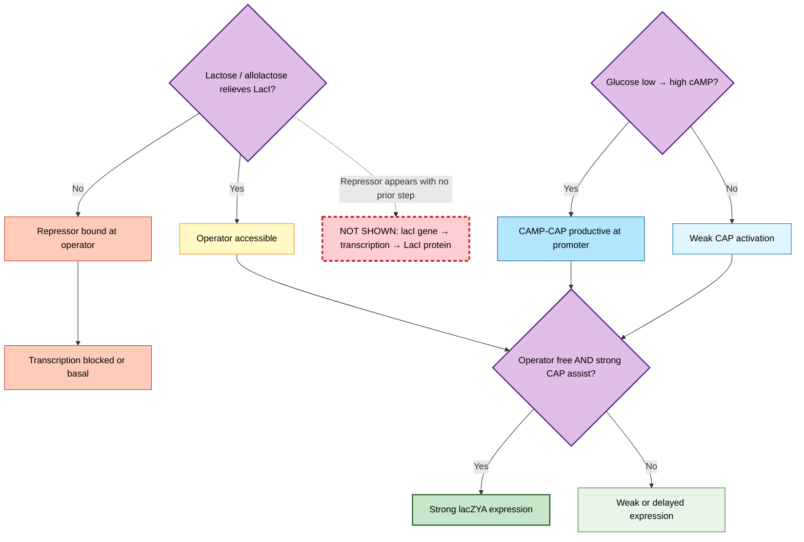
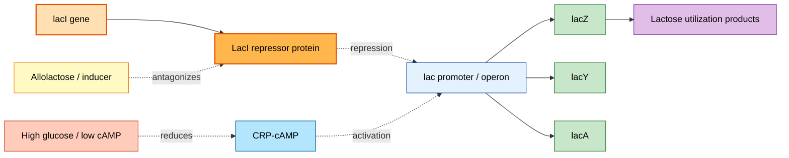
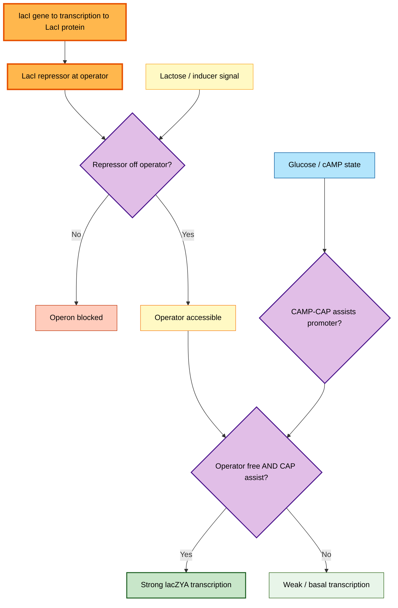

**Draft for bioRxiv / methods submission.** Not peer-reviewed. Text and figures may change before posting.

# Mermaid flowcharts for perturbation design: diagrams-as-code, curated databases, and the *E. coli* lac operon as a worked example

A methods-oriented primer for investigators combining large language models, RegulonDB-class resources, and logic-style process charts

**Gary Welz**  
<gwelz@gc.cuny.edu> · CUNY Graduate Center / New Media Lab  
Genome Logic Modeling Project (GLMP)  
Chan Zuckerberg Biohub Network (community member)  
Draft date: May 2026

## Recommended hands-on before reading the methods sections

In any contemporary large language model, run the following prompt verbatim (paste as written):

Use mermaid markdown format to make a flowchart of the Lac Operon and deliver it to me as an html file.

Inspect the returned HTML. Then issue a *second* prompt of the same form for **any other biological process** you use in the lab or in silico (pathway, signaling cascade, drug mechanism). The remainder of this draft assumes familiarity with how variable, detailed, and revisable such outputs are—and why reconciliation with curated data remains necessary.

## Abstract

Planning genetic, pharmacological, or nutritional perturbations is easier when the investigator can state, in advance, which molecular levers are plausible and which readouts would discriminate competing mechanisms. Logic-style flowcharts—authored as *diagrams-as-code* (here using **Mermaid** markdown)—provide a lightweight, versionable complement to pathway databases, genome browsers, and machine-learning predictors. This methods paper distills a seminar-tested workflow for a general research audience: we motivate text-based diagrams in wet-lab and computational pipelines; we compare three deliberately different encodings of the classical *Escherichia coli* lactose (*lac*) operon—a **literature-first logic diagram** with explicit Boolean-style gates, a **RegulonDB-emphasis regulatory wiring diagram** without those gates, and a **hybrid diagram** that retains interpretive logic while adding database-grounded entities (notably explicit *lacI* expression); we explain why the full two-input induction condition (inducer present and catabolite repression relieved) appears only in some encodings; and we recommend *layered hybridization* (regulatory backbone + literature logic + identifier and parts audits) instead of naively merging incompatible ontologies. No bespoke software is required beyond ordinary LLM access, Mermaid rendering, and public databases.

## 1. Introduction

The *lac* operon remains the canonical bacterial example of integrating environmental signals, transcription factors, and promoter logic.[1](#r1) Contemporary laboratories rarely study it in isolation, but it is ideal as a *tutorial system*: many curated representations exist, so **source choice** becomes visible as scientific information rather than as an invisible preprocessing step.

Meanwhile, perturbation-forward workflows—CRISPR screens, chemical genetics, single-cell readouts, virtual-cell-style predictors—benefit from an explicit, criticizable sketch of **inputs, branch points, feedback, and candidate measurements** before budget is committed. A flowchart is not a mechanistic ordinary differential equation model and not a trained deep network; it is a **hypothesis artifact** suitable for group review, supplementary files, and teaching.

**Mermaid** is a widely supported markdown-adjacent language for flowcharts and related diagrams; source text diffs cleanly in Git and renders in browsers, notebooks, and static site generators.[2](#r2) Modern LLMs can emit fenced `mermaid` blocks from natural language, which accelerates first drafts but *increases* the obligation to validate against authoritative resources: prompt and model choice change topology and node identity.

## 2. Objectives for the practicing investigator

- State **what could change** under a planned intervention before locking readouts or model architecture.
- Maintain **diagrams-as-code** beside literature notes and analysis scripts.
- Combine **LLM-assisted layout** with **RegulonDB-class** (or organism-equivalent) regulatory facts without collapsing distinct abstraction levels into one unreadable graph.
- Treat **disagreement between diagram sources** as data—analogous to comparing alignment or quantification pipelines.

## 3. Role alongside transcriptomics and predictive models

High-dimensional expression or chromatin data and modern predictors answer different questions than a hand-specified logic chart. The chart’s job is to make **conditional structure** discussable: which environmental axes gate which genes, where redundancy may hide causal effects, and which branch-point perturbations would be most informative. It should complement—not replace—controlled experiments and quantitative models.

## 4. Practical properties of Mermaid in research groups

- **Text → vector diagram:** the same source renders in CI documentation, lab wikis, and supplementary PDF pipelines.
- **Collaboration:** pull requests on diagram source are interpretable; meeting-driven edits are quick.
- **LLM interface:** models can propose structure; human authors remain responsible for citations, organism fit, and experimental feasibility.

## 5. LLM-first *lac* charts: what to expect

A well-posed conversational prompt often yields a surprisingly detailed first pass: two-input logic (allolactose / LacI and glucose / cAMP–CRP), default OFF at the operator, graded induction, sometimes a feedback arc as inducer is consumed. Reliability varies by model version and prompt; treat any auto-generated chart as **revision zero** to be checked against reviews and databases.

## 6. Three encodings of the same operon

GLMP-style public comparisons (see viewer linked below) contrast multiple evidence mixes for one operon. For methods exposition we isolate **three** complementary styles—without the older “V1/V2” labels that confused seminar audiences. Names here are descriptive only.

### 6.1 Literature-first logic diagram

Built from textbook-style reasoning, this encoding foregrounds **explicit AND-style integration** (e.g. strong transcription when the operator is free *and* CAP is productively engaged) and separates high-glucose / low-cAMP branches. It is optimized for *pedagogy and perturbation intuition*, not for locus tags.

**What is typically *missing* here:** there is **no** first-class node for ***lacI* transcription** or for the **gene → protein** production of the repressor. “LacI” appears only inside the wording of the first diamond—the repressor is *assumed* to exist whenever lactose logic is discussed. That is fine for high-level logic, but it hides a real experimental lever (CRISPRi on *lacI*, titration of repressor copy number, etc.).

Figure A. Literature-first logic. **Purple diamonds** = explicit Boolean-style questions. **Green** = strong transcription outcome. **Red dashed box** = what this encoding usually leaves implicit (no biosynthesis path for LacI).

**Read Figure A against Figure C:** the red dashed node has *no counterpart* in the main flow above—the hybrid instead inserts a real chain of orange nodes for *lacI* expression before any “repressor off operator?” question.

### 6.2 RegulonDB-emphasis regulatory wiring

A chart faithful to how **RegulonDB** (and similar TF→target resources) represent *E. coli* transcriptional regulation centers **who regulates whom** with signed or labeled edges; it does not, by itself, encode the full Boolean “both conditions” story as explicit gate nodes. It excels at **entity completeness for regulatory interactions**.[3](#r3)

Figure B. Regulatory wiring emphasis (schematic). **Orange** highlights the same *lacI* gene → protein spine RegulonDB-style resources encode as first-class entities. There are still **no purple AND diamonds**—combining “operator free” with “CAP assist” is left to the reader.

### 6.3 Hybrid diagram (literature logic + RegulonDB entity completeness)

The **hybrid** merges interpretive structure from reviews and LLM drafts with **database-grounded entities**. Concretely for *lac*, one adds an explicit step for ***lacI* transcription → LacI protein** upstream of operator control. That node matters for real perturbations (e.g. tuning repressor dosage) that a purely narrative “repressor exists” arrow can elide. Boolean-style gates from the literature-first chart are retained where they clarify conditionality.

**Exactly one structural addition vs. Figure A:** the two **orange** nodes at the top—*lacI* biosynthesis—are the RegulonDB-class spine that Figure A’s red “NOT SHOWN” box warned was missing. The **purple diamonds** and the final **green** transcription outcome use the same color language as Figure A so the *logic* layer is visually comparable; only the orange chain is new.

Figure C. Hybrid. **Orange** = explicit *lacI* gene → protein (RegulonDB-style completeness). **Purple diamonds** = same style of Boolean questions as Figure A. **Green** = strong lacZYA output.

**Visual diff A → C:** follow the orange boxes—Figure A has no such path; Figure C inserts the same biological spine already drawn in orange in Figure B, then reconnects it to the purple logic diamonds.

### 6.4 At-a-glance: literature-first vs. hybrid

| Feature                                    | Literature-first (Fig. A)                                  | Hybrid (Fig. C)                                          |
|--------------------------------------------|------------------------------------------------------------|----------------------------------------------------------|
| *lacI* gene → mRNA → LacI protein          | **Absent** (repressor “appears” only inside question text) | **Present** as two orange nodes at the top of the graph  |
| Explicit AND gate for strong transcription | Yes (purple diamond)                                       | Yes (same color convention)                              |
| Perturbation you can read off the picture  | Nutrients, operator, CAP branch                            | Those **plus** tuning *lacI* expression as its own lever |
| RegulonDB-style entity completeness        | Not the goal                                               | Explicitly merged into the logic chart                   |

Interactive multi-encoding views for the same operon (many additional source mixes exist in the public corpus) are available at the GLMP demo viewer:  
<https://storage.googleapis.com/regal-scholar-453620-r7-podcast-storage/glmp-v2/viewer_demo/glmp-viewer-demo-v1-v6.html?process=ecoli_lac_operon&version=v1>

## 7. Why the two-input induction condition is not automatic in database-native views

Strong induction requires relief of LacI-mediated repression *and* favorable catabolite control (often summarized as glucose scarcity → sufficient cAMP for CRP). Textbook diagrams express that as **AND** logic. Curated regulatory databases excel at listing regulators, targets, and evidence; they do not always export that **simultaneous** requirement as explicit gate nodes. LLM- or review-driven charts supply that interpretive layer—subject to validation—while RegulonDB-class edges supply **who is connected to whom**.

## 8. Layered hybridization (recommended workflow)

1.  **Regulatory backbone:** TF→gene resolution from a trusted resource (for *E. coli*, RegulonDB or equivalent).
2.  **Interpretive overlay:** literature or LLM-assisted gates and feedback arcs where they clarify conditionality.
3.  **Parts audit:** EcoCyc / BioCyc for enzyme identities and reactions—often checked rather than merged as raw topology.[4](#r4)
4.  **Identifier layer:** KEGG or model-organism locus tags attached as node metadata after topology stabilizes.[5](#r5)

Naive union of every node type from multiple ontologies typically **obscures** the very branch logic that makes diagrams useful for perturbation planning.

## 9. Prompt sensitivity

Same pathway, same organism, different natural-language instructions (detail level, whether to foreground CRP, metabolism vs. regulation) yield different Mermaid topologies. Best practice: generate two charts, diff the source, reconcile against one primary review figure or database page, and archive both the Mermaid text and the citation in supplementary material.

## 10. Operational habit: tools before sunk cost

Investigators benefit from routinely pairing literature search, structured databases, and diagram-as-code so that **inputs, branch points, and feedback** are explicit before large experiments or model training runs. Public GLMP galleries illustrate how source mixtures change charts; they are optional references, not prerequisites.

## 11. Evidence buckets for perturbation design

Real projects combine:

1.  Primary literature and reviews (mechanism, conditions).
2.  Pathway and interaction databases (Reactome, KEGG, WikiPathways, BioCyc; STRING for functional linkage).[6](#r6)–[8](#r8)
3.  Gene-centric resources (NCBI Gene, UniProt, Ensembl, GO).
4.  Regulatory layers (RegulonDB, Abasy-class summaries where available; refs. [3](#r3), [9](#r9)).
5.  Perturbation execution (reagents, libraries, chemistry).
6.  Data archives for realistic readouts (e.g. GEO).[10](#r10)

## 12. What logic charts add on top of databases and papers

| Typical resources                     | Logic-style flowchart                                           |
|---------------------------------------|-----------------------------------------------------------------|
| Gene lists and canonical pathway maps | Explicit branching and AND/OR reasoning under stated conditions |
| Static lookup-optimized maps          | Discourse layout: “if this edge is removed, what fails first?”  |
| Perturbation methods                  | Menu of informative interventions tied to mechanism sketch      |

## 13. Synthesis

> Databases summarize what is connected; papers record what was measured under stated designs; a logic flowchart helps investigators choose perturbations that disambiguate mechanisms and anticipate qualitative directions before committing full experimental or computational cost.

## Data and code availability

Public GLMP process JSON and viewers reside on Google Cloud Storage; the lac operon multi-viewer URL is given in §6. The GLMP flowchart database (~108 typed regulatory circuits) is available at:  
https://storage.googleapis.com/regal-scholar-453620-r7-podcast-storage/glmp-database-table.html  
The GitHub repository for the full GLMP paper series is:  
https://github.com/garywelz/glmp  
No new experimental data were generated for this methods paper.

## Acknowledgments

The layered hybridization workflow described here was developed in the context of the Genome Logic Modeling Project (GLMP). The three lac operon encodings were refined through seminar presentations at the CUNY Graduate Center. The author thanks Prof. Konstantinos Krampis (Hunter College / CUNY) for discussion of perturbation design workflows and biological validation of GLMP circuit classifications. No new experimental data were generated for this paper. All Mermaid diagrams were authored by the corresponding author and rendered using the Mermaid JavaScript library.

## References

1.  Jacob F, Monod J. Genetic regulatory mechanisms in the synthesis of proteins. *J Mol Biol*. 1961;3(3):318–356.
2.  Mermaid documentation. <https://mermaid.js.org/> (accessed 2026).
3.  Gama-Castro S, et al. RegulonDB: a database of transcriptional regulation in *Escherichia coli* K-12. *Nucleic Acids Res*. (current database issue). <https://regulondb.ccg.unam.mx/>
4.  Keseler IM, et al. EcoCyc: enriching the BioCyc collection of databases. *Nucleic Acids Res*. 2021;49(D1):D608–D612.
5.  Kanehisa M, Furumichi M, Sato Y, Kawashima M, Ishiguro-Watanabe M. KEGG for taxonomy-based analysis of pathways and genomes. *Nucleic Acids Res*. 2023;51(D1):D587–D592.
6.  Gillespie M, et al. The Reactome Pathway Knowledgebase 2024. *Nucleic Acids Res*. 2024;52(D1):D672–D678.
7.  Martens M, et al. WikiPathways: connecting communities. *Nucleic Acids Res*. 2021;49(D1):D613–D621.
8.  Szklarczyk D, et al. The STRING database in 2025. *Nucleic Acids Res*. 2025;53(D1):D638–D646.
9.  Escorcia-Rodríguez JM, Tauch A, Freyre-González JA. Abasy Atlas v2.2. *Comput Struct Biotechnol J*. 2020;18:1228–1237.
10. Barrett T, et al. NCBI GEO: archive for functional genomics data—updated. *Nucleic Acids Res*. 2013;41(D1):D991–D995.

**Suggested bioRxiv category:** Bioinformatics / Systems biology.  
**Target journals:** Bioinformatics (Oxford); PLOS Computational Biology (Methods).  
**Correspondence:** <gwelz@gc.cuny.edu>
