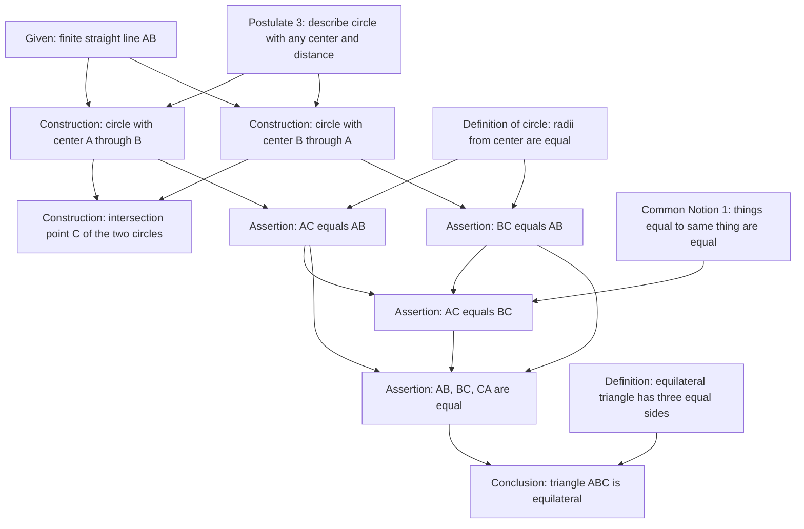
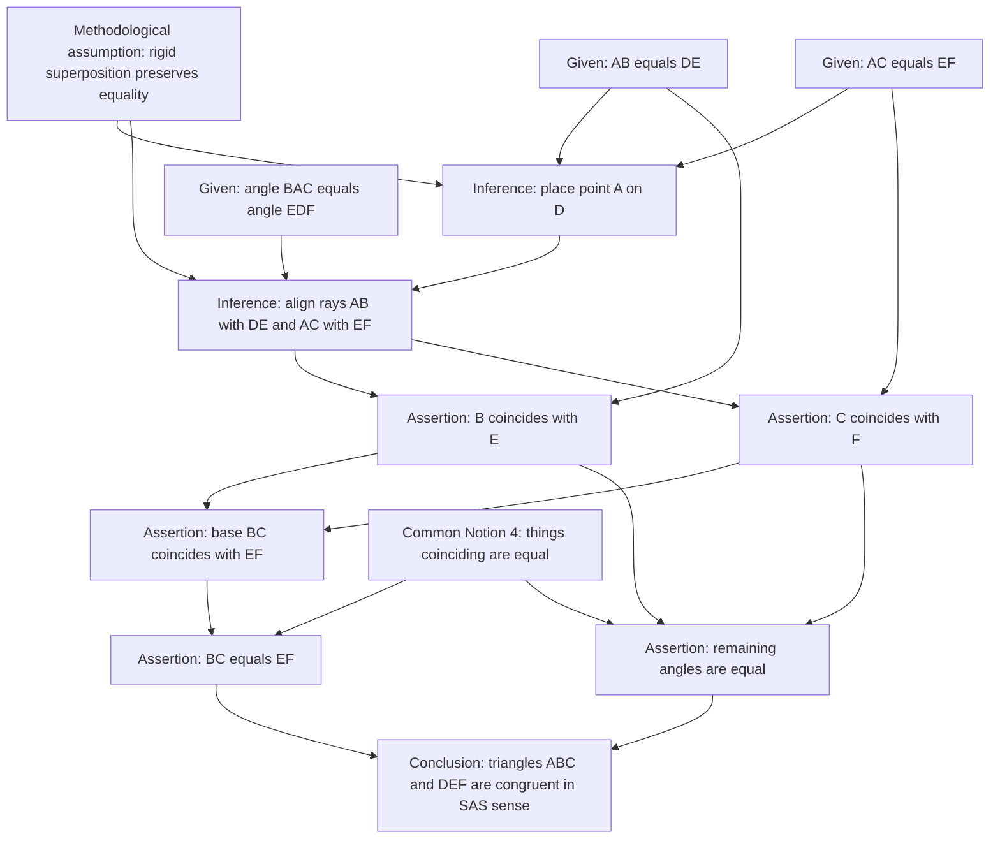
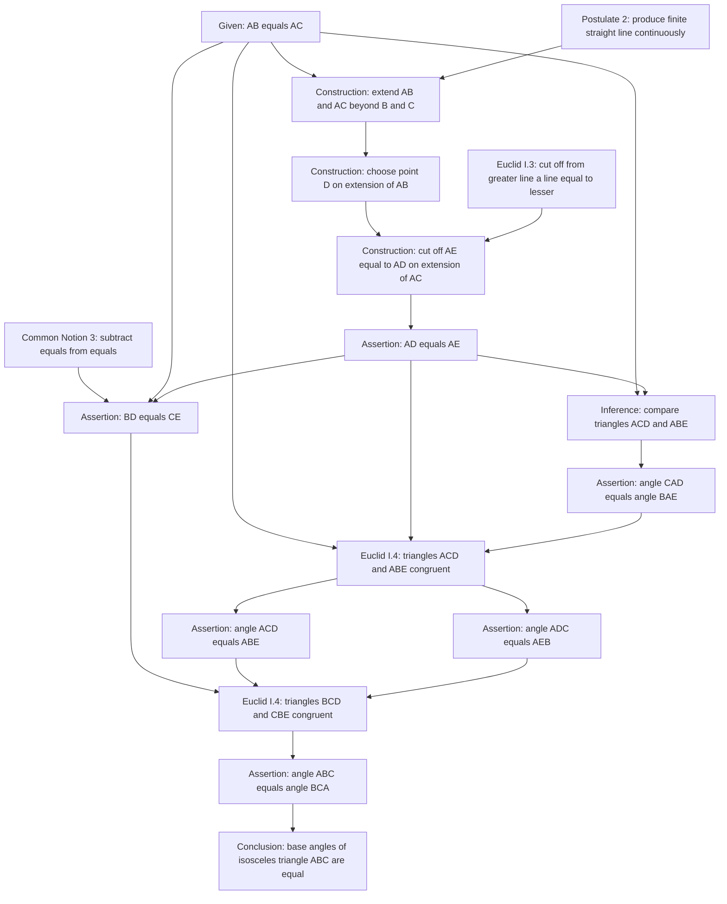

# Euclid Book I Pilot Proof Graphs

These examples test whether proof graphs can represent early Euclidean reasoning without collapsing construction, assertion, and prior theorem dependency into a single undifferentiated arrow.

## Euclid I.1: Equilateral Triangle on a Given Segment

Metadata:

- `id`: `euclid-i-1-equilateral-triangle`
- `graph_kind`: `hybrid`, mostly dependency with construction steps
- `granularity`: `medium`
- `temporary_assumptions`: none
- `algorithm_capsules`: compass-and-straightedge construction pattern
- `complexity`: 12 nodes, 14 edges, depth 5

Source note: Euclid Book I, Proposition 1, in the usual Heath-style paraphrase: on a given finite straight line, construct an equilateral triangle.

Design note: the graph is useful because it distinguishes the construction of point `C` from the equality claims that use the definition of a circle.

## Euclid I.4: Side-Angle-Side Congruence

Metadata:

- `id`: `euclid-i-4-sas-congruence`
- `graph_kind`: `dependency`
- `granularity`: `medium`
- `temporary_assumptions`: none, but contains a methodological caveat
- `algorithm_capsules`: none
- `complexity`: 13 nodes, 15 edges, depth 5

Source note: Euclid Book I, Proposition 4: if two triangles have two sides respectively equal and the included angles equal, their bases, remaining angles, and whole triangles are equal. The classical proof uses superposition; modern treatments often replace or formalize this with a congruence axiom.

Design note: this is a stress test for historical proof representation. The graph should not pretend the superposition move is an ordinary postulate from Euclid's explicit list. It should be a visible methodological assumption or replaced by a modern congruence axiom in a variant graph.

## Euclid I.5: Base Angles of an Isosceles Triangle

Metadata:

- `id`: `euclid-i-5-base-angles-isosceles`
- `graph_kind`: `dependency`
- `granularity`: `medium`
- `temporary_assumptions`: none
- `algorithm_capsules`: none
- `complexity`: 16 nodes, 19 edges, depth 7

Source note: Euclid Book I, Proposition 5: in isosceles triangles, the angles at the base are equal, and if the equal sides are produced, the angles under the base are equal. This pilot graph focuses on the main base-angle conclusion.

Design note: Proposition I.5 shows theorem reuse. Its graph depends on I.3 for the auxiliary construction and I.4 for congruence, so the proof-level graph also functions as a local theorem dependency graph.
