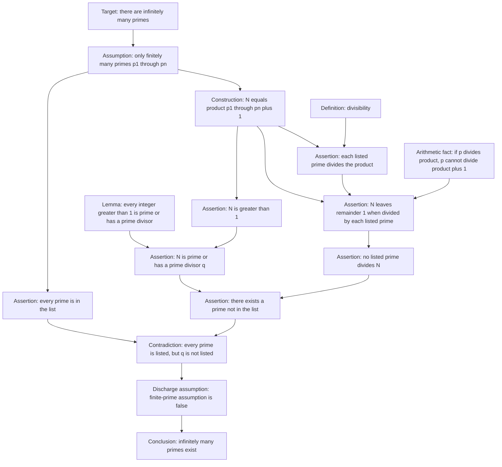
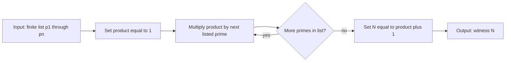

# Infinitely Many Primes

This example tests a short arithmetic proof with a temporary contradiction assumption and a constructed witness number.

## Euclid-Style Proof

Metadata:

- `id`: `infinitely-many-primes-euclid`
- `graph_kind`: `hybrid`
- `granularity`: `medium`
- `temporary_assumptions`: contradiction
- `algorithm_capsules`: product-plus-one construction
- `complexity`: 14 nodes, 17 edges, depth 6

Source note: the standard proof attributed to Euclid: assume finitely many primes `p1, ..., pn`; form `N = p1 p2 ... pn + 1`; then no listed prime divides `N`, so either `N` is prime or has a prime divisor not in the list.

## Algorithm Capsule: Product-Plus-One Witness

The construction of `N` is simple enough to remain a single node in most views, but it is procedural. This capsule can be shown on demand if the database supports expanding algorithm nodes.

## Structural Notes

This proof is best represented as a dependency graph with one optional algorithm capsule. The important logical structure is not the multiplication loop; it is the contradiction:

- finite list assumption;
- construction of a number tied to that list;
- divisibility argument excluding every listed prime;
- use of existence of prime divisors;
- discharge of the finite-list assumption.

The graph also demonstrates that a proof can be constructive inside a nonconstructive contradiction frame.
