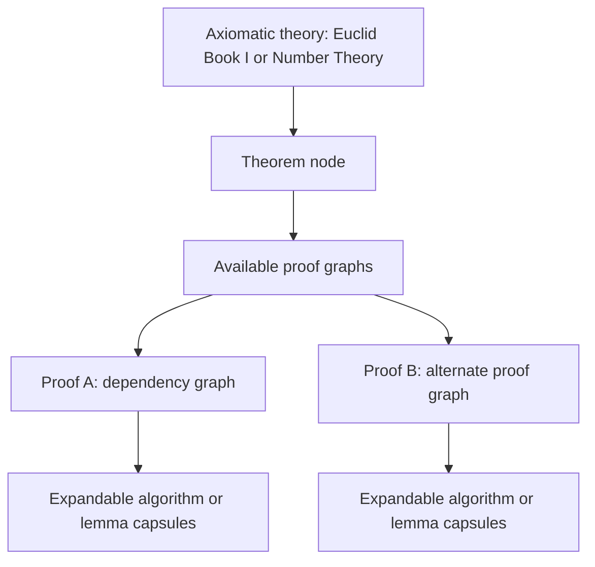

# Proof Graph Pilot Summary

This pilot defines proof graphs as a proof-level layer for the Mathematics Database. The database can keep its current distinction between algorithm flowcharts and axiomatic dependency graphs while adding drill-down proof graphs for individual theorems.

## Pilot Artifacts

- `schema.md`: node types, edge types, metadata, Mermaid conventions, and complexity measures.
- `euclid-book-i-pilot.md`: proof graphs for Euclid Book I propositions 1, 4, and 5.
- `infinitely-many-primes.md`: Euclid-style proof of infinitely many primes with a product-plus-one algorithm capsule.
- `pythagorean-comparison.md`: Euclid I.47 and an area rearrangement proof of the Pythagorean theorem.
- `fundamental-theorem-arithmetic.md`: a larger hybrid graph for existence and uniqueness of prime factorization.
- `cantor-diagonal-proofs.md`: three diagonal-structure examples: power sets, rationals countability, and reals uncountability.

## Selected Proof Set

The pilot uses ten proof artifacts plus one optional Pythagorean extension:

1. Euclid I.1, equilateral triangle construction.
2. Euclid I.4, side-angle-side congruence with superposition caveat.
3. Euclid I.5, base angles of an isosceles triangle.
4. Infinitely many primes.
5. Pythagorean theorem, Euclid I.47.
6. Pythagorean theorem, area rearrangement proof.
7. Fundamental Theorem of Arithmetic.
8. Cantor's theorem: `|P(S)| > |S|`.
9. Countability of the rationals by diagonal enumeration.
10. Uncountability of the reals by anti-diagonal construction.
11. Optional later extension: Pythagorean theorem via similar triangles.

## Scope Recommendation

Proof graphs should be added as drill-down views attached to theorem nodes, not as a completely separate top-level database category.

The current database categories are already clear:

- algorithms are process flowcharts;
- axiomatic theories are theorem-level dependency graphs.

Proof graphs are more granular than both. They belong under theorem entries as expandable views because two proofs of the same theorem can have radically different graph structures. The Pythagorean comparison is the strongest evidence: the theorem node is the same, but Euclid I.47 and the rearrangement proof have different dependency signatures.

## Display Model

Recommended display hierarchy:



Each theorem can have:

- one canonical proof graph;
- alternate proof graphs;
- expandable lemma nodes;
- expandable algorithm capsules;
- complexity metadata for comparison.

## Logical Design Rules

- Use proof graphs to show justification, not chronology alone.
- Use flowcharts only when the proof invokes a repeatable procedure or constructive algorithm.
- Mark temporary assumptions visibly and show where they are discharged.
- Mark historical or formal caveats directly in the graph metadata.
- Do not encode every algebraic simplification unless it changes the logical structure.

## Complexity Snapshot

- Euclid I.1: small construction-dependency hybrid; good first example.
- Euclid I.4: small dependency graph with historical-method caveat.
- Euclid I.5: medium dependency graph demonstrating prior theorem reuse.
- Infinitely many primes: compact contradiction graph with a simple algorithm capsule.
- Pythagorean, Euclid I.47: larger theorem-dependency graph.
- Pythagorean, rearrangement: compact invariant and area-conservation graph.
- Fundamental Theorem of Arithmetic: larger hybrid graph with induction, contradiction, lemma dependency, and algorithm capsule.
- Cantor power set theorem: compact anti-diagonal contradiction graph.
- Rationals countable: diagonal traversal used as an enumeration algorithm, not a contradiction.
- Reals uncountable: anti-diagonal digit construction refuting a proposed sequence.

## Second-Phase Candidates

Cantor's diagonal proofs point naturally toward paradox and metatheorem graphs, but those should be treated as a second pilot family. They introduce self-reference, syntax, semantic truth, and model-theoretic notions that require more careful node typing.

Good candidates:

- Russell's paradox: the set `R = {x | x notin x}` and the contradiction `R in R iff R notin R`.
- Liar paradox: semantic self-reference and the instability of an unrestricted truth predicate.
- Godel completeness theorem: a precursor metatheorem graph relating syntactic consistency, models, and semantic entailment.
- Godel incompleteness theorem: arithmetization, provability, the diagonal lemma, and an undecidable sentence.

## Implementation Notes for the Database

Add proof graph metadata to theorem entries using a nested structure:

```json
{
  "theorem_id": "pythagorean-theorem",
  "proofs": [
    {
      "proof_id": "pythagorean-euclid-i-47",
      "title": "Euclid I.47",
      "graph_kind": "dependency",
      "source_version": "Euclid Book I, Proposition 47, dependency-level paraphrase",
      "mermaid_path": "proof-graphs/pythagorean-comparison.md#proof-a-euclid-book-i-proposition-47",
      "node_count": 18,
      "edge_count": 22,
      "algorithm_capsules": []
    },
    {
      "proof_id": "pythagorean-area-rearrangement",
      "title": "Area rearrangement proof",
      "graph_kind": "hybrid",
      "source_version": "Standard four-triangle dissection proof",
      "mermaid_path": "proof-graphs/pythagorean-comparison.md#proof-b-rearrangement-area-proof",
      "node_count": 15,
      "edge_count": 17,
      "algorithm_capsules": ["rearrangement-procedure"]
    }
  ]
}
```

## Next Step

The next practical step is to convert these Markdown pilot artifacts into the database's preferred metadata format and add one theorem page with proof tabs. The best first integration target is still the Pythagorean theorem because it immediately demonstrates why theorem-level dependencies and proof-level graphs are different. The best second integration target is the Cantor diagonal family because it shows one reusable proof pattern appearing in enumeration, power set, and uncountability arguments.
