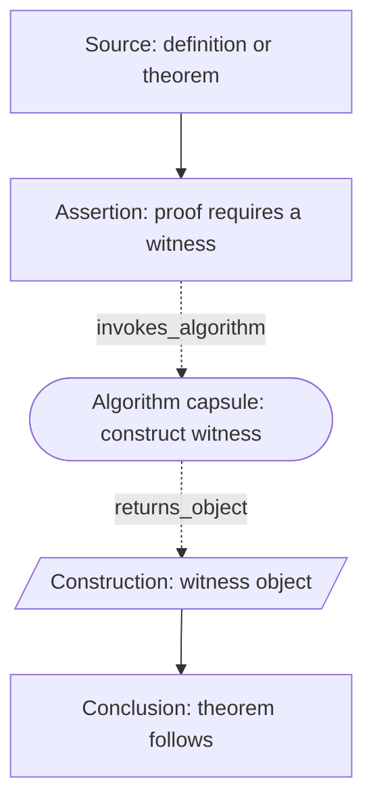

# Proof Graph Schema v2

This schema revises the first Proof Graph Pilot schema after comparing proof graphs with algorithm flowcharts and axiomatic theory dependency graphs.

## Core Principle

Use three related graph grammars:

- **Algorithm graph:** operational control flow.
- **Axiomatic theory graph:** structural dependency among primitives, axioms, definitions, and theorems.
- **Proof graph:** derivational justification from sources to conclusion, with optional algorithm capsules.

A proof graph is not simply a flowchart and not simply a theorem dependency graph. It is a derivational object that may combine axiomatic dependencies, constructive steps, case analysis, contradiction, induction, and procedural subroutines.

## Node Types

- `Source`: axiom, postulate, common notion, definition, prior theorem, or given condition.
- `Assumption`: temporary hypothesis introduced for contradiction, induction, case analysis, or conditional proof.
- `Construction`: geometric, arithmetic, algebraic, set-theoretic, or combinatorial object introduced during the proof.
- `Assertion`: claim established inside the proof.
- `Inference`: named reasoning move such as substitution, congruence, divisibility, equality transfer, area comparison, or contradiction.
- `Branch`: case split, question node, existence/uniqueness split, or fork in the proof argument.
- `Join`: explicit multi-premise node where several dependencies jointly license the next step.
- `AlgorithmCapsule`: procedure invoked by the proof and better represented by a nested flowchart.
- `Contradiction`: impossible state or inconsistency produced from assumptions.
- `Discharge`: closure of a temporary assumption, contradiction, case split, or induction schema.
- `Conclusion`: theorem statement or sub-conclusion established by the proof.

## Edge Types

- `depends_on`: target requires source.
- `derives`: source claim licenses target claim.
- `constructs`: source operation introduces target object.
- `instantiates`: general theorem, axiom, or definition is applied to a specific object.
- `branches_to`: proof splits into cases, questions, or subgoals.
- `joins`: multiple premises jointly license one step.
- `invokes_algorithm`: proof calls a procedural subroutine.
- `returns_object`: algorithm capsule returns a constructed object or witness.
- `discharges`: assumption, case split, contradiction, or induction schema is closed.
- `reuses`: prior theorem or lemma is reused in a later part of the proof.

## Visual Encoding

Recommended Mermaid shapes:

- `source["Source: ..."]`: rounded or styled source node.
- `assertion["Assertion: ..."]`: ordinary rectangle.
- `construction[/"Construction: ..."/]`: construction/object node when Mermaid support is acceptable; otherwise rectangle plus color.
- `branch{"Question or case split?"}`: diamond.
- `algorithm(["Algorithm capsule: ..."])`: stadium/capsule.
- `contradiction["Contradiction: ..."]`: red/oxblood role style.
- `conclusion["Conclusion: ..."]`: heavy border or conclusion style.

Recommended edge styles:

- Solid arrows for ordinary dependency and derivation.
- Dashed arrows for `invokes_algorithm`.
- Dotted arrows for `discharges`.
- Labels for case branches, returned objects, and theorem instantiations.

## Proof-Specific Color Palette

This palette is intentionally distinct from the GLMP/programming-framework five-color process palette.

- `Source`: amber fill `#f2c879`, brown stroke `#7a4f12`; given, axiom, definition, lemma, or prior theorem.
- `Assumption`: violet fill `#c084fc`, violet stroke `#6d28d9`; temporary hypothesis.
- `Construction`: moss fill `#8fbc5a`, olive stroke `#3f6212`; introduced object or witness.
- `Assertion`: steel fill `#8ecae6`, steel stroke `#25637a`; established claim.
- `Inference / Branch`: copper fill `#f4a261`, rust stroke `#9a3412`; proof move, case split, or question.
- `Algorithm`: indigo fill `#818cf8`, indigo stroke `#3730a3`; procedure invoked by the proof.
- `Contradiction`: crimson fill `#ef4444`, dark crimson stroke `#991b1b`; contradiction or impossible branch.
- `Conclusion / Discharge`: teal fill `#2dd4bf`, dark teal stroke `#0f766e`; final conclusion or closure of assumption.

Each proof page should include a local legend for this palette. The mathematics database table should not display a global graph color legend because each graph family has its own visual language.

## Mermaid Convention

Use `flowchart TD` for proof dependency graphs and `flowchart LR` for algorithm capsules.

Prefix node labels with their proof role:

- `Given:`
- `Definition:`
- `Postulate:`
- `Assumption:`
- `Construction:`
- `Assertion:`
- `Inference:`
- `Algorithm capsule:`
- `Contradiction:`
- `Discharge assumption:`
- `Conclusion:`

The current builder can color many nodes from these prefixes automatically. Manual class assignments may still be useful for ambiguous cases.

## Complexity Measures

Record both graph-size and proof-structure measures:

- `node_count`
- `edge_count`
- `depth`
- `source_count`
- `assumption_count`
- `construction_count`
- `branch_count`
- `join_count`
- `algorithm_capsule_count`
- `contradiction_count`
- `discharge_count`
- `reused_source_count`

For hybrid proofs, measure the top-level proof graph separately from algorithm capsules. This avoids confusing proof depth with procedural runtime complexity.

## Loop Policy

Visible proof graphs should usually be acyclic. If a loop appears, classify it:

- `induction_schema`
- `recursive_algorithm`
- `diagonal_construction`
- `self_reference`
- `theorem_reuse`

Only `recursive_algorithm` should normally be drawn as an algorithmic loop. Induction and diagonalization should be represented as named proof schema or construction nodes, not as ordinary feedback arrows.

## Hybrid Pattern

The top-level proof graph shows why the algorithm is needed. The algorithm capsule can expand separately to show how the procedure works.
