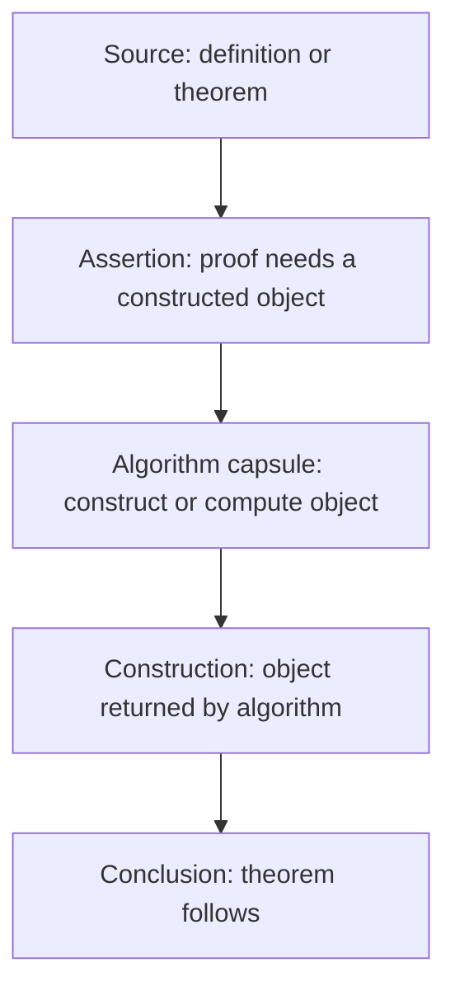

# Proof Graph Schema

This pilot adds a proof-level graph layer to the Mathematics Database. Existing database entries can show algorithms as flowcharts and axiomatic systems as dependency graphs; proof graphs sit between them, showing the internal logical structure of a proof while allowing small procedural capsules where a proof calls an algorithm.

## Core Principle

Use a dependency graph for justification and a flowchart for procedure.

A proof graph should answer: "What must already be known for this step to be valid?" A flowchart should answer: "What action is performed next, and what branch or loop controls it?" Many mathematical proofs need only dependency graphs. Some proofs, especially constructive or algorithmic proofs, benefit from embedding a small flowchart capsule inside the dependency graph.

## Node Types

- `Source`: an axiom, postulate, common notion, definition, or prior theorem used by the proof.
- `Assumption`: a temporary hypothesis introduced for contradiction, induction, case analysis, or conditional proof.
- `Construction`: a geometric, arithmetic, algebraic, or set-theoretic object introduced during the proof.
- `Assertion`: a claim established inside the proof.
- `Inference`: a named reasoning move such as substitution, congruence, divisibility, induction step, contradiction, equality transfer, or area comparison.
- `Algorithm`: a procedure invoked by the proof and better represented by a flowchart.
- `Discharge`: a node that closes a temporary assumption and records the conclusion licensed by that closure.
- `Conclusion`: the theorem statement established by the proof.

## Edge Types

- `depends_on`: the target step requires the source step, definition, axiom, or theorem.
- `constructs`: the source operation introduces the target object.
- `instantiates`: a general theorem, definition, or axiom is applied to a specific object.
- `derives`: one established assertion leads to another by a named inference.
- `invokes_algorithm`: the proof calls a procedural subroutine.
- `branches_to`: a proof splits into cases or into existence and uniqueness parts.
- `discharges`: a contradiction, induction, or temporary assumption is closed.

## Metadata Fields

Each graph should carry:

- `id`: stable kebab-case identifier, such as `euclid-i-1-equilateral-triangle`.
- `title`: human-readable proof title.
- `domain`: geometry, arithmetic, number theory, algebra, analysis, topology, or another broad area.
- `source_version`: the proof source or paraphrase used.
- `graph_kind`: `dependency`, `flowchart`, or `hybrid`.
- `granularity`: `coarse`, `medium`, or `fine`.
- `node_count`: number of visible nodes in the diagram.
- `edge_count`: number of visible arrows in the diagram.
- `temporary_assumptions`: contradiction, induction, case split, or none.
- `algorithm_capsules`: named procedural subgraphs, if any.
- `notes`: historical or formalization caveats.

## Mermaid Conventions

Use Mermaid `flowchart` syntax for both dependency graphs and flowcharts so the database can render the pilot with the same diagram pipeline.

Recommended direction:

- `flowchart TD` for dependency graphs, because sources naturally feed down into conclusions.
- `flowchart LR` for comparison diagrams or algorithm capsules.

Recommended labels:

- Prefix source nodes with their role, such as `Postulate 1`, `Definition 15`, or `Euclid I.4`.
- Keep proof step labels short; put commentary outside the diagram.
- Use subgraphs for large branches such as existence and uniqueness.
- Avoid encoding every algebraic simplification as its own node unless it affects the proof structure.

## Hybrid Graph Pattern

Hybrid proof graphs should expose the algorithm as a capsule, not flatten the algorithm into the proof dependency chain.

## Complexity Measures

For each graph, record:

- `nodes`: total visible nodes.
- `edges`: total visible directed edges.
- `depth`: longest source-to-conclusion path.
- `reused_sources`: prior results used in more than one step.
- `assumption_count`: temporary assumptions introduced and discharged.
- `algorithm_capsule_count`: embedded procedural subgraphs.

These measures are intentionally simple. They are useful for comparing proof shape, not for claiming formal proof complexity.
