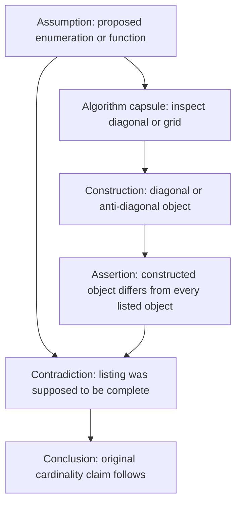
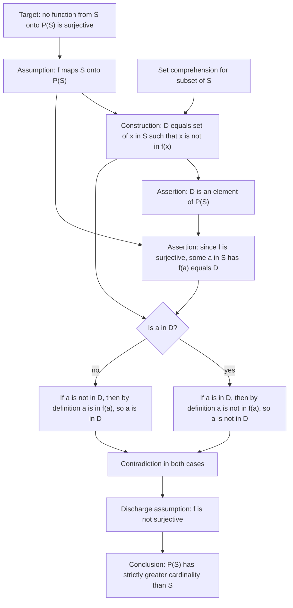
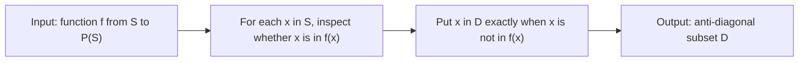
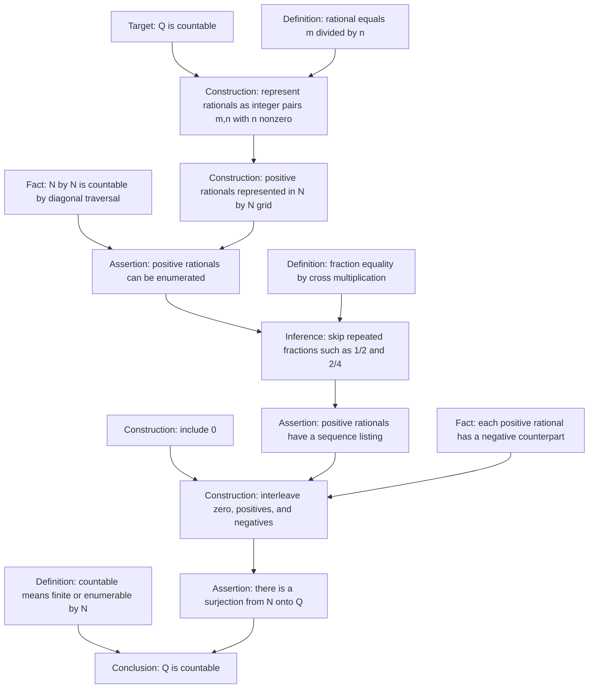
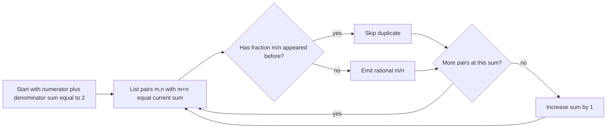
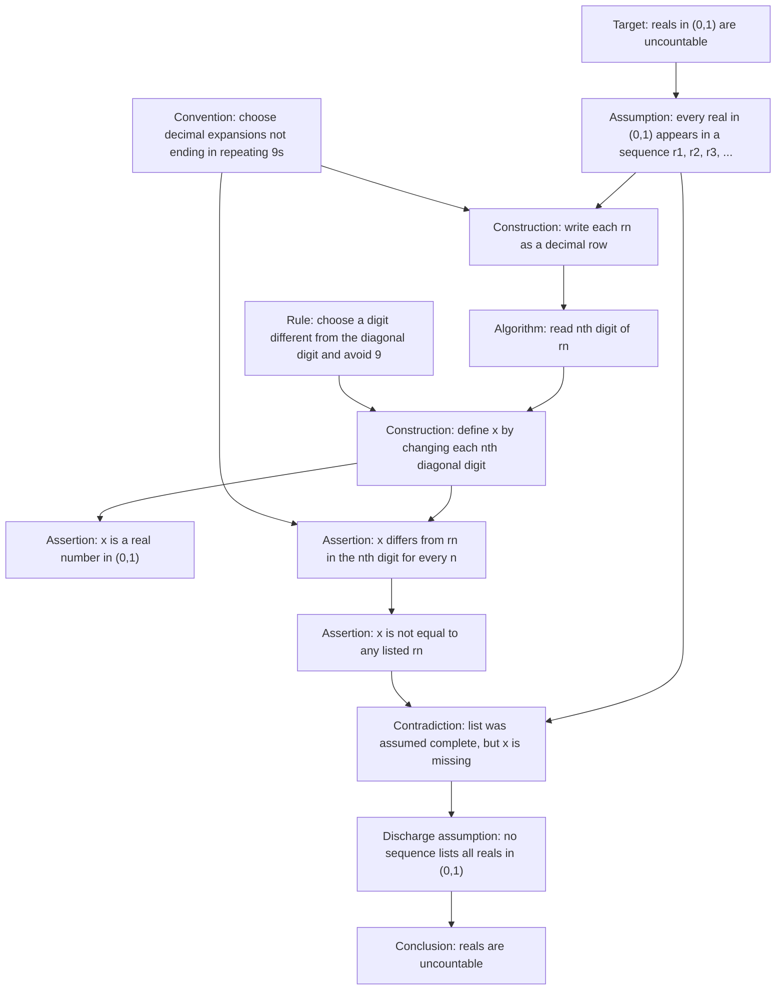
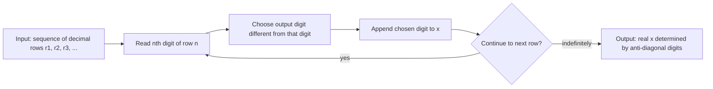

# Cantor Diagonal Proofs

This extension adds three Cantor-style proof graphs to the pilot. They test a family of structures that differs from the Euclidean and arithmetic examples: enumeration, diagonal traversal, anti-diagonal construction, and self-reference-like contradiction.

## Family Design Note

Cantor's diagonal arguments are best represented as hybrid proof graphs:

- the logical proof is a dependency graph;
- the diagonal scan or enumeration is an algorithm capsule;
- the decisive step is usually an anti-diagonal object constructed from an assumed listing.

These graphs are especially useful for the database because they show a recurring proof pattern across different theorems.

## Cantor's Theorem: Power Set Has Greater Cardinality

Metadata:

- `id`: `cantor-power-set-theorem`
- `graph_kind`: `hybrid`
- `granularity`: `medium`
- `temporary_assumptions`: contradiction
- `algorithm_capsules`: diagonal subset construction
- `complexity`: 13 nodes, 16 edges, depth 6

Source note: Cantor's theorem: for every set `S`, there is no surjection from `S` onto its power set `P(S)`. Therefore `|P(S)| > |S|`.

### Algorithm Capsule: Diagonal Subset

## The Rationals Are Countable

Metadata:

- `id`: `rationals-are-countable`
- `graph_kind`: `hybrid`
- `granularity`: `medium`
- `temporary_assumptions`: none
- `algorithm_capsules`: diagonal grid enumeration
- `complexity`: 14 nodes, 16 edges, depth 6

Source note: a standard enumeration proof: list positive rational numbers by traversing the integer grid of numerator-denominator pairs diagonally, skip duplicates, include signs and zero, and obtain a countable enumeration of `Q`.

### Algorithm Capsule: Diagonal Enumeration of Positive Rationals

## The Reals Are Uncountable

Metadata:

- `id`: `reals-are-uncountable-diagonal`
- `graph_kind`: `hybrid`
- `granularity`: `medium`
- `temporary_assumptions`: contradiction
- `algorithm_capsules`: anti-diagonal real construction
- `complexity`: 15 nodes, 18 edges, depth 7

Source note: Cantor's diagonal proof for real numbers in `(0,1)`: assume all real numbers in `(0,1)` are listed by decimal expansions, construct a new decimal number differing from the nth listed number in its nth digit, and conclude the list was incomplete. A technical note should avoid ambiguous decimal expansions ending in repeating 9s.

### Algorithm Capsule: Anti-Diagonal Real

## Pattern Comparison

- Power set theorem: diagonalization is membership flipping against a function `S -> P(S)`.
- Rationals countable: diagonal traversal is an enumeration algorithm, not a contradiction.
- Reals uncountable: diagonalization is digit flipping against a proposed list.

The three examples are valuable together because they prevent a common mistake: not every diagonal structure proves uncountability. The rationals proof uses a diagonal path to enumerate; the power set and reals proofs use anti-diagonal construction to refute a proposed complete listing.

## Optional Extensions: Paradox and Metatheorem Family

These are natural later additions, but they should be scoped as a second pilot family because they introduce self-reference, syntax, and semantic truth.

- Russell's paradox: graph the set `R = {x | x notin x}` and the contradiction `R in R iff R notin R`.
- Liar paradox: graph semantic self-reference, truth predicate assumptions, and contradiction.
- Godel completeness theorem: graph syntactic consistency, models, and semantic entailment as a precursor to metatheorem diagrams.
- Godel incompleteness theorem: graph arithmetization, provability predicate, diagonal lemma, and the undecidable sentence.

For the current pilot, Cantor's theorem is the best bridge toward these later examples because it uses a diagonal object without requiring the machinery of formal syntax and provability.
