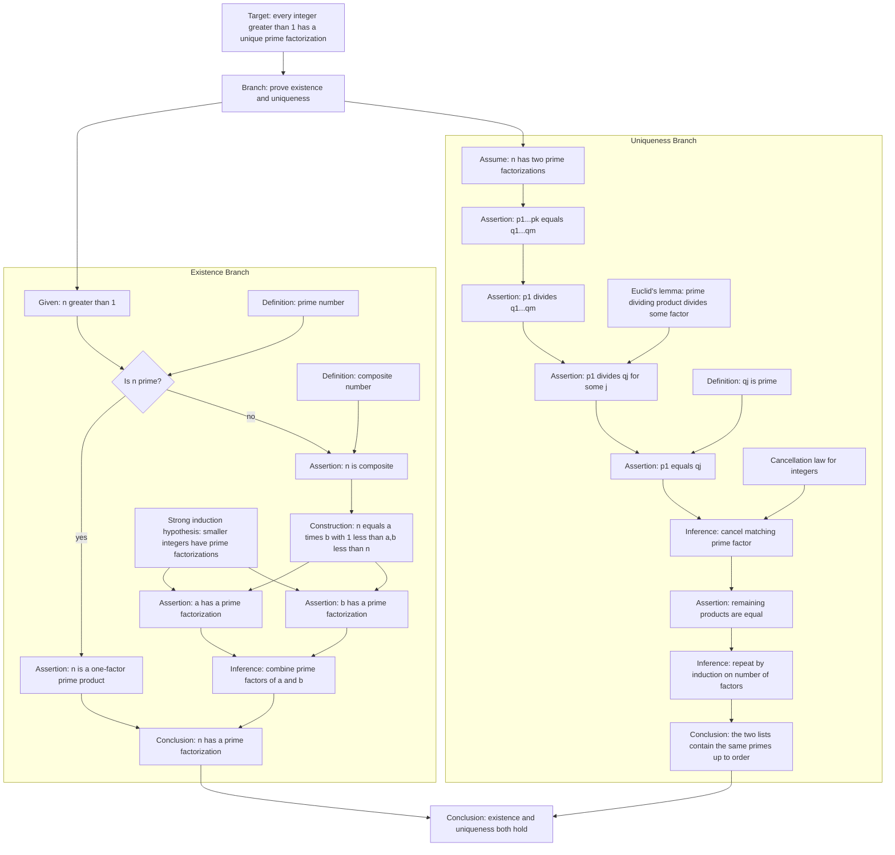
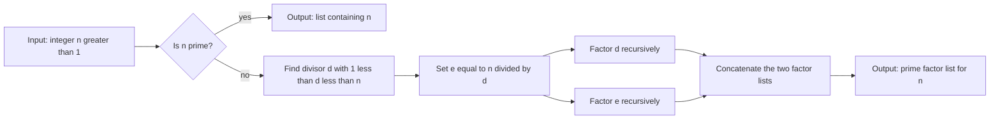
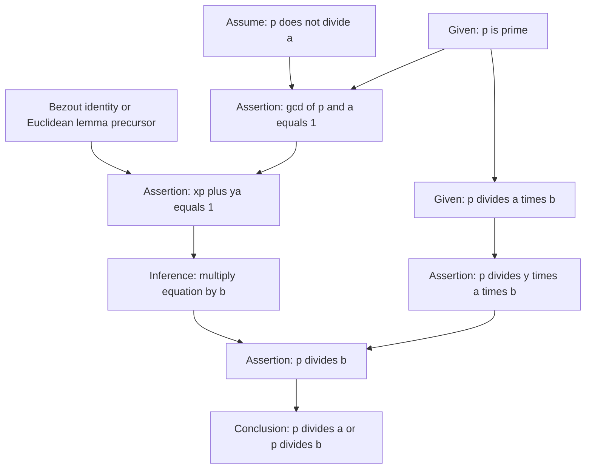

# Fundamental Theorem of Arithmetic

This is the pilot's final, more complicated theorem. It tests whether proof graphs can show nested structure without becoming unreadable: existence, uniqueness, induction, Euclid's lemma, and a factorization procedure all appear in one theorem.

## Theorem

Every integer greater than 1 can be expressed as a product of primes, and this expression is unique up to the order of the factors.

Metadata:

- `id`: `fundamental-theorem-arithmetic`
- `graph_kind`: `hybrid`
- `granularity`: `medium`
- `temporary_assumptions`: induction and contradiction
- `algorithm_capsules`: recursive factorization search
- `complexity`: 27 nodes, 34 edges, depth 9

Source note: a standard elementary proof. Existence is proved by strong induction or descent. Uniqueness is proved using Euclid's lemma: if a prime divides a product, it divides one of the factors.

## Main Proof Graph

## Algorithm Capsule: Recursive Factorization Search

This procedure is not the theorem itself, but it is naturally called by the constructive part of the existence proof.

## Dependency Capsule: Euclid's Lemma

The uniqueness branch depends heavily on Euclid's lemma. If the database later supports expandable lemma nodes, this proof should be expandable.

## Structural Notes

The theorem should remain a hybrid graph. The proof dependencies are the main object, but the existence branch naturally invokes a procedure that can be displayed as a flowchart. The uniqueness branch should not be flowcharted; it is a logical dependency chain governed by Euclid's lemma and induction on factor lists.

This example also suggests a future database feature: expandable dependency nodes. `Euclid's lemma`, `strong induction`, and `cancellation law` can be leaf nodes in the top-level graph, but each can also open into its own proof graph.
