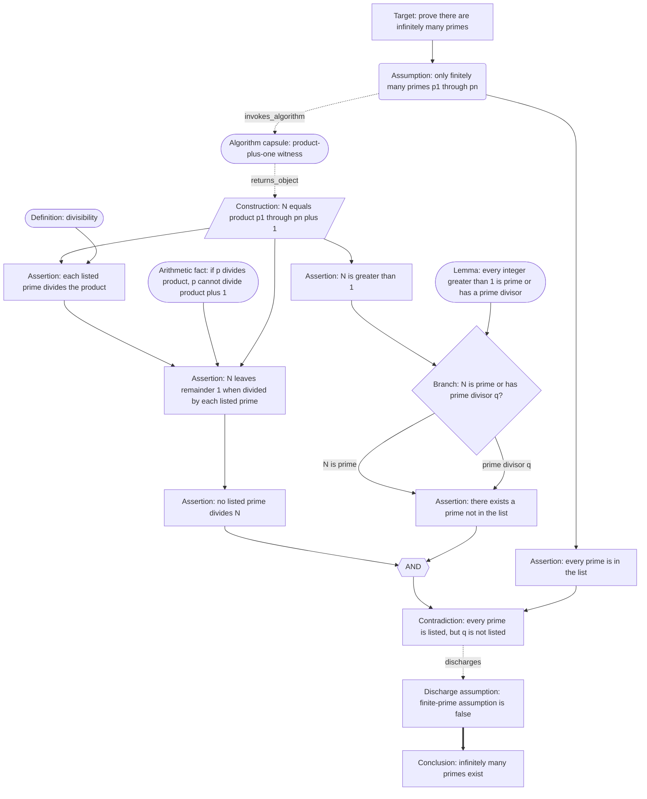
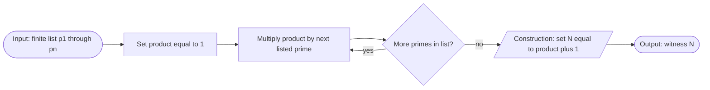

# Infinitely Many Primes — Proof Graph v2 Demo

This page is a design demonstration of the revised proof graph grammar. It uses the same mathematical proof as the original infinitely-many-primes page, but applies distinct node shapes and edge styles:

- rounded nodes for assumptions;
- parallelogram nodes for constructions;
- a diamond for a proof branch;
- a compact hexagonal AND join marker for multi-premise support;
- a capsule for the invoked algorithm;
- dashed edges for algorithm invocation and returned objects;
- heavy conclusion/contradiction coloring from the proof-specific palette.

The goal is not to replace the original proof yet. The goal is to make the proposed v2 design concrete enough to judge visually.

## V2 Proof-Level Graph

## Nested Algorithm Capsule

## Notes

The top graph remains a proof dependency graph: it shows how the contradiction is licensed. The compact AND marker indicates that the constructed witness and the no-listed-divisor claim jointly support the contradiction step. The nested capsule is an algorithm graph: it shows how the witness `N` is computed from a finite list. This keeps proof-level justification and procedural execution visually related but not identical.
