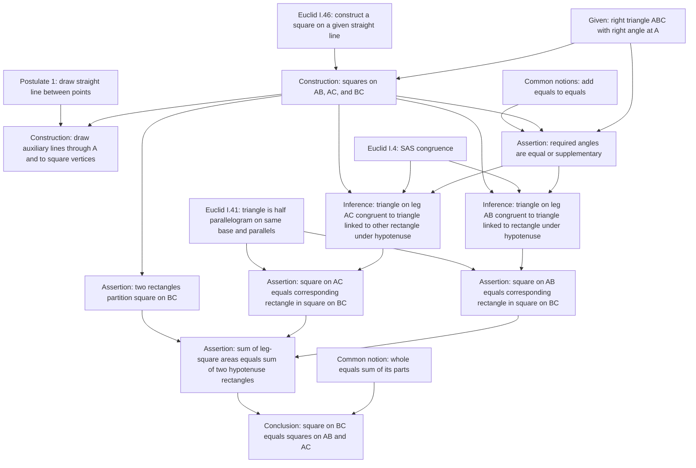
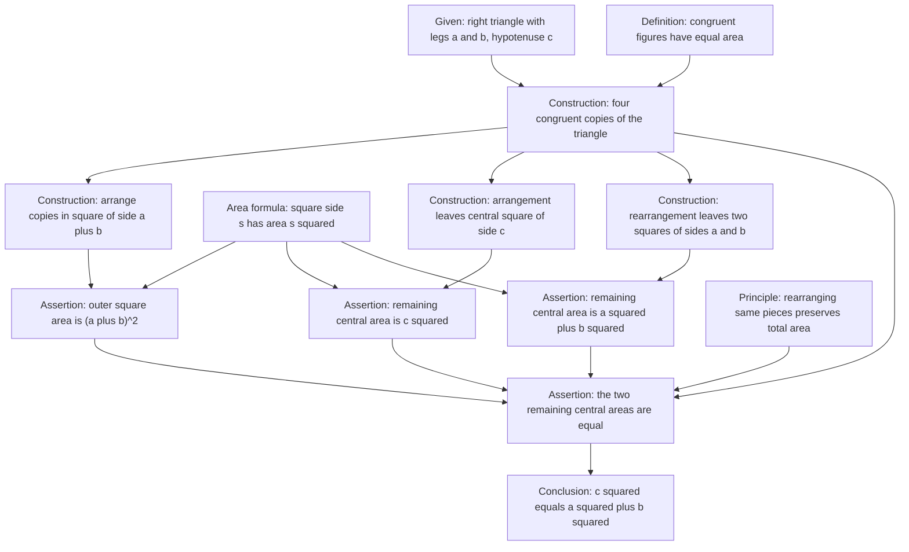
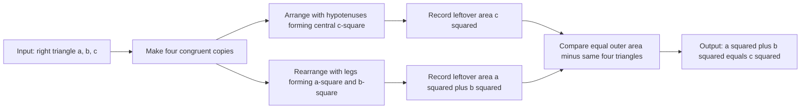

# Pythagorean Theorem Proof Graph Comparison

This pilot includes two proofs of the same theorem to test whether proof graphs reveal structural differences that are hidden by the final theorem statement.

## Shared Theorem

For a right triangle with legs `a` and `b` and hypotenuse `c`, the square on the hypotenuse has area equal to the sum of the areas of the squares on the legs: `a^2 + b^2 = c^2`.

## Proof A: Euclid Book I, Proposition 47

Metadata:

- `id`: `pythagorean-euclid-i-47`
- `graph_kind`: `dependency`
- `granularity`: `coarse-to-medium`
- `temporary_assumptions`: none
- `algorithm_capsules`: none
- `complexity`: 18 nodes, 22 edges, depth 8

Source note: Euclid Book I, Proposition 47, paraphrased at dependency level. The graph emphasizes the theorem dependencies and area-equality transfers rather than every diagram line in Euclid's construction.

Design note: this graph is dependency-heavy. Its value is that it shows the Pythagorean theorem as the endpoint of a chain of earlier Euclidean construction, congruence, parallel, and area propositions.

## Proof B: Rearrangement Area Proof

Metadata:

- `id`: `pythagorean-area-rearrangement`
- `graph_kind`: `hybrid`
- `granularity`: `medium`
- `temporary_assumptions`: none
- `algorithm_capsules`: geometric rearrangement routine
- `complexity`: 15 nodes, 17 edges, depth 6

Source note: a standard dissection proof using four congruent right triangles arranged inside a square of side `a + b`. Two arrangements leave different central regions whose equal total areas imply `a^2 + b^2 = c^2`.

## Algorithm Capsule: Rearrangement Procedure

## Structural Comparison

- Euclid I.47 is dependency-rich: the graph points backward into the Euclidean proposition network.
- The rearrangement proof is invariant-rich: the graph centers on conservation of area under rearrangement.
- Euclid I.47 has more theorem dependencies; the rearrangement proof has a clearer algorithmic capsule.
- Both prove the same conclusion, but their graph signatures are different enough to justify storing proof graphs separately from theorem nodes.

## Optional Third Graph

A similar-triangles proof should be considered for a later pass. It would use altitude to the hypotenuse, triangle similarity, proportionality, and algebraic combination. It is an excellent third comparison because it is neither a Euclidean square-area proof nor a pure rearrangement proof.
