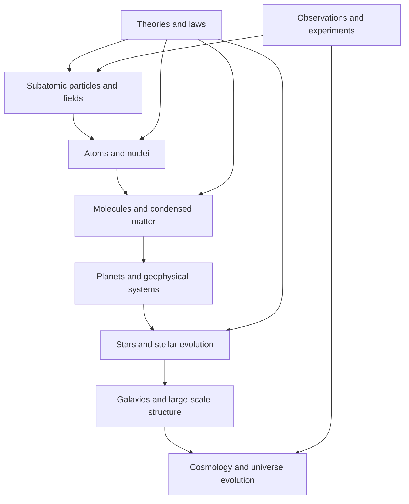

# Whole-Discipline Visualization Strategy

This note records the strategy for extending the existing Whole of Mathematics and Whole of Life visualizations to Chemistry, Physics, and Computer Science. The key decision is to treat the node-and-spoke force map as one candidate visualization, not as the default intellectual structure for every subject.

## Existing Pattern

The successful maps use a simple graph data shape:

- `nodes`: root, domain/category, subcategory, process, or topic nodes
- `links`: source/target edges between those nodes
- process nodes link back to existing process pages

The generator is `scripts/processes/discipline_databases/generate_whole_discipline_maps.py`.

It emits:

- `chemistry-processes-database/whole-of-chemistry.html`
- `chemistry-processes-database/whole-of-chemistry-graph-data.json`
- `physics-processes-database/whole-of-physics.html`
- `physics-processes-database/whole-of-physics-graph-data.json`
- `computer-science-processes-database/whole-of-computer-science.html`
- `computer-science-processes-database/whole-of-computer-science-graph-data.json`

Each graph-data file contains multiple candidate variants so the subject can be evaluated before a final canonical view is chosen.

## Visualization Models

Use these as a menu of subject-sensitive layouts:

1. **Force-directed hub map**: best for exploration, cross-links, and browsing process pages. Weakness: can imply relationships that are only visual proximity.
2. **Radial hierarchy / taxonomy**: best for coverage and familiar table-of-contents structure. Weakness: poor at cross-cutting relationships.
3. **Dependency DAG**: best for prerequisites, derivations, proof dependencies, laws, protocols, and algorithmic dependencies.
4. **Layered stack**: best when abstraction levels are meaningful. Strong fit for Computer Science and physical scale maps.
5. **Regime / phase / scale map**: best when a field is organized by scale, energy, temperature, material regime, or governing approximation.
6. **Bipartite or matrix map**: best for method-to-system, theory-to-regime, instrument-to-observable, or process-to-material relationships.
7. **Treemap / sunburst**: best for quantitative coverage summaries. It should supplement, not replace, graph maps.
8. **Semantic embedding map**: best for discovery by similarity. Useful later, but secondary because canonical subject structure is often more important than embedding proximity.

## Discipline Defaults

### Chemistry

Recommended primary view: **Reaction / Mechanism Hybrid**

Chemistry should not be represented only as a node-and-spoke branch taxonomy. The field is organized simultaneously by branches, reaction mechanisms, instrumentation, materials systems, and energy/rate concepts.

The current generated primary variant groups processes into Molecular Transformations, Measurement and Instrumentation, Materials and Surfaces, Energy/Equilibrium/Rates, Models and Computation, and Other/Mixed.

Next likely topic-scale maps:

- **Whole of Molecular Structure**: atoms, bonds, orbitals, functional groups, molecules, polymers, crystals, materials.
- **Whole of Reaction Mechanisms**: substitution, addition, elimination, redox, catalysis, electrochemistry, photochemistry.
- **Whole of Analytical Chemistry**: analytes, instruments, signals, calibration, validation, detection limits.

### Physics

Recommended primary view: **Regime / Theory Map**

Physics is not naturally a single taxonomy. It is often better represented by regimes and scales: classical/macroscopic, electromagnetic/optical, thermal/statistical, quantum/particle/field, and nuclear/cosmic.

The physical universe should use a scale-aware version of this strategy:

Next likely topic-scale maps:

- **Whole of the Physical Universe**: subatomic, atomic, molecular, planetary, stellar, galactic, cosmological scales.
- **Standard Model Map**: particles, fields, interactions, symmetries, conservation laws, experimental signatures.
- **Atomic and Molecular Physics Map**: nuclei, electrons, orbitals, spectra, transitions, molecules, condensed states.
- **Regime Map of Matter**: gases, liquids, solids, plasmas, quantum fluids, superconductors, phase transitions.

### Computer Science

Recommended primary view: **Abstraction Stack**

Computer Science has a strong layered structure: foundations/theory, algorithms/data structures, software/runtime, networks/databases/distributed systems, security/reliability, and AI/ML/data systems.

The node-and-spoke view remains useful for browsing, but the canonical map should make abstraction layers and dependencies visible.

Next likely topic-scale maps:

- **Whole Computing Stack**: hardware, instruction sets, OS, runtimes, databases, networks, cloud, applications, AI systems.
- **Algorithms and Complexity Map**: problem classes, algorithm families, data structures, complexity classes, reductions.
- **Security Map**: identity, crypto, protocols, systems security, application security, detection, response.
- **AI Systems Map**: data, features, training, evaluation, deployment, monitoring, alignment/safety.

## GLMP and Topic-Scale Maps

The Genome Logic Modeling Project is a model for topic-scale visualization:

- the subject has a dense corpus of process diagrams
- each process node should open a Mermaid process page
- the overview map should organize process families, mechanisms, and regulatory logic
- domain-specific node types matter more than a generic branch taxonomy

Recommended GLMP-style map models:

- **Process family map** for pathways and regulatory modules.
- **Influence network** for regulators, genes, signals, and phenotypes.
- **Taxonomy/process hybrid** for organisms and biological systems.
- **Dependency DAG** for causal chains or regulatory prerequisites.

## Evaluation Rubric

Use the generated variant scores as first-pass heuristics, then revise after visual inspection. The real decision should consider subject fidelity, navigability, cross-links, pedagogy, and extensibility.

## Implementation Rule

For each discipline or topic:

1. Generate at least two candidate graph variants.
2. Inspect them interactively.
3. Pick a primary view and a secondary view.
4. Add the map to `featuredMaps` only when it is useful enough to browse.
5. Keep the process database table as the stable fallback.
