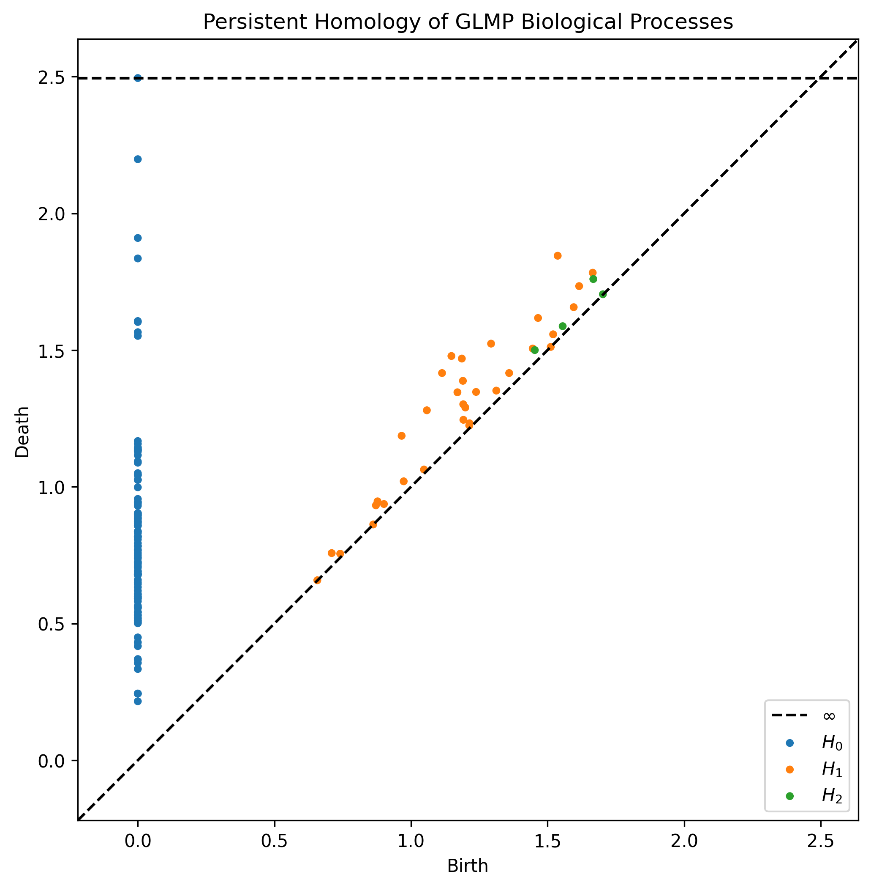

# TDA Analysis of GLMP Biological Processes - Cursor Project Instructions

## Project Goal
Extract features from Gary's GLMP biological process JSON data, compute persistent homology using TDA methods, and generate persistence diagrams to analyze topological structure of genetic regulatory circuits.

## Context for Cursor

Gary has:
- **109 biological processes** stored as JSON in Google Cloud Storage
- Each process is a **Mermaid flowchart** representing genetic circuits
- Metadata includes: organism, category, complexity, node counts, logic gates (OR, AND, NOT)
- Example processes: lac operon, β-galactosidase expression, cell cycle regulation, etc.
- Data location: `https://storage.googleapis.com/regal-scholar-453620-r7-podcast-storage/glmp-v2/metadata/`

## What We're Building

**Phase 1**: Extract features from GLMP JSON → create feature matrix
**Phase 2**: Compute persistent homology using Ripser
**Phase 3**: Generate and interpret persistence diagrams

## Technical Setup

### Environment
```bash
# Create new project directory
mkdir glmp-tda-analysis
cd glmp-tda-analysis

# Create virtual environment
python -m venv venv
source venv/bin/activate  # On Windows: venv\Scripts\activate

# Install dependencies
pip install ripser persim numpy pandas matplotlib requests scikit-learn
```

### Dependencies Explanation
- **ripser**: Fast persistent homology computation
- **persim**: Persistence diagram visualization
- **numpy/pandas**: Data manipulation
- **matplotlib**: Plotting
- **requests**: Fetch JSON from Google Cloud Storage
- **scikit-learn**: Distance/similarity computations

## Implementation Tasks

### Task 1: Fetch GLMP Metadata

Create `fetch_glmp_data.py`:

```python
"""
Fetch GLMP biological process metadata from Google Cloud Storage.
Each process has JSON metadata including structural features.
"""

import requests
import json
import pandas as pd
from pathlib import Path

# Base URL for GLMP metadata
BASE_URL = "https://storage.googleapis.com/regal-scholar-453620-r7-podcast-storage/glmp-v2/metadata/"

def fetch_process_list():
    """
    Fetch list of available GLMP processes.
    Gary's GLMP has ~109 processes stored as individual JSON files.
    """
    # This is a placeholder - we need Gary to provide either:
    # 1. A metadata index file listing all processes
    # 2. Or we manually create a list of known process IDs
    
    # For now, create sample process IDs based on common biological processes
    sample_processes = [
        "lac_operon",
        "trp_operon", 
        "beta_galactosidase",
        "cell_cycle_yeast",
        "glycolysis",
        # Add more as we discover them
    ]
    return sample_processes

def fetch_process_metadata(process_id):
    """
    Fetch metadata for a specific process.
    
    Expected JSON structure:
    {
        "process_name": "...",
        "organism": "...",
        "category": "...",
        "complexity": "...",
        "nodes": [...],
        "edges": [...],
        "metadata": {
            "node_count": N,
            "conditional_count": N,
            "or_gates": N,
            "and_gates": N,
            "not_gates": N
        }
    }
    """
    url = f"{BASE_URL}{process_id}.json"
    try:
        response = requests.get(url)
        response.raise_for_status()
        return response.json()
    except Exception as e:
        print(f"Error fetching {process_id}: {e}")
        return None

def main():
    processes = fetch_process_list()
    data = []
    
    for pid in processes:
        metadata = fetch_process_metadata(pid)
        if metadata:
            data.append(metadata)
    
    # Save to local file
    with open('glmp_processes.json', 'w') as f:
        json.dump(data, f, indent=2)
    
    print(f"Fetched {len(data)} processes")
    return data

if __name__ == "__main__":
    main()
```

**IMPORTANT CURSOR NOTE**: 
The actual URL structure for GLMP metadata may differ. Gary needs to verify:
1. What's the exact URL pattern for GLMP JSON files?
2. Is there an index/manifest file listing all 109 processes?
3. What's the actual JSON schema for each process?

### Task 2: Extract Features for TDA

Create `extract_features.py`:

```python
"""
Extract topological features from GLMP biological processes.
Convert each process into a feature vector suitable for TDA analysis.
"""

import numpy as np
import pandas as pd
import json
from typing import Dict, List
import networkx as nx

class GLMPFeatureExtractor:
    """
    Extract features from GLMP biological process graphs.
    
    Features to extract:
    1. Structural: nodes, edges, density
    2. Topological: cycles, connected components
    3. Logical: gate counts (AND, OR, NOT)
    4. Complexity: path lengths, branching factor
    """
    
    def __init__(self, process_data: Dict):
        self.data = process_data
        self.graph = self._build_graph()
    
    def _build_graph(self) -> nx.DiGraph:
        """Convert GLMP process to NetworkX graph."""
        G = nx.DiGraph()
        
        # Add nodes
        if 'nodes' in self.data:
            for node in self.data['nodes']:
                G.add_node(node['id'], **node)
        
        # Add edges
        if 'edges' in self.data:
            for edge in self.data['edges']:
                G.add_edge(edge['source'], edge['target'], **edge)
        
        return G
    
    def extract_structural_features(self) -> Dict:
        """Extract basic structural features."""
        G = self.graph
        return {
            'node_count': G.number_of_nodes(),
            'edge_count': G.number_of_edges(),
            'density': nx.density(G),
            'avg_degree': sum(dict(G.degree()).values()) / max(G.number_of_nodes(), 1),
        }
    
    def extract_topological_features(self) -> Dict:
        """Extract topological features (cycles, components, etc.)."""
        G = self.graph
        
        # Convert to undirected for some metrics
        G_undirected = G.to_undirected()
        
        features = {
            'num_components': nx.number_weakly_connected_components(G),
            'num_strongly_connected': nx.number_strongly_connected_components(G),
        }
        
        # Count cycles (simplified - actual cycle detection is complex)
        try:
            cycles = list(nx.simple_cycles(G))
            features['cycle_count'] = len(cycles)
            features['max_cycle_length'] = max([len(c) for c in cycles]) if cycles else 0
        except:
            features['cycle_count'] = 0
            features['max_cycle_length'] = 0
        
        return features
    
    def extract_logic_features(self) -> Dict:
        """Extract logical gate features."""
        metadata = self.data.get('metadata', {})
        return {
            'or_gates': metadata.get('or_gates', 0),
            'and_gates': metadata.get('and_gates', 0),
            'not_gates': metadata.get('not_gates', 0),
            'conditional_count': metadata.get('conditional_count', 0),
        }
    
    def extract_complexity_features(self) -> Dict:
        """Extract complexity measures."""
        G = self.graph
        
        features = {}
        
        # Average shortest path (if connected)
        try:
            if nx.is_weakly_connected(G):
                features['avg_shortest_path'] = nx.average_shortest_path_length(G)
            else:
                features['avg_shortest_path'] = 0
        except:
            features['avg_shortest_path'] = 0
        
        # Clustering coefficient
        try:
            G_undirected = G.to_undirected()
            features['clustering_coeff'] = nx.average_clustering(G_undirected)
        except:
            features['clustering_coeff'] = 0
        
        return features
    
    def extract_all_features(self) -> Dict:
        """Extract all features and combine into single dict."""
        features = {}
        features.update(self.extract_structural_features())
        features.update(self.extract_topological_features())
        features.update(self.extract_logic_features())
        features.update(self.extract_complexity_features())
        
        # Add process metadata
        features['process_name'] = self.data.get('process_name', 'unknown')
        features['organism'] = self.data.get('organism', 'unknown')
        features['category'] = self.data.get('category', 'unknown')
        
        return features

def extract_features_from_all_processes(processes_file: str = 'glmp_processes.json') -> pd.DataFrame:
    """
    Extract features from all GLMP processes.
    Returns a DataFrame where each row is a process and columns are features.
    """
    with open(processes_file, 'r') as f:
        processes = json.load(f)
    
    feature_list = []
    for process in processes:
        try:
            extractor = GLMPFeatureExtractor(process)
            features = extractor.extract_all_features()
            feature_list.append(features)
        except Exception as e:
            print(f"Error processing {process.get('process_name', 'unknown')}: {e}")
    
    df = pd.DataFrame(feature_list)
    
    # Save to CSV
    df.to_csv('glmp_features.csv', index=False)
    print(f"Extracted features for {len(df)} processes")
    print(f"Feature columns: {list(df.columns)}")
    
    return df

if __name__ == "__main__":
    df = extract_features_from_all_processes()
    print("\nFeature summary:")
    print(df.describe())
```

### Task 3: Compute Persistent Homology

Create `compute_persistence.py`:

```python
"""
Compute persistent homology on GLMP process feature vectors.
Generate persistence diagrams to reveal topological structure.
"""

import numpy as np
import pandas as pd
from ripser import ripser
from persim import plot_diagrams
import matplotlib.pyplot as plt
from sklearn.preprocessing import StandardScaler
from sklearn.metrics.pairwise import euclidean_distances

def prepare_feature_matrix(features_df: pd.DataFrame) -> np.ndarray:
    """
    Prepare feature matrix for TDA.
    
    Steps:
    1. Select numerical features only
    2. Standardize (mean=0, std=1)
    3. Return as numpy array
    """
    # Drop non-numerical columns
    numerical_df = features_df.select_dtypes(include=[np.number])
    
    # Handle any NaN values
    numerical_df = numerical_df.fillna(0)
    
    # Standardize features
    scaler = StandardScaler()
    scaled_features = scaler.fit_transform(numerical_df)
    
    print(f"Feature matrix shape: {scaled_features.shape}")
    print(f"Features used: {list(numerical_df.columns)}")
    
    return scaled_features

def compute_persistence_diagrams(feature_matrix: np.ndarray, maxdim: int = 2):
    """
    Compute persistent homology using Ripser.
    
    Args:
        feature_matrix: N x M matrix where N = processes, M = features
        maxdim: Maximum homology dimension to compute (0, 1, 2, ...)
    
    Returns:
        Dictionary with persistence diagrams for each dimension
    """
    print(f"Computing persistent homology (maxdim={maxdim})...")
    
    # Compute persistence
    result = ripser(feature_matrix, maxdim=maxdim)
    
    # Result contains:
    # - dgms: list of persistence diagrams [H0, H1, H2, ...]
    # - num_edges: number of edges in filtered complex
    # - dperm2all: permutation (for internal use)
    
    diagrams = result['dgms']
    
    print(f"Computed {len(diagrams)} persistence diagrams")
    for i, dgm in enumerate(diagrams):
        print(f"  H{i}: {len(dgm)} features")
    
    return result

def visualize_persistence(result, save_path: str = 'persistence_diagram.png'):
    """
    Create and save persistence diagram visualization.
    
    Interpretation guide:
    - H0 (red): Connected components
      - Points far from diagonal = persistent components = distinct process clusters
    
    - H1 (green): Loops/cycles  
      - Points far from diagonal = persistent loops = feedback circuits
    
    - H2 (blue): Voids/cavities
      - Points far from diagonal = higher-order structure
    
    Distance from diagonal = persistence = significance
    """
    diagrams = result['dgms']
    
    # Create figure
    fig, ax = plt.subplots(figsize=(10, 8))
    
    # Plot persistence diagrams
    plot_diagrams(diagrams, show=False, ax=ax)
    
    # Add interpretation annotations
    ax.set_title('Persistent Homology of GLMP Biological Processes', fontsize=14, fontweight='bold')
    ax.set_xlabel('Birth (feature appears)', fontsize=12)
    ax.set_ylabel('Death (feature disappears)', fontsize=12)
    
    # Add legend with interpretation
    legend_text = [
        'H₀ (red): Connected components (process clusters)',
        'H₁ (green): Loops (feedback circuits)',
        'H₂ (blue): Voids (higher-order structure)',
        '',
        'Distance from diagonal = persistence = significance'
    ]
    ax.text(0.02, 0.98, '\n'.join(legend_text), 
            transform=ax.transAxes,
            fontsize=9,
            verticalalignment='top',
            bbox=dict(boxstyle='round', facecolor='wheat', alpha=0.3))
    
    plt.tight_layout()
    plt.savefig(save_path, dpi=300, bbox_inches='tight')
    print(f"Saved persistence diagram to {save_path}")
    
    return fig

def interpret_results(result, features_df: pd.DataFrame):
    """
    Provide interpretation of persistence diagram results.
    """
    diagrams = result['dgms']
    
    print("\n" + "="*60)
    print("PERSISTENCE DIAGRAM INTERPRETATION")
    print("="*60)
    
    # H0 - Connected Components
    h0 = diagrams[0]
    # Filter out infinite persistence (the final component)
    h0_finite = h0[np.isfinite(h0).all(axis=1)]
    
    if len(h0_finite) > 0:
        persistences = h0_finite[:, 1] - h0_finite[:, 0]
        significant_components = np.sum(persistences > np.median(persistences))
        
        print(f"\nH₀ (Connected Components):")
        print(f"  Total components: {len(h0)}")
        print(f"  Significant clusters: {significant_components}")
        print(f"  Interpretation: Your {len(features_df)} processes form ~{significant_components} distinct topological clusters")
        print(f"  Meaning: These clusters likely represent different circuit types (e.g., feedback vs feedforward)")
    
    # H1 - Loops/Cycles
    if len(diagrams) > 1:
        h1 = diagrams[1]
        if len(h1) > 0:
            persistences = h1[:, 1] - h1[:, 0]
            significant_loops = np.sum(persistences > np.median(persistences)) if len(persistences) > 0 else 0
            
            print(f"\nH₁ (Loops/Cycles):")
            print(f"  Total loop features: {len(h1)}")
            print(f"  Persistent loops: {significant_loops}")
            print(f"  Interpretation: Detected {significant_loops} significant circular structures in process space")
            print(f"  Meaning: These likely correspond to processes with feedback regulation")
        else:
            print(f"\nH₁ (Loops/Cycles):")
            print(f"  No significant loop features detected")
            print(f"  Interpretation: Processes are primarily feedforward or tree-like")
    
    # H2 - Voids
    if len(diagrams) > 2:
        h2 = diagrams[2]
        if len(h2) > 0:
            print(f"\nH₂ (Voids/Cavities):")
            print(f"  Total void features: {len(h2)}")
            print(f"  Interpretation: Higher-dimensional topological structure detected")
        else:
            print(f"\nH₂ (Voids):")
            print(f"  No significant void features")
    
    print("\n" + "="*60)

def main():
    """
    Main pipeline: load features → compute persistence → visualize → interpret
    """
    # Load features
    print("Loading GLMP features...")
    features_df = pd.read_csv('glmp_features.csv')
    print(f"Loaded {len(features_df)} processes")
    
    # Prepare feature matrix
    feature_matrix = prepare_feature_matrix(features_df)
    
    # Compute persistence
    result = compute_persistence_diagrams(feature_matrix, maxdim=2)
    
    # Visualize
    visualize_persistence(result, save_path='glmp_persistence_diagram.png')
    
    # Interpret
    interpret_results(result, features_df)
    
    # Save results
    np.save('persistence_diagrams.npy', result['dgms'])
    print("\nSaved persistence diagrams to persistence_diagrams.npy")

if __name__ == "__main__":
    main()
```

### Task 4: Create Analysis Report

Create `generate_report.py`:

```python
"""
Generate comprehensive TDA analysis report for GLMP processes.
"""

import pandas as pd
import numpy as np
import matplotlib.pyplot as plt
from datetime import datetime

def generate_html_report(features_df, result, output_file='glmp_tda_report.html'):
    """
    Generate HTML report summarizing TDA analysis.
    """
    
    html = f"""
<!DOCTYPE html>
<html>
<head>
    <title>GLMP TDA Analysis Report</title>
    <style>
        body {{ font-family: Arial, sans-serif; margin: 40px; }}
        h1 {{ color: #2c3e50; }}
        h2 {{ color: #34495e; margin-top: 30px; }}
        .metric {{ background: #ecf0f1; padding: 15px; margin: 10px 0; border-radius: 5px; }}
        table {{ border-collapse: collapse; width: 100%; margin: 20px 0; }}
        th, td {{ border: 1px solid #ddd; padding: 12px; text-align: left; }}
        th {{ background-color: #3498db; color: white; }}
        img {{ max-width: 100%; height: auto; margin: 20px 0; }}
    </style>
</head>
<body>
    <h1>Topological Data Analysis of GLMP Biological Processes</h1>
    <p><strong>Generated:</strong> {datetime.now().strftime('%Y-%m-%d %H:%M:%S')}</p>
    
    <h2>Dataset Overview</h2>
    <div class="metric">
        <p><strong>Total Processes Analyzed:</strong> {len(features_df)}</p>
        <p><strong>Feature Dimensions:</strong> {features_df.select_dtypes(include=[np.number]).shape[1]}</p>
        <p><strong>Organisms:</strong> {', '.join(features_df['organism'].unique())}</p>
        <p><strong>Categories:</strong> {', '.join(features_df['category'].unique())}</p>
    </div>
    
    <h2>Persistence Diagram</h2>
    
    
    <h2>Key Findings</h2>
    <div class="metric">
        <h3>Connected Components (H₀)</h3>
        <p>Number of distinct process clusters detected in the topological space.</p>
        <p><strong>Finding:</strong> {len(result['dgms'][0])} components</p>
    </div>
    
    <div class="metric">
        <h3>Loops/Cycles (H₁)</h3>
        <p>Circular structures indicating feedback regulation or cyclic processes.</p>
        <p><strong>Finding:</strong> {len(result['dgms'][1]) if len(result['dgms']) > 1 else 0} loop features</p>
    </div>
    
    <h2>Feature Statistics</h2>
    {features_df.describe().to_html()}
    
    <h2>Next Steps for Collaboration with Dr. Vejdemo-Johansson</h2>
    <ul>
        <li>Interpret the persistent loops - do they correspond to known feedback circuits?</li>
        <li>Compare topological signatures across organisms</li>
        <li>Use Mapper to visualize the process space</li>
        <li>Apply persistent cohomology to detect circular coordinates</li>
        <li>Develop topological metrics for circuit classification</li>
    </ul>
    
</body>
</html>
"""
    
    with open(output_file, 'w') as f:
        f.write(html)
    
    print(f"Generated HTML report: {output_file}")

if __name__ == "__main__":
    features_df = pd.read_csv('glmp_features.csv')
    result = np.load('persistence_diagrams.npy', allow_pickle=True).item()
    generate_html_report(features_df, result)
```

## Execution Instructions for Cursor

**Step 1: Setup**
```bash
# Tell Cursor to:
# 1. Create project directory: glmp-tda-analysis
# 2. Create virtual environment
# 3. Install dependencies: ripser persim numpy pandas matplotlib requests scikit-learn networkx
```

**Step 2: Data Acquisition**
```bash
# Tell Cursor to:
# 1. Create fetch_glmp_data.py (from Task 1 above)
# 2. Modify BASE_URL if Gary provides correct URL
# 3. Add actual process IDs from Gary's GLMP database
# 4. Run: python fetch_glmp_data.py
```

**Step 3: Feature Extraction**
```bash
# Tell Cursor to:
# 1. Create extract_features.py (from Task 2 above)
# 2. Adjust JSON schema parsing based on actual GLMP JSON structure
# 3. Run: python extract_features.py
# 4. Verify output: glmp_features.csv
```

**Step 4: TDA Computation**
```bash
# Tell Cursor to:
# 1. Create compute_persistence.py (from Task 3 above)
# 2. Run: python compute_persistence.py
# 3. Output: glmp_persistence_diagram.png + console interpretation
```

**Step 5: Report Generation**
```bash
# Tell Cursor to:
# 1. Create generate_report.py (from Task 4 above)
# 2. Run: python generate_report.py
# 3. Open glmp_tda_report.html in browser
```

## Database Analysis Priority

Gary has multiple databases. We'll tackle them in order of TDA impact:

### **PRIORITY 1: GLMP Database (START HERE)**
- **URL**: https://storage.googleapis.com/regal-scholar-453620-r7-podcast-storage/glmp-database-table.html
- **Size**: 109 biological processes
- **Why First**: Most biologically meaningful, direct feedback loop detection, moderate size
- **Batch**: Start with 20-30, then full 109
- **TDA Questions**: 
  - Do feedback circuits have distinct H₁ signatures?
  - Can we classify circuits by topology?
  - Do circuits cluster by organism or function?

### **PRIORITY 2: Combined Programming Framework (314 processes)**
- **Biology**: https://storage.googleapis.com/regal-scholar-453620-r7-podcast-storage/biology-processes-database/biology-database-table.html (52 processes)
- **Chemistry**: https://storage.googleapis.com/regal-scholar-453620-r7-podcast-storage/chemistry-processes-database/chemistry-database-table.html (91 processes)
- **Physics**: https://storage.googleapis.com/regal-scholar-453620-r7-podcast-storage/physics-processes-database/physics-database-table.html (21 processes)
- **Mathematics**: https://storage.googleapis.com/regal-scholar-453620-r7-podcast-storage/mathematics-processes-database/mathematics-database-table.html (20 processes)
- **Computer Science**: https://storage.googleapis.com/regal-scholar-453620-r7-podcast-storage/computer-science-processes-database/computer-science-database-table.html (21 processes)
- **Why Second**: HIGHEST NOVELTY - cross-disciplinary topological patterns
- **Batch**: 10 from each discipline (50 total), then all 314
- **TDA Questions**:
  - Do processes share topological motifs across disciplines?
  - Is there universal process topology?
  - Can we predict discipline from topology?

### **PRIORITY 3: Research Paper Knowledge Graph**
- **URL**: https://copernicus-frontend-phzp4ie2sq-uc.a.run.app/knowledge-engine
- **Size**: 12,000+ papers
- **Why Third**: Large scale, impressive, but more complex to extract
- **Batch**: 500-1000 paper subgraph, then scale
- **TDA Questions**:
  - What's the topological structure of research communities?
  - Where are knowledge gaps (holes)?
  - Which papers bridge fields?

### **PRIORITY 4: Science Video Database**
- **URL**: https://storage.googleapis.com/regal-scholar-453620-r7-podcast-storage/videos-database-table.html
- **Size**: 700+ videos
- **Why Last**: Less structured, features less obvious
- **Batch**: 100 videos proof-of-concept

## Critical Information Needed from Gary

**For GLMP (Priority 1):**
1. Access to HTML table at https://storage.googleapis.com/.../glmp-database-table.html
2. How to fetch individual process JSON files
3. JSON schema verification (one example process)

**For Programming Framework (Priority 2):**
1. Access to each discipline's HTML table
2. JSON fetch pattern for each process
3. Verify schema consistency across disciplines

## Expected Outputs

After successful execution, you'll have:

1. ✅ `glmp_features.csv` - Feature matrix (109 rows x N features)
2. ✅ `glmp_persistence_diagram.png` - Visual persistence diagram
3. ✅ `persistence_diagrams.npy` - Raw numerical results
4. ✅ `glmp_tda_report.html` - Comprehensive HTML report
5. ✅ Console output with interpretation

## What to Include in Email to Vejdemo-Johansson

Attach/include:
- The persistence diagram PNG
- Key findings from console interpretation
- Question: "This H₁ loop at (birth=X, death=Y) - does this indicate...?"

## Troubleshooting Guide for Cursor

Common issues and fixes:

**Issue**: Can't fetch GLMP data from URL
**Fix**: Gary needs to provide correct URL or local data files

**Issue**: JSON parsing errors
**Fix**: Inspect actual JSON structure, adjust GLMPFeatureExtractor

**Issue**: Feature matrix has NaN/Inf values
**Fix**: Check feature extraction logic, add more robust error handling

**Issue**: Persistence computation crashes
**Fix**: Reduce maxdim from 2 to 1, or reduce number of processes

## Success Criteria

You'll know it worked when:
1. ✅ Persistence diagram shows clear structure (not random noise)
2. ✅ H₀ components < number of processes (indicates clustering)
3. ✅ H₁ features > 0 (indicates some processes have feedback loops)
4. ✅ Interpretation makes biological sense

---

**NOTE TO CURSOR**: This is a real research project with actual data. Be prepared to iterate on the JSON parsing and feature extraction based on the actual GLMP data structure. The TDA computations should work once we have clean feature matrices.

