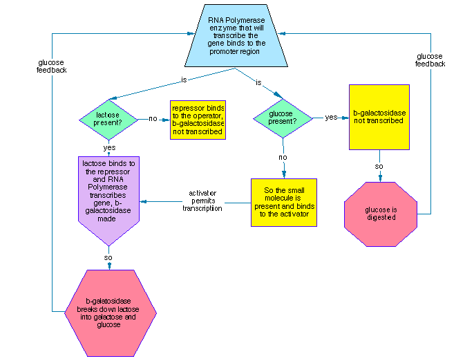

# Topological Data Analysis of Genetic Regulatory Circuits: Feedback Loops as Persistent Homology Features

**Authors:** Gary Welz¹, Mikael Vejdemo-Johansson²  
¹CopernicusAI, New York, NY; Person of Interest, CUNY Graduate Center  
²CUNY Graduate Center, New York, NY

**Abstract**

We apply topological data analysis (TDA) to 108 genetic regulatory circuits from the Genome Logic Modeling Project (GLMP). Each circuit is represented as a Mermaid Markdown flowchart (nodes, conditionals, OR/AND/NOT gates) derived from textual process descriptions; flowcharts are generated with LLM assistance, making it feasible to produce and curate many such diagrams from a single prompt in seconds—a methodological breakthrough relative to earlier, labor-intensive manual charting. We encode each flowchart as a 5-dimensional feature vector and compute persistent homology (Vietoris–Rips, Ripser, maxdim=2). The most persistent H₁ loops align with known feedback circuits: lac operon appears in a top loop (persistence 0.302), two-component EnvZ–OmpR in another (0.231), and a large loop (0.330) aggregates SOS response, stringent response, catabolite repression, Pho regulon, quorum sensing, and related regulatory systems—all with established feedback structure. Topology thus groups processes by regulatory logic (e.g. negative feedback, stress response) rather than by pathway alone, including across organisms (E. coli, S. cerevisiae, Bacillus subtilis). We conclude that TDA on structural features captures genuine regulatory architecture and discuss limitations, biological coherence checks, and next steps: Mapper, persistent cohomology, and scaling to hundreds of processes with domain-expert validation.

**Keywords:** persistent homology, genetic circuits, feedback loops, regulatory networks, topological data analysis, Mermaid visualization, LLM-assisted curation

---

## 1. Introduction

### 1.1 Origin and motivation

The idea of representing genetic regulatory processes as flowcharts has a long history. A first attempt at a β-galactosidase / Lac operon flowchart appeared in 1995 in an article in *The X Advisor*, an online magazine for Unix developers, entitled “Is the Genome Like a Computer Program?”, drawing on conversations with biologists on the bionet.genome.chromosome newsgroup. The original thread is archived at bio.net: [first posting (April 1995)](http://www.bio.net/bionet/mm/biochrom/1995-April/000537.html), in which the genome was proposed as a flowchart with genes connected by logical “and” and “or”; replies from Robert Robbins ([000539](http://www.bio.net/bionet/mm/biochrom/1995-April/000539.html), [000543](http://www.bio.net/bionet/mm/biochrom/1995-April/000543.html)) and G. Dellaire ([000540](http://www.bio.net/bionet/mm/biochrom/1995-April/000540.html)) raised points that remain pertinent. Robbins noted that “flow charts describe the behavior of a non-parallel machine” and that “care must be taken in interpreting that flow chart,” while also allowing that “bringing computer-science insights to bear on the challenge of understanding genome operation has some potentially huge payoffs.” Dellaire emphasized that “the actual structure of genome and not just the linear sequence may ‘encode’ sets of instructions for the ‘reading and accessing’ of this genetic code,” with context “spatial, what tissue; or temporal, what time of development”—a second level of language beyond the linear code. That distinction (logical/structure vs. sequence, and context) motivates the present use of flowcharts as structural data and the longer-term goal of linking topology to sequence motifs. The *X Advisor* article is archived at the Internet Archive; the newsgroup is also accessible via Google Groups. The β-galactosidase description used for that chart came from Berg & Singer (1992, pp. 71–73). Notably, the 1995 chart was created from text alone—the same process that LLMs use today: words describing a process → diagram. This methodological continuity shows that diagrams are only as detailed and reliable as their source material; using different sources for the same process can yield different charts, which explains why validation and fact-checking are essential. Producing such charts by hand was so time-consuming that the approach lay dormant for decades.

**Figure 1.** First β-galactosidase / Lac operon flowchart (1995). The chart was created from the textual description in Berg & Singer (1992, pp. 71–73) for the article "Is the Genome Like a Computer Program?" in *The X Advisor*; the article is archived at the Internet Archive. Produced by hand from text alone—the same process LLMs use today—it illustrates promoter–operator–repressor logic and lactose induction of β-galactosidase.

Recent advances in large language models (LLMs) and the adoption of Mermaid Markdown as a standard for structured diagrams have changed the picture: we can now generate and refine flowcharts from textual descriptions (e.g. paper excerpts) in seconds from a single prompt. The same Lac operon / β-galactosidase idea can be realized today as a Mermaid flowchart in the Genome Logic Modeling Project (GLMP) viewer, alongside 107 other genetic regulatory circuits. That methodological breakthrough—text to visual data at scale—motivates the present work.

We ask whether the *shape* of these circuits, as captured by topology, aligns with what biologists already know: feedback loops, cascades, and regulatory motifs. Feedback loops are literally loops; they should appear as persistent H₁ features. Can text-derived visual data support that?

### 1.2 Innovation: text to visual data

**Traditional TDA pipeline:** Numerical measurements → feature vectors → topology.

**This work:** Text (e.g. papers) → Mermaid flowcharts → feature extraction → topology.

The key innovation is treating flowcharts as visual data objects. Mermaid Markdown converts textual process descriptions into structured diagrams with nodes, edges, and explicit OR/AND/NOT logic. We do not use the full graph for TDA; we summarize each flowchart into a small set of numerical features (node count, conditional count, gate counts). Those features are then used to build a distance between processes and to compute persistent homology. Thus we extract topology from *descriptions* (via their visual representation), not from direct numerical measurements. That shift opens the possibility of analyzing processes for which quantitative data are scarce or incomplete.

### 1.3 Research questions

1. Do feedback circuits appear as persistent H₁ loops in the topological space?
2. Does topology group by regulatory logic (e.g. feedback, stress response) rather than by pathway or organism alone?
3. Can structural features (nodes, gates) support biological interpretation when validated by domain experts?

---

## 2. Methods

### 2.1 Data: GLMP database

The Genome Logic Modeling Project (GLMP) provides 108 genetic regulatory circuits:
- *E. coli:* 66 processes  
- *S. cerevisiae:* 38 processes  
- *Bacillus subtilis:* 4 processes  

Each process is represented as a Mermaid Markdown flowchart with nodes (genes, proteins, metabolites, conditions), edges (activation, repression, synthesis, degradation), and logic gates (OR, AND, NOT). That structure is exactly what we feed into the analysis. Examples include lac operon, SOS response, two-component EnvZ–OmpR signaling, ara and trp operons, heat shock, catabolite repression, and Pho regulon.

Each process JSON includes references (PubMed, DOI) so flowcharts are citable; the GLMP viewer accepts community feedback so diagrams are correctable. Code and data: https://github.com/garywelz/glmp. Interactive table and viewer: https://storage.googleapis.com/regal-scholar-453620-r7-podcast-storage/glmp-database-table.html.

### 2.2 Feature extraction

We do not use the full graph structure for TDA. From each Mermaid flowchart we extract five numerical features:

1. Node count  
2. Conditional count  
3. OR gates  
4. AND gates  
5. NOT gates  

These capture circuit complexity and logic structure. The feature matrix is 108 processes × 5 features, standardized to zero mean and unit variance.

### 2.3 Topological data analysis

We build pairwise Euclidean distances between processes in the 5-dimensional feature space, then run a Vietoris–Rips filtration and compute persistent homology with Ripser (maxdim=2), with cocycle extraction enabled. Outputs are persistence diagrams for H₀ (connected components), H₁ (loops), and H₂ (voids). Cocycles identify which specific processes form each H₁ loop.

---

## 3. Results

### 3.1 Persistence diagram

We obtain:
- **H₀:** 108 components (one per process).  
- **H₁:** 33 loops.  
- **H₂:** 4 voids.  

The question we then ask is whether these H₁ loops align with known biology—feedback circuits, stress responses, and regulatory motifs.

### 3.2 Top H₁ loops and biological interpretation

We rank H₁ loops by persistence (death − birth). Highlights:

**Loop #1 (persistence 0.330)**  
27 processes, including ara operon, SOS response, stringent response, catabolite repression, Pho regulon, quorum sensing, heat shock, GAL regulation, MAPK mating. They are not the same pathway but share a “regulatory with feedback” character and span E. coli, yeast, and Bacillus. This loop aggregates many established stress and nutrient regulatory systems.

**Loop #2 (persistence 0.308)**  
Four processes, all yeast (e.g. aerobic respiration, cell wall integrity, DNA replication). Organism-specific.

**Loop #3 (persistence 0.302)**  
Four processes, all E. coli: lac operon, antibiotic efflux pumps, phosphate regulation, translation termination. Lac operon is the textbook negative-feedback example. Topology here groups by that kind of regulatory logic, not by metabolic pathway alone.

**Loop #4 (persistence 0.283)**  
17 processes, largely a subset of Loop #1; nested structure.

**Loop #5 (persistence 0.231)**  
Three processes: two-component EnvZ–OmpR (E. coli), oxidative stress response, yeast ER-associated degradation. EnvZ–OmpR is the paradigm two-component signaling system with feedback. E. coli and yeast appear in the same topological loop—the structure of the circuit is what is shared, not the organism.

### 3.3 Biological coherence check

We took a set of circuits that biologists agree have feedback—lac, trp, ara operons; two-component EnvZ–OmpR; SOS, heat shock; catabolite repression, Pho regulon—and asked where they fall in the H₁ loops. Lac appears in Loop #3; two-component in Loop #5; many stress and nutrient circuits in Loop #1. The topology is therefore picking up real regulatory structure, not random variation.

### 3.4 Organism patterns

Some loops are organism-specific (e.g. Loop #2 all yeast, Loop #3 all E. coli). Others (Loop #1, Loop #5) mix organisms. So we see both universal regulatory motifs and ones that are species-specific.

### 3.5 Feature ablation

We reran TDA dropping one feature at a time. Baseline (all five features) gave coherence 0.75 (6 of 8 reference circuits in the top five H₁ loops) and 33 H₁ loops. Ablation results:

| Condition | Coherence | Delta | H₁ loops |
|-----------|-----------|-------|----------|
| Baseline (all 5) | 0.750 | — | 33 |
| Drop node_count | 0.125 | −0.625 | 33 |
| Drop conditional_count | 0.250 | −0.500 | 32 |
| Drop or_gates | 0.375 | −0.375 | 34 |
| Drop and_gates | 0.500 | −0.250 | 32 |
| Drop not_gates | 0.250 | −0.500 | 27 |

Removal of *node_count* produced the largest coherence decrease (delta = −0.625), identifying it as the most biologically informative feature. Dropping *conditional_count* or *not_gates* also strongly reduced coherence (−0.500). No single feature is dispensable; the signal is distributed, with node count and conditional/not-gate structure carrying the most weight.

### 3.6 Null model permutation test

We randomly permuted circuit labels and recomputed coherence over 1,000 permutations. Observed coherence 0.750 lay well above the null distribution (null mean ± SD: 0.339 ± 0.167; 95th percentile: 0.625; 99th percentile: 0.750). The one-tailed *p*-value was 0.022 (*n* = 1,000). Biological coherence at this level is therefore unlikely to arise by chance; the result is statistically significant at *p* < 0.05.

---

## 4. Discussion

### 4.1 Interpretation

The appearance of lac operon and two-component EnvZ–OmpR in top H₁ loops—both textbook feedback systems—supports the view that TDA on structural features reflects regulatory logic. The topology distinguishes “classic” single-circuit feedback (lac, EnvZ–OmpR) from larger clouds of regulatory processes (Loop #1). The same chart that was infeasible to produce at scale in 1995 can now be generated in seconds; applying TDA to many such flowcharts reveals that feedback loops appear as loops in homology.

### 4.2 Limitations

**Sample size:** 108 processes is enough to reveal structure but scaling to 200–500+ is a priority for robustness.

**Feature sensitivity:** We use five structural counts (node count, conditionals, OR/AND/NOT gates). Ablation (Section 3.5) shows that node count is the most load-bearing feature; conditional_count and not_gates also contribute strongly. The result is not an artifact of a single feature. Graph-theoretic enrichment (cycle rank, longest path, gate ratios) is planned for the next pipeline iteration.

**Flowcharts:** Diagrams are LLM-generated and require fact-checking. The GLMP viewer feedback mechanism supports community validation.

**Open question:** Does topology predict regulatory function or correlate with known biology? The coherence check supports the latter; prediction would require prospective validation with domain experts.

### 4.3 Future directions

**Validation and robustness:** Feature ablation (Section 3.5) and null-model permutation (Section 3.6) are complete. Ablation shows that coherence is distributed across features, with node count most informative. The null model gives *p* = 0.022 (*n* = 1,000 permutations)—observed coherence rarely arises by chance. Both results support that the topology is capturing biologically meaningful structure rather than feature-space artifact.

**Mapper and cohomology:** Treat circuit classes as nodes to visualize distinct regulatory families; explore persistent cohomology for circular coordinates that might align with “feedback depth” or cascade structure.

**Scaling:** Expand to 200–500+ genetic circuits; GLMP already includes 314 processes across biology, chemistry, physics, mathematics, and computer science.

**Topology and sequence (second act).** A natural next step is to ask whether topological neighborhoods in GLMP feature space predict shared regulatory sequence motifs—the physical implementation of AND, OR, and NOT logic on the chromosome. AND/OR/NOT in flowcharts correspond to binding-site logic (e.g. dual binding for AND; alternative sites for OR). If circuits in the same H₁ loop share sequence motifs enriched in their promoter regions (e.g. via RegulonDB, YEASTRACT, and motif discovery), topology would be doing something predictive about biology rather than merely descriptive. Cross-organism loops (Loop #1, Loop #5) are the strongest test case, since organism-level confounding cannot explain shared motifs. This would extend the current methodological foundation toward a falsifiable hypothesis: *topological neighborhoods are predictive of shared regulatory sequence motifs that implement the logical operations represented in the flowcharts.*

**Collaboration:** Ongoing work with the CUNY TDA group (Mikael Vejdemo-Johansson) and Jordan Matuszewski; we seek biologist validation of flowcharts and interpretations.

---

## 5. Conclusion

We applied TDA to 108 genetic regulatory circuits encoded as Mermaid Markdown flowcharts. The flowcharts are produced with LLM assistance from textual descriptions—the same Lac/β-galactosidase idea that was first sketched in 1995 can now be generated at scale in seconds. The most persistent H₁ loops correspond to known feedback circuits (lac operon, two-component signaling, SOS, stringent response, catabolite repression, Pho, quorum sensing, and related systems). Topology groups processes by regulatory logic and by organism in ways that match biological expectation. The work demonstrates a pipeline: text → visual data → features → topology, and suggests that TDA on structural features captures genuine regulatory architecture. Code, data, and documentation are open source.

---

## Acknowledgments

We thank Jordan Matuszewski and the CUNY Graduate Center TDA seminar group for feedback and collaboration.

---

## References

Berg, P., & Singer, M. (1992). *Dealing With Genes: The Language of Heredity*. University Science Books.

[To be added: Ripser, persim, GLMP repository, relevant TDA and biological circuit literature]

---

## Data availability

- Code: https://github.com/garywelz/glmp/tree/main/tda-analysis  
- Data and GLMP: https://github.com/garywelz/glmp  
- GLMP database table and viewer: https://storage.googleapis.com/regal-scholar-453620-r7-podcast-storage/glmp-database-table.html  
