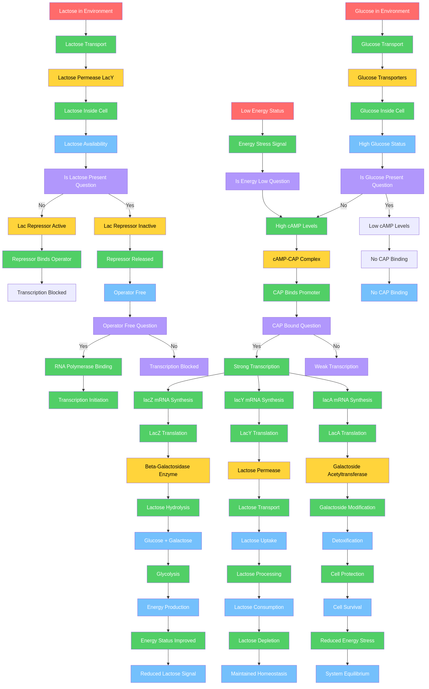
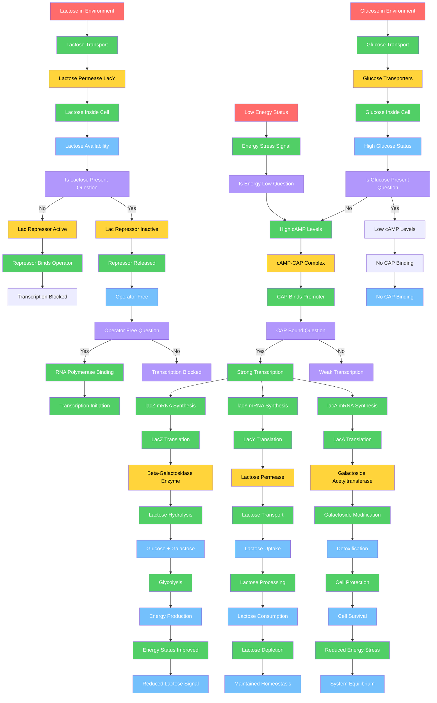

# The Genome Logic Modeling Project: A Call to Collaborative Discovery

**Gary Welz**  
Retired Faculty Member  
John Jay College, CUNY (Department of Mathematics and Computer Science)  
Borough of Manhattan Community College, CUNY  
CUNY Graduate Center (New Media Lab)  
Email: gwelz@jjay.cuny.edu

---

## Abstract

The Genome Logic Modeling Project (GLMP) proposes a bold hypothesis: that biological processes, when visualized as structured flowcharts, reveal logical patterns that may reflect underlying logical connectives encoded in genomes. This paper is not a report of verified results, but rather an invitation to join a collaborative effort to create, refine, and validate a comprehensive collection of biological process flowcharts using Mermaid Markdown syntax. We present the project's vision, methodology, and tools, and call upon the scientific community to participate in this ambitious exploration of biological logic at the molecular level.

**Keywords:** biological process visualization, genome logic, collaborative science, Mermaid flowcharts, biological pathways, logical connectives

---

## 1. Introduction: The Vision

### 1.1 A Hypothesis Worth Exploring

Biology is replete with processes that exhibit logical structure: decision points, conditional branches, feedback loops, and sequential operations. DNA replication follows a precise sequence of steps. Gene regulation involves conditional logic—if certain conditions are met, then specific genes are expressed. Metabolic pathways branch based on cellular state. Signal transduction cascades propagate information through logical gates.

What if these observable logical patterns in biological processes reflect something deeper? What if genomes themselves encode not just sequences of nucleotides, but logical connectives—the biological equivalents of AND, OR, NOT, IF-THEN, and other logical operators? This is the central hypothesis of the Genome Logic Modeling Project (GLMP).

We propose that by systematically visualizing biological processes as structured flowcharts, we can:
1. **Identify recurring logical patterns** across diverse biological systems
2. **Map these patterns to genomic elements** that may encode logical operations
3. **Develop a framework for understanding** how genomes implement computational logic at the molecular level

This is not a claim of verified truth, but rather a hypothesis that invites exploration, validation, and collaborative refinement.

### 1.2 The Scope of the Challenge

The complexity of biological systems is staggering. Even well-studied organisms like *E. coli* or *S. cerevisiae* contain thousands of genes, each potentially involved in multiple processes. The human genome encodes over 20,000 protein-coding genes, and the full complexity of regulatory networks, metabolic pathways, and signaling cascades remains incompletely mapped.

No single research group can comprehensively map all biological processes. This is why GLMP is designed as a **collaborative, open project**—a call to the scientific community to join in creating, refining, and validating process visualizations that may ultimately reveal fundamental principles of biological logic.

---

## 2. The Hypothesis: Logical Connectives in Genomes

### 2.1 What We Mean by "Logical Connectives"

In computer science and logic, connectives like AND, OR, NOT, and IF-THEN define relationships between propositions. In biology, we observe analogous patterns:

- **AND gates:** A process requires multiple conditions to be true (e.g., "IF glucose is present AND oxygen is available, THEN proceed with aerobic respiration")
- **OR gates:** A process can proceed via multiple alternative pathways (e.g., "IF DNA damage is detected, THEN initiate repair via pathway A OR pathway B")
- **NOT gates:** Inhibition and repression mechanisms (e.g., "IF repressor is bound, THEN transcription does NOT occur")
- **IF-THEN logic:** Conditional execution based on cellular state (e.g., "IF nutrient levels are low, THEN activate stress response")

These patterns are observable in process descriptions, but the question remains: **Are these patterns encoded in the genome itself?** Do specific genomic elements—promoters, enhancers, regulatory sequences, or even coding regions—function as logical operators?

### 2.2 From Process Visualization to Genomic Logic

The analogy between genomes and computer programs has been explored by researchers such as Shapiro (2009, 2011), who argues that genomes function as sophisticated information-processing systems. If genomes are indeed computational systems, then they must implement logical operations—the biological equivalents of programming constructs like conditionals, loops, and logical gates.

The GLMP hypothesis suggests that by:
1. **Systematically visualizing processes** as structured flowcharts
2. **Identifying recurring logical patterns** across diverse biological systems
3. **Correlating these patterns with genomic elements** involved in each process

We may discover that genomes encode logical operations in ways that are currently unrecognized. This could have profound implications for:
- **Understanding evolution:** How do logical structures evolve? Are there conserved logical "algorithms" across species?
- **Synthetic biology:** Can we design genomes with specific logical properties, as Endy (2005) and others have proposed?
- **Disease mechanisms:** Do mutations disrupt logical operations, not just sequences? Could "logic errors" explain some disease phenotypes?
- **Computational biology:** Can we model biological systems using formal logic, enabling more accurate predictions?

### 2.3 Why This Matters

If genomes encode logical connectives, this represents a fundamental shift in how we understand biological information processing. It suggests that genomes are not merely repositories of sequence data, but active computational systems that implement logical operations at the molecular level—a view consistent with Shapiro's (2011) argument that genomes function as sophisticated information-processing systems, and with the growing field of synthetic biology that treats biological systems as engineerable computational devices (Benner & Sismour, 2005; Endy, 2005).

This hypothesis is **testable** through systematic process visualization and pattern analysis. It is **falsifiable**—if no consistent logical patterns emerge, or if patterns cannot be mapped to genomic elements, the hypothesis fails. But it is also **ambitious**—requiring comprehensive process mapping across diverse organisms and systems.

---

## 3. The GLMP Project: Methodology and Current State

### 3.1 Project Overview

The Genome Logic Modeling Project applies the [Programming Framework](https://huggingface.co/spaces/garywelz/programming_framework) to biological processes, transforming textual descriptions into structured, computable flowcharts using:

- **Large Language Models (LLMs)** for extracting process logic from scientific literature
- **Mermaid Markdown syntax** for human-readable, version-controllable diagrams
- **JSON-based storage** with rich metadata for programmatic access and analysis
- **Iterative refinement** through human review and validation

### 3.2 Current Progress

As of this writing, GLMP contains **110+ biological processes** across **21 categories**, including:

- **Stress Response** (19 processes)
- **Metabolic Pathway** (13 processes)
- **Signal Transduction** (11 processes)
- **Gene Regulation** (9 processes)
- **DNA Repair** (7 processes)
- **DNA Replication** (5 processes)
- And many more...

Each process is stored as a JSON file containing:
- Process name, description, and category
- Mermaid flowchart syntax
- Metadata (version, references, source papers)
- Entity lists (genes, proteins, molecules involved)

All processes are publicly accessible via:
- **Interactive web viewer:** [GLMP Hugging Face Space](https://huggingface.co/spaces/garywelz/glmp)
- **Database table:** [GLMP Database](https://storage.googleapis.com/regal-scholar-453620-r7-podcast-storage/glmp-database-table.html)
- **Google Cloud Storage:** JSON files in `gs://regal-scholar-453620-r7-podcast-storage/glmp-v2/processes/`

### 3.3 Why Mermaid Flowcharts?

Mermaid Markdown offers several advantages for collaborative biological process visualization:

1. **Human-readable:** Flowcharts are written in text, making them easy to review, edit, and discuss
2. **Version-controllable:** Text-based format integrates with Git and other version control systems
3. **Interactive:** Mermaid.js renders flowcharts as interactive diagrams in web browsers
4. **Standardized:** Consistent syntax enables programmatic analysis and comparison
5. **Accessible:** Text-based format is accessible to screen readers and can be converted to other formats

The Programming Framework suggests a five-category color-coding system (Red/Yellow/Green/Blue/Violet) for consistent representation, but this is customizable for specific biological contexts.

---

## 4. A Call to Participation

### 4.1 Why We Need Your Help

The GLMP project is ambitious in scope. To test the hypothesis that genomes encode logical connectives, we need:

1. **Comprehensive process coverage:** Thousands of processes across diverse organisms
2. **Expert validation:** Domain experts to review and refine flowcharts
3. **Pattern analysis:** Computational biologists to identify recurring logical structures
4. **Genomic correlation:** Researchers to map logical patterns to genomic elements
5. **Cross-disciplinary collaboration:** Biologists, computer scientists, and logicians working together

No single individual or research group can accomplish this alone. **We invite you to join us.**

### 4.2 How You Can Participate

#### Creating New Process Flowcharts

- **Choose a biological process** from your area of expertise
- **Extract the process logic** from scientific literature (or use our LLM-based tools)
- **Create a Mermaid flowchart** following the Programming Framework methodology
- **Submit for review** via our GitHub repository or Hugging Face Space

#### Validating Existing Flowcharts

- **Review existing GLMP processes** in your domain
- **Identify errors, omissions, or improvements**
- **Propose corrections** or refinements
- **Validate against current scientific understanding**

#### Analyzing Logical Patterns

- **Examine flowcharts** for recurring logical structures
- **Develop formal representations** of biological logic
- **Correlate patterns with genomic elements**
- **Test the hypothesis** through computational analysis

#### Contributing Tools and Methods

- **Develop analysis tools** for pattern detection
- **Create visualization enhancements**
- **Build integration with other databases**
- **Improve the methodology** itself

### 4.3 Benefits of Participation

By participating in GLMP, you contribute to:

1. **Open science:** All contributions are publicly accessible and citable
2. **Knowledge discovery:** Systematic process visualization may reveal new insights
3. **Tool development:** Your feedback improves the methodology for everyone
4. **Collaboration:** Connect with researchers across disciplines
5. **Publication:** Contributors will be acknowledged in future publications

---

## 5. Benefits and Advantages of the GLMP Approach

### 5.1 Systematic Process Representation

Traditional biological process descriptions are often:
- **Narrative:** Written in prose, making systematic comparison difficult
- **Static:** Diagrams are images, not computable data structures
- **Inconsistent:** Different authors use different conventions

GLMP flowcharts are:
- **Structured:** Consistent format enables programmatic analysis
- **Computable:** JSON storage allows querying, searching, and comparison
- **Standardized:** Mermaid syntax provides consistent visualization

### 5.2 Enabling Computational Analysis

Structured flowcharts enable:
- **Pattern detection:** Identify recurring logical structures across processes
- **Comparative analysis:** Compare processes across organisms or conditions
- **Simulation:** Use flowcharts as inputs to computational models
- **Search and discovery:** Find processes with specific logical properties

### 5.3 Integration with Existing Resources

GLMP flowcharts can integrate with:
- **Genomic databases:** Link processes to genes, regulatory elements, and sequences
- **Pathway databases:** Complement existing pathway resources (KEGG, Reactome, etc.)
- **Literature databases:** Connect processes to source papers and citations
- **AI systems:** Enable AI assistants to understand and reason about biological processes

### 5.4 Educational Value

Structured process visualizations support:
- **Teaching:** Clear, interactive diagrams for biology education
- **Learning:** Students can explore processes at their own pace
- **Research training:** Graduate students learn systematic process analysis
- **Public understanding:** Making complex biology accessible to non-specialists

---

## 6. How to Get Started

### 6.1 Explore Existing Processes

1. Visit the [GLMP Hugging Face Space](https://huggingface.co/spaces/garywelz/glmp)
2. Browse processes by category
3. Review Mermaid flowchart syntax
4. Examine JSON file structure

### 6.2 Learn the Methodology

1. Read the [Programming Framework paper](https://huggingface.co/spaces/garywelz/programming_framework)
2. Study example flowcharts
3. Understand the color-coding system
4. Review validation criteria

### 6.3 Contribute Your First Process

1. **Choose a process** from your expertise
2. **Gather source materials** (papers, textbooks, databases)
3. **Extract process logic** (manually or using LLM tools)
4. **Create Mermaid flowchart** following the framework
5. **Validate against literature**
6. **Submit for review**

### 6.4 Join the Community

- **GitHub:** [Repository link to be added]
- **Discussions:** [Forum/Discord link to be added]
- **Email:** Contact the project lead for collaboration opportunities

---

## 7. Future Directions and Research Questions

### 7.1 Expanding Coverage

- **More processes:** Thousands of processes across diverse organisms
- **More categories:** Expand beyond current 21 categories
- **More organisms:** From bacteria to humans, from model systems to wild species
- **More conditions:** Processes under different environmental or disease states

### 7.2 Pattern Analysis

- **Logical structure classification:** Develop taxonomy of biological logic
- **Evolutionary analysis:** How do logical patterns evolve?
- **Comparative genomics:** Compare logical structures across species
- **Disease correlation:** Do mutations disrupt logical operations?

### 7.3 Genomic Mapping

- **Regulatory element identification:** Map logical operators to genomic sequences
- **Enhancer logic:** Do enhancers function as logical gates?
- **Promoter logic:** How do promoters implement conditional expression?
- **Synthetic biology applications:** Design genomes with specific logical properties

### 7.4 Tool Development

- **Automated pattern detection:** AI tools to identify logical structures
- **Visualization enhancements:** Interactive tools for exploring processes
- **Integration platforms:** Connect GLMP with other biological databases
- **Analysis pipelines:** Computational tools for hypothesis testing

---

## 8. Limitations and Challenges

### 8.1 Current Limitations

- **Coverage:** Only 110+ processes mapped (thousands remain)
- **Validation:** Many processes need expert review
- **Completeness:** Some processes may be oversimplified
- **Bias:** Coverage may reflect literature availability, not biological importance

### 8.2 Methodological Challenges

- **LLM accuracy:** Automated extraction may contain errors
- **Process complexity:** Some processes resist simple flowchart representation
- **Context dependence:** Processes may vary by cell type, condition, or organism
- **Dynamic processes:** Static flowcharts may miss temporal aspects

### 8.3 Hypothesis Testing Challenges

- **Pattern identification:** Distinguishing signal from noise in logical structures
- **Genomic correlation:** Mapping logical patterns to specific genomic elements
- **Causality:** Establishing that genomic elements encode logic, not just correlate
- **Falsifiability:** Defining clear criteria for hypothesis rejection

We acknowledge these limitations and invite the community to help address them.

---

## 9. Conclusion: An Invitation to Explore

The Genome Logic Modeling Project presents a bold hypothesis: that biological processes reveal logical patterns that may reflect logical connectives encoded in genomes. This is not a claim of verified truth, but rather an **invitation to collaborative exploration**.

We have created tools, methodology, and an initial collection of 110+ process flowcharts. But this is just the beginning. To test the hypothesis, we need:

- **Thousands of processes** mapped and validated
- **Expert review** from domain specialists
- **Pattern analysis** from computational biologists
- **Genomic correlation** from molecular biologists
- **Collaboration** across disciplines

**We invite you to join us** in this ambitious exploration of biological logic. Whether you contribute a single process flowchart, validate existing ones, analyze patterns, or develop tools—your participation matters.

The question of whether genomes encode logical connectives is profound. The answer may reshape our understanding of biological information processing, evolution, and the nature of life itself. But we cannot answer this question alone.

**Join the Genome Logic Modeling Project. Help us discover the logic of life.**

---

## Acknowledgments

The GLMP project builds upon the Programming Framework methodology and integrates with the CopernicusAI Knowledge Engine. We thank early contributors and look forward to expanding our collaborative community.

---

## References

1. Welz, G. (2024). The Programming Framework: A General Method for Process Analysis Using LLMs and Mermaid Visualization. *Hugging Face Space*. https://huggingface.co/spaces/garywelz/programming_framework

2. Jacob, F., & Monod, J. (1961). Genetic regulatory mechanisms in the synthesis of proteins. *Journal of Molecular Biology*, 3(3), 318-356. https://doi.org/10.1016/S0022-2836(61)80072-7

3. Shapiro, J. A. (2009). Revisiting the central dogma in the 21st century. *Annals of the New York Academy of Sciences*, 1178(1), 6-28. https://doi.org/10.1111/j.1749-6632.2009.04990.x

4. Shapiro, J. A. (2011). Evolution: A view from the 21st century. *FT Press Science*.

5. Benner, S. A., & Sismour, A. M. (2005). Synthetic biology. *Nature Reviews Genetics*, 6(7), 533-543. https://doi.org/10.1038/nrg1637

6. Endy, D. (2005). Foundations for engineering biology. *Nature*, 438(7067), 449-453. https://doi.org/10.1038/nature04342

7. Elowitz, M. B., & Leibler, S. (2000). A synthetic oscillatory network of transcriptional regulators. *Nature*, 403(6767), 335-338. https://doi.org/10.1038/35002125

8. Gardner, T. S., Cantor, C. R., & Collins, J. J. (2000). Construction of a genetic toggle switch in Escherichia coli. *Nature*, 403(6767), 339-342. https://doi.org/10.1038/35002131

9. KEGG: Kyoto Encyclopedia of Genes and Genomes. (2024). https://www.genome.jp/kegg/

10. Reactome: A curated pathway database. (2024). https://reactome.org/

11. Mermaid - Diagramming and charting tool. (2024). https://mermaid.js.org/

12. Ptashne, M., & Gann, A. (2002). *Genes and signals*. Cold Spring Harbor Laboratory Press.

13. Alon, U. (2007). *An introduction to systems biology: Design principles of biological circuits*. Chapman and Hall/CRC.

14. Rosen, R. (1991). *Life itself: A comprehensive inquiry into the nature, origin, and fabrication of life*. Columbia University Press.

15. Kauffman, S. A. (1993). *The origins of order: Self-organization and selection in evolution*. Oxford University Press.

16. Noble, D. (2006). *The music of life: Biology beyond the genome*. Oxford University Press.

17. Genome Logic Modeling Project (GLMP). (2024). *Hugging Face Space*. https://huggingface.co/spaces/garywelz/glmp

18. GLMP Database. (2024). *Google Cloud Storage*. https://storage.googleapis.com/regal-scholar-453620-r7-podcast-storage/glmp-database-table.html

19. CopernicusAI Knowledge Engine. (2025). https://huggingface.co/spaces/garywelz/copernicusai

20. Welz, G. (2024). From inspiration to AI: Biology as visual programming. *Medium*. https://medium.com/@garywelz_47126/from-inspiration-to-ai-biology-as-visual-programming-520ee523029a

---

## Appendix A: Example Process Flowchart

### Beta-Galactosidase Regulation System

The lac operon in *E. coli* provides an excellent example of biological logic in action. This system demonstrates clear IF-THEN logic: **IF** lactose is present **AND** glucose is absent, **THEN** express the genes needed for lactose metabolism. The following comprehensive flowchart illustrates the complete regulatory system, including environmental inputs, transport processes, regulatory logic gates (Lac repressor and CAP-cAMP), transcription control, gene expression for all three operon genes (lacZ, lacY, lacA), protein synthesis, metabolic functions, and feedback control mechanisms.

**Rendered Flowchart:**



*Figure A1: Beta-Galactosidase Regulation System. This comprehensive computational flowchart demonstrates the Programming Framework's ability to represent complex genetic regulatory networks with complete feedback loops and system equilibrium. The visualization shows environmental inputs (lactose, glucose, energy status), regulatory complexes and enzymes (Lac repressor, CAP-cAMP complex, beta-galactosidase), intermediate states and logic gates, functional outputs (glucose + galactose, lactose uptake, detoxification), and dynamic feedback control mechanisms. This detailed representation reveals multiple layers of logical operations: conditional branching (IF-THEN), inhibition (NOT gates), sequential processing, and feedback loops that maintain system equilibrium.*

**Mermaid Markdown Code:**



**Color Legend:**
- **Red (#ff6b6b):** Triggers & Inputs (Lactose Present)
- **Yellow (#ffd43b):** Structures & Objects (LacI Repressor, RNA Polymerase, Beta-Galactosidase Enzyme)
- **Green (#51cf66):** Processing & Operations (Transcription Initiated, mRNA Production, Lactose Hydrolysis)
- **Blue (#74c0fc):** Intermediates & States (Lactose Binding decision, Repressor Released/Bound states)
- **Violet (#b197fc):** Products & Outputs (No Transcription, Glucose + Galactose)

**Logical Structure Analysis:**

This comprehensive flowchart reveals multiple layers of logical operations:

- **Conditional Branching (IF-THEN gates):** Multiple decision points including "Is Lactose Present?" (M), "Is Glucose Present?" (N), "Is Energy Low?" (O), "Operator Free?" (BB), and "CAP Bound?" (CC)

- **AND Logic:** Transcription requires both operator free (U) AND CAP bound (Z) for strong transcription (FF)

- **OR Logic:** The system can proceed via multiple pathways (e.g., energy can come from glycolysis OR other sources)

- **Inhibition Logic (NOT gates):** The repressor bound state (R) implements a NOT gate (if bound, then transcription blocked)

- **Sequential Logic:** Clear sequence from environmental inputs → transport → regulatory decisions → transcription → translation → function → metabolic output → feedback

- **Feedback Loops:** Dynamic equilibrium maintained through feedback from energy status (DDD), lactose depletion (EEE), and reduced stress (FFF) back to system inputs

- **Multi-gene Coordination:** All three operon genes (lacZ, lacY, lacA) are expressed coordinately, demonstrating parallel processing logic

**JSON Metadata Example:**

```json
{
  "id": "beta-galactosidase-regulation",
  "title": "Beta-Galactosidase Regulation System",
  "description": "Regulatory system controlling lactose metabolism in E. coli via the lac operon. Demonstrates IF-THEN logic: IF lactose is present AND glucose is absent, THEN express lactose metabolism genes.",
  "category": "Gene Regulation",
  "organism": "Escherichia coli",
  "version": "1.0",
  "mermaid": "flowchart TD\n    A[Lactose Present] --> B[LacI Repressor]\n    ...",
  "entities": ["LacI", "beta-galactosidase", "lactose", "RNA polymerase", "lac operon"],
  "logical_operations": {
    "conditional": ["Lactose Binding decision"],
    "inhibition": ["Repressor binding blocks transcription"],
    "sequential": ["Transcription → Translation → Function"]
  },
  "source": "Jacob, F., & Monod, J. (1961). Genetic regulatory mechanisms in the synthesis of proteins. Journal of Molecular Biology, 3(3), 318-356.",
  "references": [
    "https://doi.org/10.1016/S0022-2836(61)80072-7"
  ],
  "created_by": "LLM (Gemini 2.0 Flash)",
  "reviewed_by": "Domain Expert",
  "validation_status": "validated"
}
```

This example demonstrates how biological processes can be represented as structured flowcharts that reveal logical patterns—patterns that may reflect underlying genomic logic.

## Appendix B: Contribution Guidelines

[Detailed guidelines for:
- Process selection criteria
- Mermaid syntax standards
- Validation requirements
- Submission process
- Review procedures]

## Appendix C: Tools and Resources

[Links to:
- GLMP database and viewer
- Programming Framework documentation
- Mermaid syntax reference
- Example processes
- Contribution templates]

