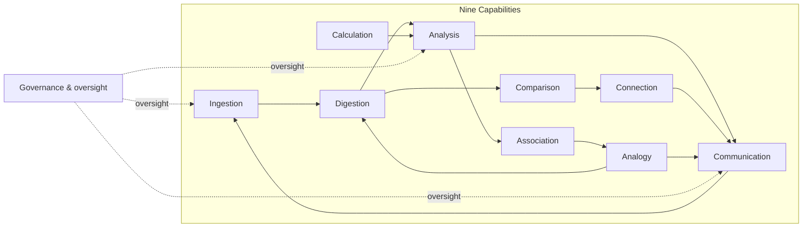
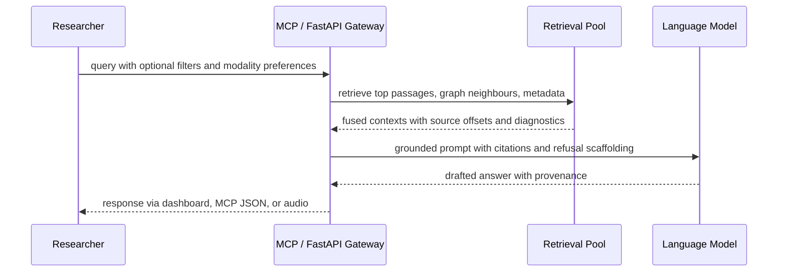

# AI-Powered Knowledge Engines as Research Infrastructure for Systematic Knowledge Discovery

**Gary Welz**

Researcher, New Media Lab, CUNY Graduate Center
Email: gwelz@gc.cuny.edu
ORCID: https://orcid.org/0009-0005-7806-0892

---

## Abstract

This paper proposes *knowledge engines* as a framework for understanding how intelligent systems — both human and artificial — systematically discover, integrate, and generate knowledge. We argue that history's greatest scientific minds functioned as knowledge engines, processing information through iterative cycles of ingestion, analysis, synthesis, and communication, guided by curiosity and willingness to challenge established beliefs.

We propose a taxonomy of nine integrated capabilities — ingestion, digestion, analysis, calculation, comparison, connection, association, analogy, and multimodal communication — that any serious knowledge engine must combine systematically. The argument is deliberately integrative: achieving ambitious research goals requires orchestrating all nine capabilities within a durable infrastructure, not merely scaling up foundation models alone.

We present CopernicusAI as a working proof-of-concept of the knowledge engine framework, demonstrating feasibility through a fully deployed system with 59,499 indexed research papers, 582 process diagrams across six scientific disciplines, an operational knowledge graph, vector search, and retrieval-augmented generation (RAG) capabilities. To address reviewer requests for empirical content, we report a preliminary retrieval pilot (30 queries, lexical TF-IDF baseline, frozen corpus of 59,499 documents) yielding a mean nDCG@10 of 0.545 — a useful early benchmark, with dense-vector evaluation deferred pending infrastructure resumption. While extensive validation remains necessary, the system demonstrates that the knowledge engine framework can be instantiated in practice.

**Keywords:** knowledge engines; research infrastructure; human-AI collaboration; retrieval-augmented generation; knowledge graphs; Model Context Protocol; evaluation

---

## 1. Introduction

At its most fundamental level, a knowledge engine is any system — biological or artificial — that systematically transforms information into knowledge. The term "engine" is deliberate: it suggests a mechanism that performs real work, converting raw inputs (information) into useful outputs (knowledge, understanding, actionable insights).

History's greatest scientists — Aristotle, Newton, Euler, Copernicus — functioned as knowledge engines. They processed information through iterative cycles of observation, analysis, calculation, and synthesis. What made them effective was not raw intelligence alone, but systematic processes: disciplined ingestion of evidence, careful structuring of findings, connection of ideas across domains, and communication of results in forms others could scrutinize and build upon. They also contributed tools — telescopes, microscopes, conceptual frameworks, mathematical notation — that enabled future knowledge discovery.

Modern AI creates an opportunity to build computational knowledge engines that combine this kind of systematic rigor with capabilities that exceed human limitations in scale, speed, and persistence. However, creating such systems requires more than applying large language models to a problem. It requires understanding and implementing the systematic processes that make knowledge engines effective — what we call the knowledge engine framework.

**Contributions.** This paper makes four concrete contributions:

1. A nine-capability taxonomy that provides a vocabulary for designing knowledge engines and clarifies what engineering obligations each capability entails in practice.
2. A deployed prototype, CopernicusAI, demonstrating that the framework can be instantiated by a single researcher using commodity tools and modest infrastructure.
3. A preliminary retrieval pilot providing the first quantitative benchmark of the system's performance, with honest acknowledgment of its scope and limitations.
4. An evaluation roadmap outlining how future studies can rigorously assess knowledge engine effectiveness.

**What this paper does not claim.** We are not proposing new machine learning algorithms, claiming validated superiority over existing systems, or presenting a production-ready research tool. We offer a framework and an existence proof, with extensive validation still required.

---

## 2. Related Work and Positioning

The knowledge engine framework builds on seven decades of AI research spanning several distinct traditions.

**Expert systems (1970s–1990s).** Early systems such as MYCIN [19] and CYC [20] demonstrated that structured knowledge representation and rule-based reasoning could achieve expert-level performance in narrow domains. Their lasting lessons were not just about what they could do, but about what they could not: knowledge acquisition became a bottleneck, coverage was brittle, and maintenance costs were high. These failure modes motivate our emphasis on scalable ingestion, flexible representation, and ongoing human oversight rather than static knowledge bases.

**Knowledge representation and the Semantic Web.** Formal frameworks for organizing knowledge — semantic networks, frames, ontologies, and linked data [1, 2, 3] — established durable principles around identifiers, constraints, and interoperability. Contemporary knowledge engines inherit these obligations. Open scholarly infrastructures such as Semantic Scholar [4] and OpenAlex [5] demonstrate what this looks like at scale: reproducible joins, provenance tracking, and participatory correction loops that brittle scraping approaches cannot sustain.

**Retrieval and generation.** Dense passage retrieval [6] and retrieval-augmented generation (RAG) [7] represent the current state of the art for grounding language model outputs in external knowledge. RAG addresses a fundamental limitation of standard LLMs: their knowledge is frozen at training time and cannot access current or domain-specific information. By retrieving relevant passages before generating an answer, RAG systems can produce cited, verifiable responses. PaperQA [8] extends this approach with explicit skepticism about absent evidence — a useful counterweight to the tendency of LLMs to confabulate when evidence is thin. Our framework extends RAG further by situating retrieval within a broader infrastructure that includes ingestion provenance, structured process representations, knowledge graph navigation, and multimodal communication.

**Cognitive architectures.** Frameworks such as SOAR [13] and ACT-R [14] provide useful vocabulary for decomposing intelligent behavior into distinct subsystems. We borrow this vocabulary for the nine-capability taxonomy while explicitly disclaiming any claim of psychological fidelity. Our labels denote engineering affordances, not cognitive mechanisms.

**Cautionary cases.** IBM Watson's oncology deployments [10, 11] illustrate the gap between engineering-era optimism and clinical reality. Galactica [9], a large language model trained on scientific text, was withdrawn after generating confident but inaccurate outputs. These cases reinforce a core argument of this paper: building bigger models is not sufficient. Reliable knowledge systems require disciplined infrastructure, transparent evaluation, and honest acknowledgment of limitations.

**Positioning.** Semantic Scholar, OpenAlex, and PaperQA each address important parts of the knowledge engine problem. The contribution of this paper is to argue for their systematic integration within a unified framework that adds ingestion provenance, multimodal delivery, interoperable tool access via the Model Context Protocol [15], and governance artefacts. Section 5 shows how CopernicusAI instantiates this vision; Section 6 provides an initial empirical benchmark.

---

## 3. A Taxonomy of Knowledge Engine Capabilities

We propose nine integrated capabilities that any knowledge engine must combine systematically. These capabilities are not novel — they are well-established in cognitive science and AI. Our contribution is proposing their systematic integration through a clear taxonomy, explicit feedback loops, and governance oversight.

The nine capabilities are:

1. **Ingestion:** Multi-source, multi-modal acquisition of information with provenance tracking and quality assessment.
2. **Digestion:** Processing raw information into structured, usable forms — normalization, chunking, entity extraction, identifier alignment.
3. **Analysis:** Deep examination of structured information to identify patterns, anomalies, and relationships.
4. **Calculation:** Mathematical computation, simulation, optimization, and quantitative prediction.
5. **Comparison:** Similarity assessment, difference identification, and cross-domain juxtaposition.
6. **Connection:** Relationship discovery, network analysis, path finding, and clustering across items.
7. **Association:** Co-occurrence detection, correlation analysis, and weak signal identification.
8. **Analogy:** Structural mapping across domains, enabling transfer of insight from one field to another.
9. **Communication:** Multi-modal expression of results through text, visual, audio, and interactive formats.

The power of a knowledge engine lies not in any single capability but in their integration. A system that can ingest but not analyze is merely a database. One that analyzes but does not connect misses relationships. One that connects but cannot communicate cannot share knowledge. Feedback loops tie the capabilities together: outputs from communication feed back into ingestion priorities; analogy suggestions inform what new material to digest; governance oversight monitors ingestion, analysis, and communication to catch errors and biases before they propagate.

### 3.1 How the Capabilities Work Together

The diagram below illustrates the coupling between capabilities and the role of governance oversight. Note that the nine capabilities need not map one-to-one onto software modules — a single subsystem may implement several capabilities, and a single capability may be distributed across subsystems.

*Figure 1. Nine-capability coupling diagram showing feedback loops and governance oversight. Arrows indicate data flow and influence; governance oversight (dashed) applies to ingestion, analysis, and communication as the three points of greatest risk for error propagation.*

### 3.2 What Each Capability Means in an Engineered System

Reviewers reasonably ask how abstract capability labels acquire concrete meaning in an engineered system rather than remaining as metaphors. Table 1 answers this by specifying what each capability means operationally — what artefacts it produces, and how CopernicusAI implements it.

**Table 1. Operational semantics of the nine capabilities**

| Capability | What it means in an engineered system | CopernicusAI implementation |
|---|---|---|
| Ingestion | Licensed data acquisition with provenance manifests, checksums, and ingestion telemetry | Scheduled Python adapters for arXiv, PubMed, NASA ADS; curator upload workflows; typed Firestore records |
| Digestion | Normalization, chunking, identifier alignment, and metadata structuring of raw inputs | LLM-assisted entity extraction; Programming Framework prose-to-JSON diagram pipeline |
| Analysis | Summarization, contradiction surfacing, and pattern identification over structured content | Retrieval-fused prompting; exploratory ranking boosts (flagged as unvalidated) |
| Calculation | Executable numerics, surrogate solvers, and quantitative estimation | Mostly delegated to external calculators and notebooks; internal kernels are a roadmap item |
| Comparison | Ranking, deduplication, divergence surfacing, and side-by-side juxtaposition | Dense similarity search; lexical fallback; category filters; paired paper views |
| Connection | Explicit relationship induction, graph traversal, and neighbourhood exploration | Knowledge graph edges encoding citations, semantic similarity, and category links; interactive UI |
| Association | Weak-signal co-occurrence mining and exploratory correlation hints | Embedding neighbourhood overlaps; metadata correlations (flagged exploratory) |
| Analogy | Cross-domain juxtaposition and provisional structural mapping | Guided prompts; distal neighbourhood retrieval; disclaimer-heavy sceptical scaffolding |
| Communication | Interfaces, rendered artefacts, and inspectable output surfaces | HTTPS dashboard; MCP tool payloads; AI-synthesized podcasts; knowledge graph visualization |

The embedding-based similarity underlying Comparison, Connection, and Association supplies a topical geometry — approximate proximity in semantic space — rather than logical entailment. The Model Context Protocol (MCP) [15] surfaces frozen, auditable payloads that reviewers and users can inspect without re-running opaque pipelines. Governance oversight routes through the Communication capability via participatory feedback, explicit refusal when evidence is insufficient, and versioned artefacts that preserve the history of the system's outputs.

---

## 4. Why Ambitious Research Goals Require a Framework

Public discussions of AI research assistants often suggest that a sufficiently powerful language model could answer questions like "What is the cure for cancer?" This framing misses a fundamental reality: no model can generate reliable answers to such questions from scratch, regardless of its scale.

Consider what answering that question actually requires. First, comprehensive ingestion of evidence across oncology, genomics, pharmacology, immunology, and related fields — no single model's training data is sufficient. Second, multimodal analytic tools capable of processing not just text but images, structured clinical data, and time series. Third, hypothesis generation that goes beyond retrieval — the ability to propose novel connections and test them against evidence. Fourth, experimental validation interfaces that route users toward reproducible checks rather than conversational assertions. Fifth, reliability auditing that surfaces uncertainty and conflicting evidence rather than generating fluent but misleading summaries. Sixth, collaboration infrastructure that brings human expertise into the loop at the right moments. Seventh, conceptual scaffolding that organizes the problem space so researchers can navigate it without becoming disoriented.

Each of these requirements maps to one or more of the nine capabilities described in Section 3. Table 2 makes this mapping explicit.

**Table 2. Prerequisites for ambitious research goals, mapped to knowledge engine capabilities**

| Prerequisite | Primary capabilities involved | Notes |
|---|---|---|
| Comprehensive multi-disciplinary ingestion | Ingestion, digestion, communication | Volume without provenance produces an unauditable corpus |
| Multimodal analytic tooling | Digestion, analysis, comparison, calculation | Cross-modal contrast reduces modality-tunnel hallucination |
| Hypothesis scaffolding beyond naive Q&A | Analysis, association, analogy, communication | Creative leaps without auditing create ethical risks |
| Experimental validation interfaces | Calculation, analysis, communication | Claims should route users toward reproducible checks |
| Reliability auditing and explicit refusal | Comparison, analysis, communication | Transparency artefacts are scholarly outputs in their own right |
| Collaboration infrastructure | Communication, ingestion, governance | MCP [15] enables audited, routable access — but is not sufficient alone |
| Conceptual scaffolding | Digestion, connection, communication | Discipline-scale maps reduce disorientation as corpora grow |

The implication is not that AI cannot contribute to ambitious research goals, but that contributing meaningfully requires building the right infrastructure rather than simply scaling model size. This is the core argument for the knowledge engine framework.

---

## 5. CopernicusAI: A Proof-of-Concept Implementation

CopernicusAI is an early prototype demonstrating how the knowledge engine framework can be instantiated in practice. It is an existence proof — showing that such systems can be built by a single researcher using commodity tools — not a validated production system. The implementation is described here with explicit acknowledgment of its current limitations.

### Architecture Overview

The system integrates multiple components following the nine-capability taxonomy. Data flows from ingestion through processing to a variety of query interfaces. The architecture diagram below illustrates the complete pipeline.

*Figure 2. CopernicusAI architecture using the Programming Framework five-color palette: Red = inputs, Yellow = structured storage, Green = processing, Blue = decision points, Violet = outputs. The palette annotates diagram roles and does not map one-to-one onto the nine capabilities — a single colored node may implement multiple capabilities. Export at full column width, ≥9pt labels, colorblind-safe palette (Okabe–Ito recommended).*

### Current Status (May 2026)

The system is fully deployed and publicly accessible. Table 3 summarizes current staging statistics.

**Table 3. CopernicusAI staging statistics (May 2026)**

| Component | Current count |
|---|---|
| Research papers indexed | 59,499 |
| Process diagrams (six discipline families) | 582 |
| Science videos indexed | 753 |
| AI-synthesized podcast briefings | 90 |
| Papers with vector embeddings | 11,746 (20% of corpus) |

The live system is accessible at https://copernicus-frontend-phzp4ie2sq-uc.a.run.app/knowledge-engine.

### How a Query Moves Through the System

The following sequence diagram shows what happens when a researcher submits a query. The six stages correspond to the six checkpoints in the system architecture and map onto the capability taxonomy as follows: ingestion and digestion populate the retrieval pool asynchronously; comparison and connection operate at the indexing stage; analysis and analogy guide the grounded synthesis step; communication is the final delivery.

*Figure 3. Query lifecycle showing retrieval pooling, grounded synthesis, and multimodal delivery. If retrieved evidence is insufficient, the system declines to generate an answer rather than fabricating one.*

### Technology Stack

The system is built from the following components:

- **Harvesting and ingestion.** Python adapters for arXiv, PubMed, and NASA ADS, with quota management and provenance manifests.
- **Structuring.** LLM-assisted parsing and chunking; the Programming Framework [17] pipeline for converting prose process descriptions into structured Mermaid flowcharts stored as JSON.
- **Storage and embeddings.** Firestore for document records; approximate nearest-neighbour search for semantic similarity; Postgres for relational workloads.
- **Interfaces.** Next.js dashboard; FastAPI backend; MCP server [15] for AI assistant integration; optional AI-synthesized podcast briefings.
- **Governance hooks.** Participant-configurable trait overlays that adjust exploratory ranking signals, pending blind replication studies.

### Known Limitations

The following limitations are acknowledged explicitly:

- **Trait-conditioned ranking is unvalidated.** The character-inspired ranking boosts (e.g., upweighting papers that challenge established views) are illustrative and have not been tested against a control condition.
- **Contradiction auditing is shallow.** The system can surface conflicting papers but cannot reliably adjudicate between them; human expert review remains essential.
- **Knowledge graph coverage is uneven.** The graph is denser in some disciplines than others; the staging statistics in Table 3 reflect this honestly.
- **Embedding coverage is partial.** Only 20% of indexed papers currently have vector embeddings; the remainder are retrievable only via lexical search.
- **The system was built and is maintained by a single researcher.** This is a strength in terms of demonstrating accessibility, but a limitation in terms of scale, review, and institutional robustness.

### The Programming Framework as Knowledge Engine Infrastructure

The process diagram component of CopernicusAI has been formalized as a standalone companion methodology — the Programming Framework [17] — described in a companion paper. The Programming Framework provides the pipeline by which textual process descriptions are transformed into structured Mermaid flowcharts, stored as JSON with metadata, and organized into searchable discipline databases. Within the knowledge engine taxonomy, it operationalizes the Digestion capability (transforming unstructured text into structured representations), the Connection capability (linking process diagrams to source papers), and the Communication capability (rendering processes as interactive visual artefacts).

---

## 6. Evaluation: Preliminary Pilot and Roadmap

Reviewer 2 requested empirical content beyond the system description. We respond with a preliminary retrieval pilot that provides an initial benchmark while being transparent about its scope. We report only what was actually measured; we do not extrapolate to comparisons with other systems that were not run.

### Preliminary Retrieval Pilot

The pilot evaluates lexical retrieval quality over a frozen corpus export. Dense-vector retrieval and hybrid reranking were not run in this cycle due to the cost of sustained neural indexing on the hosted infrastructure; those comparisons remain future work.

**Corpus.** Firestore database `copernicusai`, collection `research_papers`, exported as a gzipped JSONL file (`research_papers_20260526.jsonl.gz`) on 2026-05-26 with host ingest disabled to freeze the corpus. The export contains 59,499 documents. SHA256: `3dd5e019fca5f8e823bd71020a80c534b2e1a9e7199272b27c0b13da40ee8065`. The corpus and evaluation bundle are archived at https://doi.org/10.5281/zenodo.18463303.

**Queries.** 30 queries covering a range of scientific topics represented in the corpus, listed in full in Appendix A. The query list was frozen before evaluation (SHA256: `8fcfe7bcd50a85ba665ad065afe4a9623c38422da0254f78cdadac47d4dfdd1f`).

**Retrieval method.** TF-IDF over pooled titles and abstracts, implemented in a reproducible Colab notebook (`retrieval_pilot_colab_bundle.ipynb`, random seed 42, commit `77ebbe92a908edfd77bfb0c207e04164d43016f5`).

**Judgment protocol.** For each query, the top-10 retrieved documents were pooled (~300 query-document pairs total). One assessor (the author) assigned binary relevance (0 = not relevant, 1 = relevant) based on title and abstract only. Full-text reading and multi-assessor agreement (Cohen's kappa) are deferred to future evaluation cycles.

**Table 4. Preliminary lexical retrieval pilot results (May 2026 freeze)**

| Metric | Lexical TF-IDF |
|---|---|
| Mean nDCG@10 | 0.545 |
| Mean Precision@10 | 0.323 |
| Median Reciprocal Rank | 0.500 |
| Queries with no relevant result in top-10 | 8 of 30 |

**Interpretation.** These results reflect a narrow protocol — lexical retrieval only, single-assessor judgment, no comparison with an external baseline — and should be treated as a preliminary benchmark rather than a validated performance claim. The nDCG@10 of 0.545 is a reasonable starting point for a system of this scale and complexity; the 8 queries with no relevant result in the top-10 point to the limitations of keyword-based retrieval for conceptually complex queries, which motivates the planned transition to dense-vector retrieval once infrastructure costs allow.

### Evaluation Roadmap

The following evaluation tracks are planned in sequence:

- **(A) Dense retrieval benchmarking.** Once hosted neural indexing resumes, Vertex AI dense embeddings will be evaluated against the same 30-query set, enabling direct comparison with the lexical baseline reported above.
- **(B) Knowledge graph adjudication.** Domain experts will rate candidate neighbourhood connections against randomised negatives. Earlier informal pilots suggested approximately 60% plausibility; a formal study with institutional recruitment is in preparation.
- **(C) User study.** A participatory study will ask researchers to use CopernicusAI for literature review and hypothesis generation tasks, measuring time-to-completion, output quality, and user satisfaction relative to their existing tools.
- **(D) Trait-conditioned ablations.** The character-inspired ranking boosts will be evaluated in a controlled A/B design, comparing Copernicus-inspired, Aristotle-inspired, and neutral baseline configurations.
- **(E) Longitudinal impact tracking.** With appropriate consent, long-term tracking of whether system-assisted insights contribute to publications, grant applications, or experimental designs.

---

## 7. Limitations, Future Directions, and Ethical Considerations

### Current Limitations

Several limitations of the current implementation are worth restating clearly:

- The character-specification ranking boosts remain illustrative and unvalidated; they may or may not improve retrieval quality compared to a neutral baseline.
- The system has not been evaluated against established retrieval benchmarks or compared directly with Semantic Scholar, PubMed, or similar tools.
- Analogy-based suggestions carry hallucination risk if not accompanied by adversarial auditing; users should treat them as hypotheses to investigate rather than conclusions.
- The system was built and is maintained by a single researcher on a modest budget (~$200/month in cloud infrastructure costs), which is a demonstration of accessibility but also a constraint on robustness and scale.

### Future Directions

Key open research questions include: How should knowledge engine effectiveness be measured holistically, beyond retrieval metrics? Do character-specification approaches meaningfully improve research outcomes for users? How do integrated systems compare with specialized point solutions for specific tasks? What is the right division of labor between human researchers and automated components?

### Ethical Considerations

Building knowledge infrastructure at scale raises several ethical obligations:

- **Representational bias.** Which research traditions, languages, and institutions are represented in the indexed corpus? What perspectives are missing? The current corpus is heavily weighted toward English-language papers from arXiv, PubMed, and NASA ADS.
- **Accuracy and hallucination.** How do we ensure outputs are correct and do not mislead users? The explicit refusal behavior and citation requirements in the RAG system are partial mitigations, not solutions.
- **Attribution.** How should original researchers be credited when their work is summarized, connected, or synthesized by an automated system?
- **Access.** Who has access to knowledge engine tools, and who benefits? Demonstrating that such systems can be built at low cost is one contribution toward democratizing access.
- **Responsibility.** When a knowledge engine produces an incorrect or misleading output, who is responsible — the system builder, the infrastructure provider, or the user?

---

## 8. Conclusion

This paper proposes knowledge engines as a framework for systematically transforming information into knowledge. By recognizing common patterns across effective knowledge systems — historical and computational — we can design better research infrastructure for the AI era.

The nine-capability taxonomy provides a concrete vocabulary for knowledge engine design. While each capability is well-established individually, the contribution here is proposing their systematic integration through explicit feedback loops and governance oversight. The framework argues that achieving ambitious research goals requires not just powerful models, but comprehensive infrastructure: disciplined ingestion, structured representation, calibrated retrieval, contestable outputs, and collaborative interfaces.

CopernicusAI demonstrates that this infrastructure can be built by a single researcher working with a laptop, standard cloud services, and AI coding assistants, at a total monthly cost under $200. This is not a claim of superiority over well-resourced systems, but a demonstration that sophisticated knowledge engines are now accessible to individual researchers and small teams. The preliminary retrieval pilot provides an initial empirical benchmark — mean nDCG@10 of 0.545 on a 30-query lexical evaluation — and the evaluation roadmap charts a path toward more rigorous validation.

The term "knowledge engine" should enter AI discourse as a generic concept describing systems that systematically convert information into auditable, citable, extensible knowledge. We offer this framework to stimulate discussion, provide common vocabulary, and motivate the infrastructure investments that ambitious research goals require.

---

## Acknowledgements

The author thanks the open-source and open-science communities whose infrastructure — including arXiv, PubMed, NASA ADS, Zenodo, and the Mermaid diagramming toolchain — makes independent research of this kind possible.

---

## Competing Interests

The author declares no competing interests.

## Author Contributions

G.W. conceived the framework, designed and implemented CopernicusAI, conducted the retrieval pilot, and wrote the manuscript.

## Funding

The author received no funding for this research.

## Data Availability

The live, interactive CopernicusAI system is publicly accessible at https://huggingface.co/spaces/garywelz/copernicusai, with the knowledge-engine frontend deployed at https://copernicus-frontend-phzp4ie2sq-uc.a.run.app/knowledge-engine. The Programming Framework companion is published on Zenodo (https://doi.org/10.5281/zenodo.18463441), with a live demo at https://huggingface.co/spaces/garywelz/programming_framework. The evaluation corpus, query list, retrieval notebook, judgments, and metrics are archived at https://doi.org/10.5281/zenodo.18463303, the citable permanent record for this paper's empirical results.

---

## Declarations

### Ethical Approval

This is a computational research paper describing system architecture, methodology, and a retrieval pilot over publicly available research literature. No human participants were recruited, no sensitive personal data were processed, and no interventions were conducted. Prospective user studies referenced in Section 6 will require appropriate institutional review board approval prior to enrolment.

### Consent to Participate

Not applicable. No human participants are described in this paper. Future participatory studies referenced in Section 6 will obtain appropriate informed consent prior to data collection.

### Consent to Publish

Not applicable. No identifiable personal data or case records appear in this paper.

---

## Appendix A: Pilot Query Prompts

The following 30 queries were used in the preliminary retrieval pilot (Section 6). The list was frozen before evaluation; SHA256 of `appendix_queries.json`: `8fcfe7bcd50a85ba665ad065afe4a9623c38422da0254f78cdadac47d4dfdd1f`.

1. Probabilistic causal claims in single-cell perturbation screens: ML-heavy analyses, summaries, safeguards, and critiques (arXiv, 2024 onward)
2. Contrasts between transformer scaling-law narratives and recurrent memory-augmented architectures with empirical ablations
3. Automated peer-review augmentation: leakage critiques and dataset issues
4. Dissipative adaptation thermodynamics juxtaposed with maximum-entropy framings in statistical physics and neuroscience
5. Geometric deep learning for biomedical graph anomaly detection: open problems and pitfalls
6. Uncertainty in diffusion and generative models: a survey of negative results
7. Neuroscience reproducibility: Jupyter-heavy workflows, container critiques
8. Synthetic chart understanding in vision-language models: benchmark and distribution-shift critiques
9. Self-supervised protein representation learning: pitfalls and limited negative controls
10. Climate-econometrics causal inference: disclaimers, cross-domain challenges, robustness probes
11. Multilingual speech corpora: governance and consent issues
12. Robotics sim-to-real transfer: adversarial robustness surveys
13. Retrieval-augmented radiology assistants: evaluation, hallucination, and responsible deployment
14. Graph neural network oversmoothing: critiques and positional-encoding remedies
15. Federated learning with differential privacy in genomics meta-analysis: trade-offs
16. Computational modeling of political polarization: ethics and exploratory caution
17. Transformer carbon-accounting: methodological disputes
18. Ontology alignment and knowledge-graph embedding benchmarking: contradictions and surveys
19. SOAR, ACT-R, and CLARION versus neural hybrids: history and crosswalk
20. Hallucination taxonomies for conversational scientific assistants: fabrication, omission, confabulation
21. Reading-comprehension benchmark saturation: leaderboard inflation and adversarial filtration
22. Astronomical anomaly detection benchmarking: dataset bias
23. Multilingual toxicity classifiers: fairness and cultural nuance critiques
24. Wearable mental-health sensing: informed-consent and instrumentation critiques
25. Differentiable physics simulators: reproducibility pitfalls
26. Dataset lineage and combating scraped data recycling
27. Few-shot molecular property prediction: metric-learning and scaffold-split pitfalls
28. Conflicting empirical replications in adversarial purification
29. Large reasoning model evaluation: transparency and chain-of-thought cautions
30. Scientific foundation model benchmarking: methodological governance cautions

---

## References

1. Hogan, A., et al. (2021). Knowledge graphs. *ACM Computing Surveys*, 54(4), Article 71. https://doi.org/10.1145/3447772

2. Berners-Lee, T., Hendler, J., & Lassila, O. (2001). The semantic web. *Scientific American*, 284(5), 34–43.

3. Bizer, C., Heath, T., & Berners-Lee, T. (2009). Linked data: The story so far. *International Journal on Semantic Web and Information Systems*, 5(3), 1–22.

4. Kinney, R., et al. (2023). The Semantic Scholar Open Data Platform. *arXiv:2301.10140*.

5. Priem, J., Piwowar, H., & Orr, R. (2022). OpenAlex: A fully-open index of scholarly works. *arXiv:2205.01833*.

6. Karpukhin, V., et al. (2020). Dense passage retrieval for open-domain question answering. In *Proceedings of EMNLP*, 6769–6781.

7. Lewis, P., et al. (2020). Retrieval-augmented generation for knowledge-intensive NLP tasks. *Advances in Neural Information Processing Systems*, 33, 9459–9474.

8. Lala, J., et al. (2023). PaperQA: Retrieval-augmented generative agent for scientific research. *arXiv:2312.07559*.

9. Taylor, R., et al. (2022). Galactica: A large language model for science. *arXiv:2211.09085*.

10. Ferrucci, D., et al. (2010). Building Watson: An overview of the DeepQA project. *AI Magazine*, 31(3), 59–79.

11. Ross, C., & Swetlitz, I. (2017). IBM pitched Watson as a revolution in cancer care. It's nowhere close. *STAT News*. https://www.statnews.com/2017/09/05/watson-ibm-cancer/

12. Manning, C. D., Raghavan, P., & Schütze, H. (2008). *Introduction to Information Retrieval*. Cambridge University Press.

13. Laird, J. E. (2012). *The SOAR Cognitive Architecture*. MIT Press.

14. Anderson, J. R. (2007). *How Can the Human Mind Occur in the Physical Universe?* Oxford University Press.

15. Model Context Protocol documentation (2024). https://modelcontextprotocol.io

16. Schick, T., et al. (2023). Toolformer: Language Models Can Teach Themselves to Use Tools. *arXiv:2302.04761*.

17. Welz, G. (2026). The Programming Framework: A general method for process analysis using LLMs and Mermaid visualization. Zenodo. https://doi.org/10.5281/zenodo.18463441

18. Sveidqvist, K., et al. Mermaid diagramming toolchain. GitHub repository. https://github.com/mermaid-js/mermaid

19. Shortliffe, E. H. (1976). *Computer-Based Medical Consultations: MYCIN*. Elsevier Science.

20. Lenat, D. B. (1995). CYC: A large-scale investment in knowledge infrastructure. *Communications of the ACM*, 38(11), 33–38.
