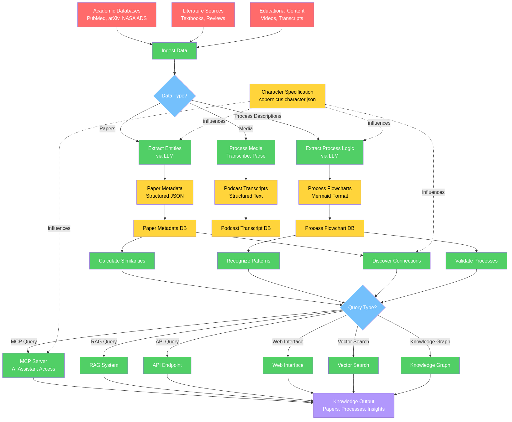
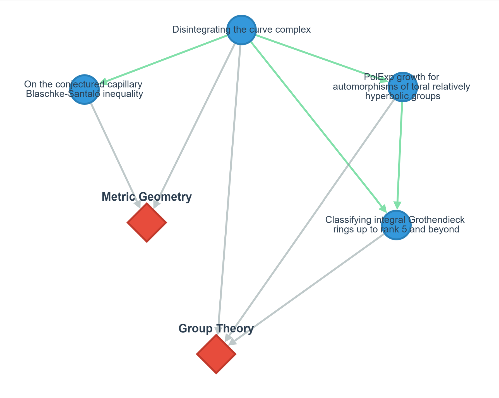

# A Vision for AI-Powered Knowledge Engines: A Framework for Systematic Knowledge Discovery and Integration

**Gary Welz**  
Retired Faculty Member, CUNY  
Email: garywelz@gmail.com

---

## Abstract

This vision paper proposes "Knowledge Engines" as a framework for understanding how intelligent systems—both human and artificial—systematically discover, integrate, and generate knowledge. We argue that history's greatest minds functioned as knowledge engines, processing information through cycles of ingestion, analysis, synthesis, and communication, guided by curiosity, fearlessness, and willingness to challenge established beliefs.

We propose a taxonomy of nine integrated capabilities—ingestion, digestion, analysis, calculation, comparison, connection, association, analogy, and multi-modal communication—synthesizing decades of prior work in expert systems, knowledge representation, and cognitive architectures for the LLM era. Our framework emphasizes that ambitious goals like "finding a cure for cancer" require comprehensive integrated systems, not merely powerful models, combining AI capabilities with structured processes, specialized tools, and systematic approaches.

We present CopernicusAI as a working implementation of the Knowledge Engine framework, demonstrating feasibility through a fully deployed system with 12,000+ indexed research papers, operational knowledge graph visualization, vector search, and RAG capabilities. While extensive validation remains necessary, the system demonstrates that the framework can be instantiated in practice. This vision paper aims to establish "Knowledge Engine" as a generic term describing systems that systematically transform information into knowledge, providing both a theoretical blueprint and a concrete implementation for future research.

**Keywords**: knowledge engine, AI systems, knowledge discovery, scientific research, knowledge integration

---

## 1. Introduction: The Knowledge Engine Concept

At its most fundamental level, a knowledge engine is any system—biological or artificial—that systematically transforms information into knowledge. The term "engine" is deliberate: it suggests a mechanism that performs work, converting raw materials (information) into useful outputs (knowledge, understanding, insights).

History's greatest scientists and thinkers—Aristotle, Newton, Euler, Copernicus—functioned as knowledge engines, systematically processing information through cycles of observation, analysis, calculation, and synthesis. These historical knowledge engines reveal common patterns: systematic ingestion of information, analytical digestion, pattern identification, generative output of new frameworks, and iterative refinement through feedback. They also contributed essential tools like telescopes, microscopes, conceptual frameworks, and calculation devices that enabled future knowledge discovery.

**The Computational Opportunity**: Modern AI enables computational knowledge engines that combine the systematic rigor of historical knowledge creators with capabilities exceeding human limitations in scale, speed, and persistence. However, creating such systems requires more than applying AI tools—it requires understanding the systematic processes that make knowledge engines effective.

**Contribution**: This vision paper proposes a synthesizing framework integrating classical AI approaches (knowledge graphs, structured reasoning) with modern capabilities (LLMs, embeddings, neural generation). While individual components are well-established, our systematic integration—organized around a nine-capability taxonomy—provides a coherent approach for designing knowledge systems. We present CopernicusAI as an early prototype demonstrating feasibility, though extensive validation remains necessary.

**What This Paper Does NOT Contribute**: Novel capabilities (these are well-established), new algorithms, validated effectiveness, or proven character specifications. We offer a vision and framework requiring extensive validation.

---

## 2. Related Work and Positioning

Our framework builds upon seven decades of AI research:

**Expert Systems (1970s-1990s)**: Early systems like MYCIN, DENDRAL, and Cyc demonstrated that structured knowledge representation and rule-based reasoning could enable expert-level performance. However, they faced critical limitations: knowledge acquisition bottlenecks, brittleness, inability to handle uncertainty, and maintenance burdens. The "AI Winter" resulted partly from expert systems' failure to scale. Our framework attempts to address these through modern AI capabilities (LLMs reduce knowledge acquisition burden; neural approaches handle uncertainty), though similar scaling challenges may apply.

**Knowledge Representation (1968-present)**: Semantic networks (Quillian, 1968), frames (Minsky, 1974), ontologies (Gruber, 1993), and the Semantic Web (Berners-Lee et al., 2001) provide formal frameworks for organizing knowledge. We build upon these but emphasize integration with modern neural approaches, combining symbolic structures (explainability, logical reasoning) with learned representations (handling ambiguity, learning from data).

**Modern Systems at Scale**: IBM Watson (Ferrucci et al., 2010) demonstrated knowledge system integration but faced accuracy challenges in high-stakes domains. Google Knowledge Graph (billions of entities) and Wolfram Alpha show feasibility but optimize for specific tasks (lookup, computation). Academic knowledge graphs (Semantic Scholar, OpenAlex) demonstrate scale in scientific literature. Our framework differs by emphasizing systematic integration of ALL capabilities—not just retrieval, but analysis, comparison, connection, and multi-modal communication.

**Cognitive Architectures**: SOAR (Laird, 2012), ACT-R (Anderson, 2007), and CLARION (Sun, 2006) provide systematic frameworks sharing our emphasis on decomposition, integration, and feedback loops.

**RAG and Modern Retrieval**: Recent RAG work (Lewis et al., 2020) combines retrieval with LLM generation. RAG systems address a key limitation of standard LLMs: while LLMs can generate fluent text, they're limited to information from their training data and cannot access current or domain-specific knowledge. RAG solves this by first searching a knowledge base (like our 12,000+ papers) to retrieve relevant information, then using that retrieved context to generate accurate, cited answers—essentially giving the LLM access to a constantly updated library. Our framework can be seen as extended RAG, emphasizing structured analysis, explicit connection discovery, cross-modal integration, and character-guided behavior. Whether these additions provide value beyond standard RAG requires validation.

**Our Contribution**: Not proposing fundamentally new capabilities, but a synthesizing framework for the LLM era emphasizing: (1) systematic integration guided by clear taxonomy, (2) multi-modal knowledge integration, (3) character/ethos specifications (exploratory), (4) framework requirement argument (ambitious goals need comprehensive frameworks), and (5) concrete prototype demonstrating feasibility.

---

## 3. A Taxonomy of Knowledge Engine Capabilities

We propose nine integrated capabilities that knowledge engines must combine systematically:

1. **Ingestion**: Multi-source, multi-modal acquisition with quality assessment
2. **Digestion**: Processing raw information into structured, usable forms (NLP, entity extraction, normalization)
3. **Analysis**: Deep examination identifying patterns, anomalies, causal relationships
4. **Calculation**: Mathematical computation, simulation, optimization, prediction
5. **Comparison**: Similarity assessment, difference identification, cross-domain comparison
6. **Connection**: Relationship discovery, network analysis, path finding, clustering
7. **Association**: Co-occurrence detection, correlation analysis, weak signal detection
8. **Analogy**: Structural mapping across domains, transfer learning, abstraction
9. **Communication**: Multi-modal expression (text, visual, audio, interactive)

These capabilities are not novel—they're well-established in cognitive science and AI. Our contribution is proposing their systematic integration through clear taxonomy and feedback loops. The power lies not in any single capability, but in integration: a system that can ingest but not analyze is merely a database; one that analyzes but doesn't connect misses relationships; one that connects but doesn't communicate cannot share knowledge.

---

## 4. The Framework Requirement Argument

When AI developers suggest AI might "find a cure for cancer," they often envision asking a powerful LLM and receiving an answer. This vision neglects a fundamental reality: no AI can create such answers from scratch, regardless of model power.

A knowledge engine cannot answer "What is the cure for cancer?" without:
1. **Comprehensive information ingestion** across multiple disciplines
2. **Multi-modal analysis tools** for text, images, structured data, time-series
3. **Hypothesis generation capabilities** beyond retrieval
4. **Experimental testing frameworks** for simulation and validation
5. **Validation and verification systems** ensuring reliability
6. **Collaboration infrastructure** enabling human-AI teamwork
7. **Conceptual frameworks and scaffolding** organizing knowledge and guiding inquiry

Simply building bigger AI will never suffice. We must build the **conceptual frameworks and scaffolding** that enable intellectual goals. This is why the knowledge engine framework matters: it provides structure for building systems that can achieve ambitious goals. The framework recognizes knowledge creation requires more than raw intelligence—it requires systematic processes, appropriate tools, comprehensive information, and the right approach.

---

## 5. CopernicusAI: A Proof-of-Concept Prototype

We present CopernicusAI as an early prototype demonstrating how the framework might be instantiated. This is an existence proof—showing such systems can be built—not a validated solution.

### System Architecture

The CopernicusAI system integrates multiple components following the nine-capability taxonomy, with data flowing from ingestion through processing to various query interfaces. The architecture diagram below illustrates the complete data pipeline from academic sources through structured storage to knowledge output.

*Figure 1: CopernicusAI Architecture using Programming Framework five-color system: Red=Inputs, Yellow=Structures/Storage, Green=Processing, Blue=Decision Points, Violet=Outputs. This diagram was generated using Mermaid Markdown format (Sveidqvist, 2014) in conjunction with an LLM, a technique that is further exploited in the Programming Framework (Welz, 2024) for creating process visualizations. All major components are now implemented, including Knowledge Graph, Vector Search, and RAG System. The system is fully operational and deployed to Google Cloud Run.*

**Technology Stack**:
- **Ingestion**: Python, API clients for PubMed/arXiv/NASA ADS
- **Processing**: GPT-4 for entity extraction, process generation
- **Storage**: JSON (Google Cloud), PostgreSQL (planned), Mermaid for flowcharts
- **Communication**: MCP server for AI assistant integration, FastAPI backend. The MCP (Model Context Protocol) server acts like a translator that allows AI assistants (like ChatGPT or Claude) to directly access and query the knowledge engine's databases, search functions, and knowledge graphs—essentially giving AI tools the ability to "plug into" the knowledge engine and retrieve real-time information rather than relying only on their training data.

**Current Status** (December 2025):
- **Research Papers**: 12,000+ mathematics papers indexed from arXiv with full metadata and vector embeddings
- **Processes**: 100+ biological processes (via GLMP), 70+ chemistry processes, 20+ cross-domain processes
- **Podcasts**: 50+ AI-synthesized research briefings. The podcast generation system has API access to 250 million papers.
- **Knowledge Graph**: Fully operational with interactive visualization, relationship extraction (citations, similarity, categories), and graph query capabilities
- **Vector Search**: Implemented using Vertex AI embeddings with semantic similarity search across papers, podcasts, and processes. Vector search works by converting text into mathematical representations (vectors) that capture meaning, allowing the system to find papers or content that are conceptually similar to a query even if they don't share exact keywords—think of it like finding books in a library by topic rather than by title.
- **RAG System**: Operational with citation support, context retrieval, and multi-modal content integration. RAG (Retrieval-Augmented Generation) systems first search the knowledge engine's database to find relevant information, then use that information to generate answers—unlike a standard LLM that relies only on its training data, RAG can provide up-to-date, cited information from the actual research papers and processes in the system, making answers more accurate, verifiable, and current.
- **Web Dashboard**: Fully deployed to Google Cloud Run with unified interface for knowledge map visualization, search, RAG queries, content browsing, and statistics
- **Deployment**: Production-ready system accessible 24/7 at https://copernicus-frontend-phzp4ie2sq-uc.a.run.app/knowledge-engine
- **Podcast Platform**: AI-synthesized research briefings available at https://www.copernicusai.fyi
- **MCP Integration**: Model Context Protocol server enables AI assistant integration with programmatic access to all knowledge engine capabilities. This allows users to interact with the knowledge engine through their preferred AI assistant (like ChatGPT or Claude), which can then query the system's databases, perform searches, and retrieve information in real-time.

**Implementation Details**:
- **Knowledge Graph**: Built from Firestore data with nodes representing papers and concepts, edges representing citations, semantic similarity, and category relationships. Graph visualization uses Cytoscape.js with interactive exploration capabilities.

Figure 2: Interactive Knowledge Map showing relationships between research papers. Nodes represent papers and concepts, edges represent citations, semantic similarity, and category relationships. The visualization enables exploration of connections across the 12,000+ indexed mathematics papers, allowing researchers to discover unexpected relationships and navigate the knowledge network interactively. Live system accessible at https://copernicus-frontend-phzp4ie2sq-uc.a.run.app/knowledge-engine

- **Vector Search**: Vertex AI embeddings enable semantic search across 12,000+ papers with distance-based similarity ranking and content-type filtering. This allows users to find papers by meaning rather than exact word matches—for example, searching for "machine learning" will also find papers about "neural networks" or "deep learning" because the system understands these concepts are related.
- **RAG System**: Retrieval-augmented generation combines vector search with LLM generation, providing answers with citations to source papers and processes. This approach ensures answers are grounded in actual research documents rather than the LLM's potentially outdated or incomplete training data, and provides citations so users can verify the information.
- **Architecture**: FastAPI backend deployed on Google Cloud Run, Next.js frontend with React components, Firestore database for content storage, and Vertex AI for embeddings and LLM capabilities.

**Known Limitations**:
- Character specification influences prompts but remains unvalidated
- No automated quality validation beyond basic checks
- Evaluation metrics not yet collected (system operational but not rigorously evaluated)
- Knowledge graph currently limited to mathematics domain (expansion to other domains planned)

**Character Specification (Exploratory)**: The prototype implements `copernicus.character.json` with traits inspired by the historical Copernicus. For example, when `fearlessness >= 0.7`, papers containing "challenge," "refute," "paradigm shift" receive 1.3x relevance boost. When `empirical_focus >= 0.8`, papers with experimental sections receive 1.5x boost. This is preliminary and unvalidated—we don't know if character-modified search outperforms baseline.

---

## 6. Evaluation Plans and Success Criteria

While CopernicusAI has not undergone rigorous evaluation (~200 queries from 5 beta testers, informal feedback only), we outline systematic evaluation plans:

**1. Retrieval Quality** (6 months):
- Compare against PubMed, Google Scholar, Semantic Scholar
- Metrics: Precision@10, Recall@10, MRR, nDCG
- Test set: 50-100 expert-judged queries

**2. Connection Discovery** (6-12 months):
- Domain experts rate validity and novelty of cross-domain connections
- Target: >60% of connections rated valid
- Baseline: Random connections as control

**3. User Study** (12-18 months):
- Scientists use CopernicusAI for literature review, hypothesis generation
- Measure time-to-completion, output quality, user satisfaction
- Compare with vs. without system

**4. Character Specification A/B Testing** (12-18 months):
- Compare "Copernicus" vs. "Aristotle" vs. baseline configurations
- Measure diversity, paradigm-challenging emphasis, user preference

**5. Longitudinal Impact** (2+ years):
- Track whether insights lead to publications, grants, experiments

**Success Criteria**:
- Retrieval parity or better with existing tools
- >60% valid connections per expert evaluation
- User-reported value beyond existing tools
- Measurable research impact
- Demonstrable character specification effects

**Current Status**: The system is fully operational with core capabilities implemented (knowledge graph, vector search, RAG). However, rigorous evaluation against these criteria has not yet been conducted. The system demonstrates feasibility and provides a foundation for validation studies, but extensive evaluation remains necessary to assess effectiveness compared to baseline systems.

---

## 7. Limitations, Future Directions, and Ethical Considerations

**Conceptual Limitations**: Framework largely untested; character specifications require evaluation; cross-domain applicability speculative.

**Prototype Limitations**: While core capabilities (vector search, knowledge graph, RAG) are now implemented and operational, the system lacks quantitative evaluation, comparison with alternatives, and rigorous validation. The implementation demonstrates feasibility but requires extensive evaluation to assess practical value and effectiveness.

**Future Research Questions**:
- How to measure knowledge engine effectiveness?
- Do character specifications meaningfully improve outcomes?
- How do integrated systems compare to components?
- What mechanisms translate character traits into behavior?
- What's optimal human-AI division of labor?

**Ethical Considerations**:
- **Bias**: Whose knowledge is included? What perspectives missing?
- **Accuracy**: How ensure outputs are correct?
- **Attribution**: How credit original creators?
- **Access**: Who has access? Who benefits?
- **Responsibility**: Who's responsible for outputs and errors?

**Future Needs**:
- Standard interfaces (like MCP)
- Common schemas for knowledge representation
- Interoperability for sharing knowledge
- Evaluation metrics and standards

---

## 8. Conclusion

This vision paper proposes "Knowledge Engines" as a framework for systematically transforming information into knowledge. By recognizing patterns in effective knowledge systems—human and artificial—we can potentially design better computational systems.

The nine-capability taxonomy provides a language for discussing knowledge engine design. While individual capabilities are well-established, our contribution is proposing their systematic integration with feedback loops and iterative refinement. Character/ethos specifications might guide system behavior (exploratory direction requiring validation).

Achieving ambitious goals requires more than scaling AI—it requires comprehensive frameworks, scaffolding, tools, and processes. The CopernicusAI implementation demonstrates feasibility through a working system with 12,000+ papers, operational knowledge graph, vector search, and RAG capabilities. Notably, this system was developed in one year by a single individual using a laptop and subscriptions to LLM services (ChatGPT, Claude, Grok), AI-coding assistant Cursor, ElevenLabs Text-to-Speech service, Vercel web hosting, and Google Cloud Services, with total monthly costs under $200—demonstrating that sophisticated knowledge engines are now accessible to individual researchers and small teams, not just large organizations with substantial budgets. While extensive validation remains necessary, the system provides concrete evidence that the Knowledge Engine framework can be instantiated in practice, with a fully deployed, accessible system demonstrating the integration of multiple capabilities working together systematically.

This vision paper synthesizes decades of prior work and proposes an integrated framework for the LLM era. The term "Knowledge Engine" should enter AI discourse as a generic concept describing systems with common characteristics and goals. We offer this framework to stimulate discussion, pose research questions, and provide common vocabulary—recognizing extensive validation remains necessary.

**Acknowledgments**: We acknowledge historical knowledge engines (Aristotle, Newton, Copernicus) whose approaches inspire this framework, and extensive prior work in knowledge-based AI providing the foundation.

---

## Competing Interests

The author declares no competing interests.

## Author Contributions

G.W. conceived the framework, designed and implemented CopernicusAI, and wrote the manuscript.

## Data Availability

The CopernicusAI Knowledge Engine is publicly accessible at https://copernicus-frontend-phzp4ie2sq-uc.a.run.app/knowledge-engine. Source code and documentation are available at https://huggingface.co/spaces/garywelz/copernicusai.

---

## References

1. Aristotle. (c. 350 BCE). *Metaphysics*. (Various translations)

2. Copernicus, N. (1543). *De revolutionibus orbium coelestium* (On the Revolutions of the Heavenly Spheres). Nuremberg: Johannes Petreius.

3. Galileo Galilei. (1632). *Dialogo sopra i due massimi sistemi del mondo* (Dialogue Concerning the Two Chief World Systems). Florence: Giovanni Battista Landini.

4. Newton, I. (1687). *Philosophiæ Naturalis Principia Mathematica*. London: Royal Society.

5. Euler, L. (1748). *Introductio in analysin infinitorum*. Lausanne: Marc-Michel Bousquet.

6. Galois, É. (1831). Mémoire sur les conditions de résolubilité des équations par radicaux. *Journal de mathématiques pures et appliquées*, 11, 381-444.

7. Einstein, A. (1905). Zur Elektrodynamik bewegter Körper. *Annalen der Physik*, 17(10), 891-921.

8. Ramanujan, S. (1914). Modular equations and approximations to pi. *Quarterly Journal of Mathematics*, 45, 350-372.

9. Hippocrates. (c. 400 BCE). *Corpus Hippocraticum*. (Various translations)

10. Cicero, M. T. (c. 50 BCE). *De oratore* (On the Orator). (Various translations)

11. Plato. (c. 380 BCE). *Apology of Socrates*. (Various translations)

12. Shortliffe, E. H. (1976). *Computer-Based Medical Consultations: MYCIN*. Elsevier.

13. Lindsay, R. K., Buchanan, B. G., Feigenbaum, E. A., & Lederberg, J. (1980). *Applications of Artificial Intelligence for Organic Chemistry: The DENDRAL Project*. McGraw-Hill.

14. Lenat, D. B. (1995). CYC: A large-scale investment in knowledge infrastructure. *Communications of the ACM*, 38(11), 33-38.

15. Quillian, M. R. (1968). Semantic memory. In M. Minsky (Ed.), *Semantic Information Processing* (pp. 227-270). MIT Press.

16. Minsky, M. (1974). A framework for representing knowledge. *MIT AI Laboratory Memo*, 306.

17. Gruber, T. R. (1993). A translation approach to portable ontology specifications. *Knowledge Acquisition*, 5(2), 199-220.

18. Baader, F., Calvanese, D., McGuinness, D. L., Nardi, D., & Patel-Schneider, P. F. (Eds.). (2003). *The Description Logic Handbook: Theory, Implementation, and Applications*. Cambridge University Press.

19. Laird, J. E. (2012). *The SOAR Cognitive Architecture*. MIT Press.

20. Anderson, J. R. (2007). *How Can the Human Mind Occur in the Physical Universe?* Oxford University Press.

21. Sun, R. (2006). *Cognition and Multi-Agent Interaction: From Cognitive Modeling to Social Simulation*. Cambridge University Press.

22. Manning, C. D., Raghavan, P., & Schütze, H. (2008). *Introduction to Information Retrieval*. Cambridge University Press.

23. Davenport, T. H., & Prusak, L. (1998). *Working Knowledge: How Organizations Manage What They Know*. Harvard Business School Press.

24. Mikolov, T., Chen, K., Corrado, G., & Dean, J. (2013). Efficient estimation of word representations in vector space. *arXiv preprint arXiv:1301.3781*.

25. Hogan, A., et al. (2021). Knowledge graphs. *ACM Computing Surveys*, 54(4), 1-37.

26. Shannon, C. E. (1948). A mathematical theory of communication. *Bell System Technical Journal*, 27(3), 379-423.

27. Simon, H. A. (1996). *The Sciences of the Artificial* (3rd ed.). MIT Press.

28. Polanyi, M. (1966). *The Tacit Dimension*. University of Chicago Press.

29. Nonaka, I., & Takeuchi, H. (1995). *The Knowledge-Creating Company*. Oxford University Press.

30. Berners-Lee, T., Hendler, J., & Lassila, O. (2001). The semantic web. *Scientific American*, 284(5), 34-43.

31. Bizer, C., Heath, T., & Berners-Lee, T. (2009). Linked data: The story so far. *International Journal on Semantic Web and Information Systems*, 5(3), 1-22.

32. Mitchell, T. M. (1997). *Machine Learning*. McGraw-Hill.

33. LeCun, Y., Bengio, Y., & Hinton, G. (2015). Deep learning. *Nature*, 521(7553), 436-444.

34. Devlin, J., Chang, M. W., Lee, K., & Toutanova, K. (2018). BERT: Pre-training of deep bidirectional transformers for language understanding. *arXiv preprint arXiv:1810.04805*.

35. Brown, T., et al. (2020). Language models are few-shot learners. *Advances in Neural Information Processing Systems*, 33, 1877-1901.

36. Bubeck, S., et al. (2023). Sparks of artificial general intelligence: Early experiments with GPT-4. *arXiv preprint arXiv:2303.12712*.

37. Welz, G. (2024). The Programming Framework: A General Method for Process Analysis Using LLMs and Mermaid Visualization. *Hugging Face Space*. https://huggingface.co/spaces/garywelz/programming_framework

38. Model Context Protocol. (2024). https://modelcontextprotocol.io/

39. CopernicusAI Knowledge Engine. (2025). https://huggingface.co/spaces/garywelz/copernicusai

40. Ferrucci, D., et al. (2010). Building Watson: An overview of the DeepQA project. *AI Magazine*, 31(3), 59-79.

41. Ross, C., & Swetlitz, I. (2017). IBM pitched Watson as a revolution in cancer care. It's nowhere close. *STAT News*. Retrieved from https://www.statnews.com/2017/09/05/watson-ibm-cancer/

42. Singhal, A. (2012). Introducing the Knowledge Graph: Things, not strings. *Google Official Blog*. Retrieved from https://blog.google/products/search/introducing-knowledge-graph-things-not/

43. Wolfram, S. (2009). Wolfram|Alpha is coming! *Wolfram Blog*. Retrieved from https://blog.wolfram.com/2009/03/05/wolframalpha-is-coming/

44. Kinney, R., Anastasiades, C., Authur, R., Beltagy, I., Bragg, J., Buraczynski, A., ... & Weld, D. S. (2023). The Semantic Scholar Open Data Platform. *arXiv preprint arXiv:2301.10140*.

45. Ashburner, M., et al. (2000). Gene ontology: Tool for the unification of biology. *Nature Genetics*, 25(1), 25-29.

46. Karpukhin, V., et al. (2020). Dense passage retrieval for open-domain question answering. *Proceedings of EMNLP*, 6769-6781.

47. Lewis, P., et al. (2020). Retrieval-augmented generation for knowledge-intensive NLP tasks. *Advances in Neural Information Processing Systems*, 33, 9459-9474.

48. Sveidqvist, K. (2014). Mermaid: A Markdown-inspired tool for creating diagrams and flowcharts. *GitHub Repository*. https://github.com/mermaid-js/mermaid

---

